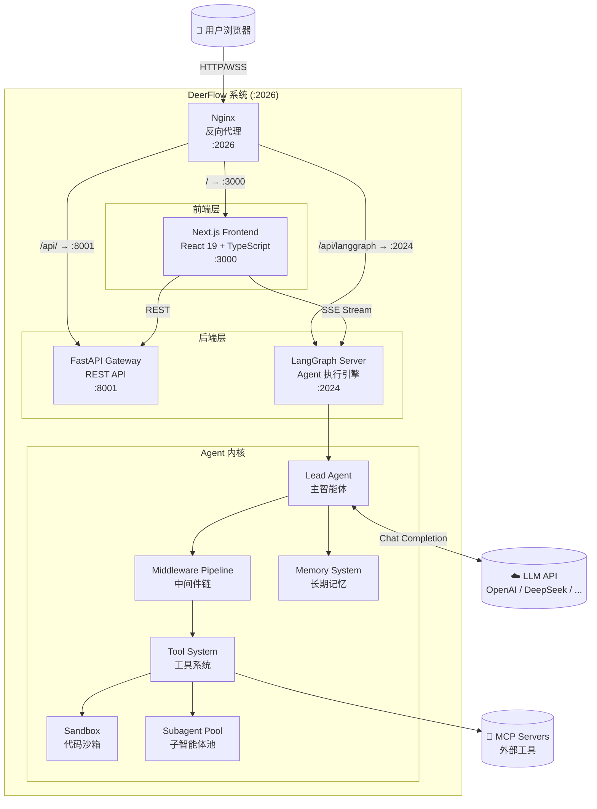
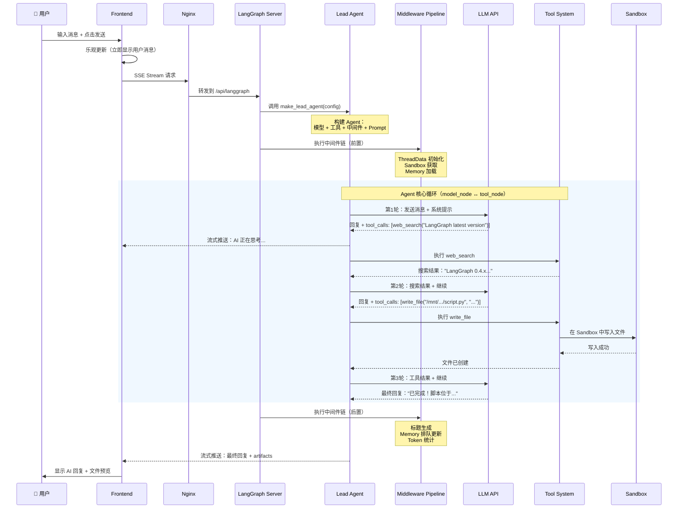

# 第一章 序言：全局视角

> **一句话收获**：读完本章，你将在脑中建立起 DeerFlow 的完整架构地图——知道它是什么、由哪些部分组成、这些部分如何协作，以及一条用户消息从发出到收到回复的完整旅程。

---

## 1.1 DeerFlow 是什么

想象你有一位 AI 助手，它不仅能和你对话，还能执行代码、搜索网页、读写文件、甚至同时派出多个"分身"并行处理复杂任务——这就是 DeerFlow 要做的事情。

**DeerFlow**（**D**eep **E**xploration and **E**fficient **R**esearch **F**low）是一个开源的 **Super Agent Harness**（超级智能体运行框架）。这个名字里有两个关键词：

- **Agent**（智能体）：能自主决策并执行动作的 AI 实体，不只是聊天，而是能"做事"。
- **Harness**（运行框架）：不是 Agent 本身，而是让 Agent 跑起来的"赛道"——提供工具、沙箱、记忆、协调机制。

用一个类比：如果 Agent 是赛车手，DeerFlow 就是整个赛车场——包括赛道（数据管道）、维修站（Sandbox）、通讯系统（Middleware）、车队策略（Subagent 调度）和赛后记录（Memory）。

### 设计哲学

DeerFlow 2.0 是一次从零重写（与 1.0 不共享代码），核心设计理念：

| 原则 | 含义 |
|------|------|
| **LangGraph 驱动** | 基于 LangGraph 构建 Agent 执行图，获得状态管理、检查点、流式输出等能力 |
| **Streaming-first（流式优先）** | 所有交互都是实时流式的，用户不必等待完整响应 |
| **Sandbox-agnostic（沙箱无关）** | 支持本地文件系统或 Docker 容器，可插拔切换 |
| **Skills 扩展** | 通过 Markdown 文件（而非代码插件）定义领域知识，降低扩展门槛 |
| **Context Engineering（上下文工程）** | 隔离子任务上下文、主动摘要、卸载中间结果到文件系统，确保长任务不会撑爆上下文窗口 |

---

## 1.2 架构全景图

DeerFlow 由四个运行时服务组成，通过 Nginx 统一对外暴露。让我们先看全景，再逐个介绍。



### 四个服务，各司其职

| 服务 | 端口 | 职责 | 技术栈 |
|------|------|------|--------|
| **Nginx** | 2026 | 统一入口，反向代理，路由分发 | Nginx |
| **Frontend** | 3000 | 用户界面：对话、文件、Agent 管理 | Next.js 16 + React 19 |
| **Gateway** | 8001 | REST API：模型列表、文件上传、Skills 管理、Agent CRUD | FastAPI |
| **LangGraph Server** | 2024 | Agent 执行引擎：运行智能体、管理状态、流式输出 | LangGraph + Python |

**Nginx 是唯一对外端口**（`:2026`）。它根据 URL 路径将请求分发到三个内部服务：

- `/` → Frontend（页面和静态资源）
- `/api/` → Gateway（管理类 REST API）
- `/api/langgraph/` → LangGraph Server（Agent 执行和流式通信）

**为什么要分成 Gateway 和 LangGraph 两个后端服务？** 因为它们的职责截然不同：

- **Gateway** 处理"管理"类请求——列出可用模型、上传文件、配置 MCP 服务器。这些是标准的 CRUD 操作，用 FastAPI 直接处理即可。
- **LangGraph Server** 处理"执行"类请求——运行 Agent、管理对话状态、流式推送结果。它需要 LangGraph 的图执行引擎、检查点系统和流式协议。

两者分开，各自可以独立扩展和部署。

---

## 1.3 核心概念词典

在深入之前，你需要认识 DeerFlow 世界里的核心角色。每个概念，我们先说"它是什么"，再说"它在系统中扮演什么角色"。

### Lead Agent（主智能体）

**它是什么**：DeerFlow 的核心执行者——一个由 LangGraph 驱动的 AI Agent，能自主决策、调用工具、委派子任务。

**它在系统中的角色**：每次用户发送消息，LangGraph Server 就会调用 `make_lead_agent()` 工厂函数来构建一个 Lead Agent。这个 Agent 负责理解用户意图、规划执行步骤、调用工具完成任务、生成最终回复。

**它和其他概念的关系**：Lead Agent 是中心节点——它被 Middleware 包裹（增强能力），通过 Tool System 执行动作，可以委派 Subagent 处理子任务，依赖 Memory 获取历史上下文。

### ThreadState（对话状态）

**它是什么**：一次对话的完整状态快照——不仅包含消息历史，还包含 Sandbox 信息、文件列表、任务清单等。

> 这是本项目特有概念，扩展自 LangChain 的 `AgentState`。标准的 `AgentState` 只包含 `messages`（消息列表），`ThreadState` 在此基础上添加了 `sandbox`、`artifacts`、`todos`、`uploaded_files`、`viewed_images` 等字段。

**它在系统中的角色**：ThreadState 是 Agent 执行图中流动的"血液"。每个节点（model_node、tool_node）都读取和修改它。LangGraph 的 Checkpointer 会在每一步保存 ThreadState，使对话可以恢复和重放。

**核心字段一览**：

```python
class ThreadState(AgentState):
    # 继承自 AgentState:
    #   messages: list[BaseMessage]     ← 对话消息历史
    
    sandbox: SandboxState | None        # 沙箱 ID 和配置
    thread_data: ThreadDataState | None # 工作区/上传/输出路径
    title: str | None                   # 自动生成的对话标题
    artifacts: list[str]                # 生成的文件路径列表
    todos: list | None                  # 任务规划清单
    uploaded_files: list[dict] | None   # 用户上传的文件元数据
    viewed_images: dict[str, ViewedImageData]  # 已查看的图片缓存
```

### Middleware Pipeline（中间件链）

**它是什么**：包裹在 Agent 核心循环（model → tool → model → ...）外层的一系列可插拔处理器。

**它在系统中的角色**：中间件链是 DeerFlow 的"增强层"。核心 Agent 循环只做一件事——LLM 思考和工具调用。而标题生成、记忆存储、循环检测、Token 追踪等横切关注点，都由中间件负责。每个中间件可以在 Agent 执行前后拦截和修改状态。

**它和其他概念的关系**：中间件链是 `make_lead_agent()` 构建 Agent 时传入的参数。DeerFlow 定义了约 15 个中间件，按严格顺序排列（详见第 4 章）。

### Sandbox（沙箱）

**它是什么**：一个隔离的代码执行环境——Agent 在其中运行 bash 命令、读写文件，不会污染宿主系统。

**它在系统中的角色**：当 Agent 需要执行代码（比如运行 Python 脚本、安装依赖、处理数据），它不是在服务器主机上直接执行，而是在 Sandbox 中操作。Sandbox 提供了一套虚拟路径（`/mnt/user-data/workspace`、`/mnt/user-data/uploads` 等），Agent 看到的是容器内路径，实际映射到宿主机的线程数据目录。

**它和其他概念的关系**：Sandbox 有两种实现——`LocalSandbox`（直接在本地文件系统操作，路径映射）和 Docker-based Sandbox（真正的容器隔离）。通过 `SandboxMiddleware` 在 Agent 执行前自动获取，执行后释放。

### Subagent（子智能体）

**它是什么**：由 Lead Agent 委派去执行特定子任务的独立 Agent 实例。

> 这是本项目特有概念，类似于行业中的 Worker Agent，但有独特的执行模型：在独立线程池中运行、有超时限制、结果通过流式事件实时回传。

**它在系统中的角色**：当任务太复杂，Lead Agent 会把它拆成多个子任务，通过 `task` 工具同时启动多个 Subagent 并行执行。比如"研究 10 个技术方案"→ 启动 3 个 Subagent 分批处理 → 汇总结果。

**它和其他概念的关系**：Subagent 通过 `task_tool`（一个特殊工具）触发，由 `SubagentExecutor` 管理生命周期，在后台线程池中执行，每个 Subagent 继承父 Agent 的工具集（但不能再委派子任务，防止递归）。

### Skills（技能）

**它是什么**：以 `SKILL.md` Markdown 文件定义的领域知识包——不是代码插件，而是结构化的 Prompt 指令。

> 这是本项目特有概念，最接近行业中的 Plugin / Template，但实现方式完全不同：Skills 通过注入到系统 Prompt 中生效，而非通过代码接口。

**它在系统中的角色**：当 Agent 处理特定领域任务（如"生成 PPT"、"深度研究"、"数据分析"），对应的 Skill 会被加载到系统 Prompt 中，为 Agent 提供领域专业知识和工作流程指导。

### MCP（Model Context Protocol）

**它是什么**：一个行业标准协议，用于将外部工具服务连接到 AI Agent。可以理解为"AI 工具的 USB 接口"。

**它在系统中的角色**：DeerFlow 通过 MCP 协议连接外部工具服务器（如搜索引擎、数据库、自定义 API）。每个 MCP Server 提供一组工具，DeerFlow 在启动时加载这些工具，Agent 可以像调用内置工具一样调用它们。支持三种传输方式：stdio、SSE、HTTP。

### Memory（长期记忆）

**它是什么**：跨对话持久化的用户上下文信息——用户偏好、工作背景、历史摘要。

**它在系统中的角色**：不同于 ThreadState（仅在单次对话内有效），Memory 在对话结束后依然保留。下次用户开始新对话时，相关记忆会被注入到系统 Prompt 中，让 Agent"记住"之前的交互。

---

## 1.4 代码库地图

理解了核心概念，让我们看看它们在代码中住在哪里。

```
deer-flow/
├── Makefile                         # 本地开发命令入口（make dev / make install）
├── config.example.yaml              # 配置模板（14 个配置段）
├── docker/                          # Docker 编排和 Nginx 配置
│
├── backend/                         # 整个后端
│   ├── langgraph.json               # LangGraph 入口配置 → make_lead_agent
│   ├── app/gateway/                 # FastAPI Gateway 服务
│   │   └── routers/                 #   REST API 路由（agents/models/mcp/uploads...）
│   │
│   └── packages/harness/deerflow/   # ⭐ Agent 核心库
│       ├── agents/                  #   Agent 系统
│       │   ├── lead_agent/          #     主智能体（agent.py, prompt.py）
│       │   ├── middlewares/         #     ~15 个中间件
│       │   ├── memory/              #     长期记忆（存储/队列/提取）
│       │   ├── checkpointer/        #     状态持久化（SQLite/Postgres）
│       │   └── thread_state.py      #     ThreadState 定义
│       │
│       ├── sandbox/                 #   代码执行沙箱
│       │   ├── sandbox.py           #     抽象接口
│       │   ├── tools.py             #     bash/read/write 等工具
│       │   └── local/               #     本地沙箱实现
│       │
│       ├── subagents/               #   子智能体系统
│       │   ├── executor.py          #     执行引擎 + 线程池
│       │   ├── registry.py          #     注册表
│       │   └── builtins/            #     内置类型（general-purpose, bash）
│       │
│       ├── tools/                   #   工具系统
│       │   ├── tools.py             #     工具发现与加载
│       │   └── builtins/            #     内置工具（task, present_files...）
│       │
│       ├── skills/                  #   Skills 加载器
│       ├── mcp/                     #   MCP 协议集成
│       ├── models/                  #   LLM 模型工厂
│       └── config/                  #   配置系统（AppConfig 及子配置）
│
├── frontend/                        # 整个前端
│   └── src/
│       ├── app/                     #   Next.js 路由（workspace/chats/agents）
│       ├── core/                    #   业务逻辑（threads/api/uploads/settings）
│       └── components/              #   UI 组件（chat/messages/input/artifacts）
│
└── skills/                          # Skills 库
    ├── public/                      #   内置 Skills（18 个）
    └── custom/                      #   用户自定义 Skills
```

**找代码的经验法则**：

- **Agent 怎么构建的** → `backend/packages/harness/deerflow/agents/lead_agent/agent.py`
- **中间件怎么工作的** → `backend/packages/harness/deerflow/agents/middlewares/`
- **工具怎么注册的** → `backend/packages/harness/deerflow/tools/tools.py`
- **前端怎么发消息的** → `frontend/src/core/threads/hooks.ts`
- **配置项在哪** → `config.example.yaml`（模板）和 `backend/packages/harness/deerflow/config/`（解析代码）

---

## 1.5 一次典型交互的极简全流程

现在，让我们用一个具体场景把所有概念串起来。假设用户在 DeerFlow 中输入：**"帮我搜索 LangGraph 的最新版本号，然后写一个 Python 脚本打印出来。"**

这条消息会经历以下旅程（这里只看全貌，每一站的内部细节在后续章节展开）：



### 逐步拆解

**第 1 步：前端发送**

用户在输入框输入消息，点击发送。Frontend 做两件事：
1. **乐观更新**——立即在界面上显示用户消息（不等服务器确认），给用户即时反馈。
2. **建立 SSE 连接**——通过 LangGraph SDK 向 `/api/langgraph/threads/{thread_id}/runs` 发起流式请求，携带消息内容和配置参数（模型名称、是否启用思考、是否启用 Subagent 等）。

**第 2 步：Nginx 路由**

Nginx 根据 URL 前缀将请求转发到 LangGraph Server（`:2024`）。

**第 3 步：Agent 构建**

LangGraph Server 收到请求后，调用 `make_lead_agent(config)` 工厂函数。这个函数根据配置构建一个完整的 Agent 实例：
- 选择 LLM 模型（根据用户设置或默认配置）
- 加载可用工具（搜索、文件操作、MCP 工具等）
- 构建中间件链（15 个中间件按顺序排列）
- 生成系统 Prompt（注入 Skills、Agent 人格等）

**第 4 步：中间件前置处理**

在 Agent 核心循环开始前，中间件链依次执行：
- `ThreadDataMiddleware`：初始化工作区路径
- `SandboxMiddleware`：获取沙箱环境
- `UploadsMiddleware`：处理用户上传的文件
- ……

**第 5 步：Agent 核心循环**

这是最关键的部分。Agent 进入 **model_node ↔ tool_node** 循环：

1. **model_node**：将对话历史发送给 LLM，LLM 返回文本回复或工具调用请求。
2. **tool_node**：如果 LLM 请求调用工具，执行对应工具并将结果添加到消息历史。
3. 回到 model_node，LLM 看到工具结果后继续思考。
4. 重复，直到 LLM 给出不含工具调用的最终回复。

在本例中，这个循环执行了 3 轮：搜索 → 写文件 → 最终回复。

**第 6 步：中间件后置处理**

Agent 核心循环结束后，中间件链再次执行：
- `TitleMiddleware`：根据对话内容自动生成标题
- `MemoryMiddleware`：将对话排入记忆更新队列
- `TokenUsageMiddleware`：记录本次消耗的 Token 数

**第 7 步：流式回传**

整个过程中，Agent 的输出通过 SSE 实时流式推送给前端。用户不必等到所有步骤完成，可以实时看到 AI 的思考过程、工具调用和最终回复。

---

## 1.6 配置系统概览

DeerFlow 的行为由一个 `config.yaml` 文件控制（模板是 `config.example.yaml`）。理解配置结构有助于建立系统的"控制面板"心智模型：

| 配置段 | 控制什么 | 对应系统组件 |
|--------|---------|-------------|
| `models` | 可用的 LLM 模型、是否支持思考/视觉 | Lead Agent 的模型选择 |
| `tools` / `tool_groups` | 可用工具和工具分组 | Tool System |
| `tool_search` | 延迟加载工具（减少上下文占用） | Deferred Tool Registry |
| `sandbox` | 沙箱类型（local / docker） | Sandbox |
| `skills` | Skills 目录和加载策略 | Skills 系统 |
| `memory` | 是否启用长期记忆 | Memory System |
| `checkpointer` | 状态存储后端（memory / sqlite / postgres） | Checkpointer |
| `summarization` | 上下文窗口接近上限时自动摘要 | SummarizationMiddleware |
| `title` | 自动标题生成配置 | TitleMiddleware |
| `token_usage` | 是否追踪 Token 使用量 | TokenUsageMiddleware |
| `channels` | IM 渠道集成（Feishu / Slack / Telegram） | Channel System |

---

## 1.7 本书路线图

本章给了你全局视角。接下来的章节将沿着"先看数据怎么流，再逐个打开黑盒"的路径深入：

| 章节 | 做什么 |
|------|--------|
| **第 2 章 数据流全景** | 完整追踪多种场景的数据流，标注每个黑盒 |
| **第 3 章 Lead Agent** | 打开第一个黑盒：Agent 工厂是怎么构建 Agent 的 |
| **第 4 章 Middleware** | 打开第二个黑盒：中间件链的设计与每个中间件的职责 |
| **第 5 章 Tool + Sandbox** | 打开第三个黑盒：工具系统和沙箱 |
| **第 6 章 Subagent** | 打开第四个黑盒：子智能体的委派和并行执行 |
| **第 7 章 Memory + State** | 横切关注点：状态持久化和长期记忆 |
| **第 8 章 MCP + Skills** | 扩展机制：外部工具和领域技能 |
| **第 9 章 Gateway + Frontend** | 补全两端：API 和用户界面 |
| **第 10 章 端到端追踪** | 用三个真实场景串联全书 |

每个"打开黑盒"的章节都遵循同样的节奏：先说这个组件是什么、做什么，再看它整体的输入输出，最后打开盖子看内部实现。

---

### 质检报告

**讲解节奏**
- [x] 每个模块/概念是否先讲"它是什么"再讲"它里面有什么"
- [x] 是否有上来就讲内部实现、没交代身份和职责的情况 — 无

**讲透了吗**
- [x] 核心流程每一步都解释了数据变化
- [x] 没有跳步
- [x] 复杂节点已标注"详见第 N 章"

**准确吗**
- [x] 使用了行业标准术语
- [x] 项目特有术语已标注并类比（ThreadState、Lead Agent、Skills、SOUL.md 等）
- [ ] ThreadState 继承的 `AgentState` 的确切导入路径需要源码验证 [需源码验证]

**读得下去吗**
- [x] 术语首次出现有解释
- [x] 每张图有文字讲解
- [x] 图粒度合理（一眼看得完）

**勘误建议**
- ThreadState 中 `AgentState` 的实际导入路径可能是 `langgraph.prebuilt` 而非 `langchain.agents`，需确认
