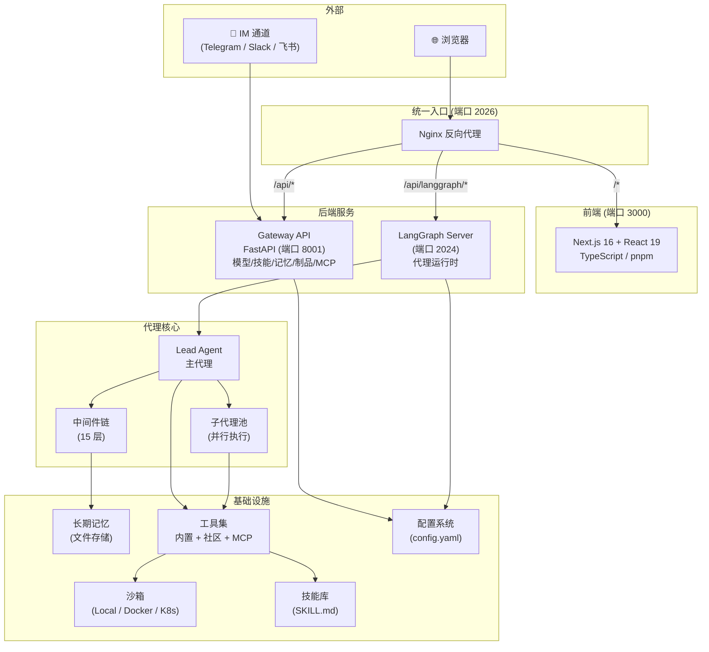
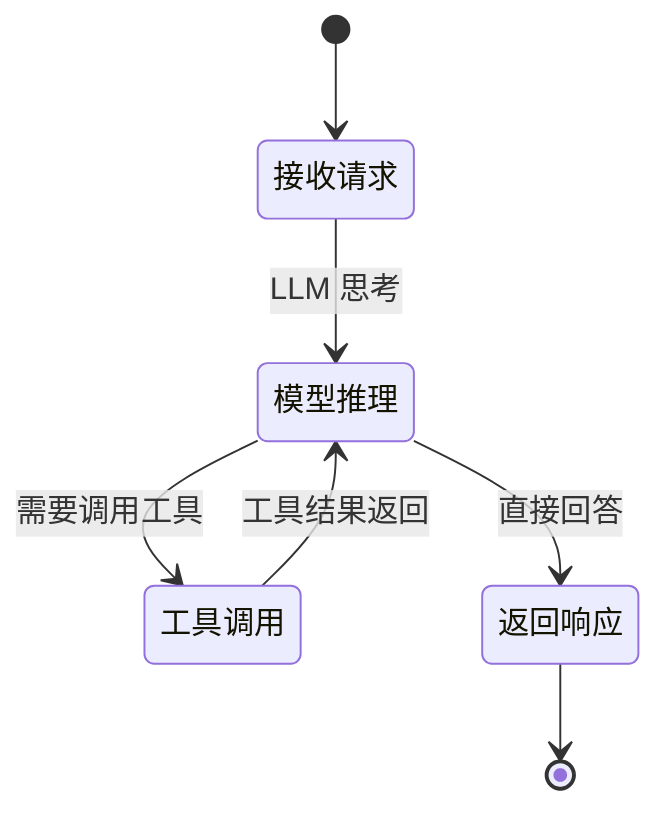
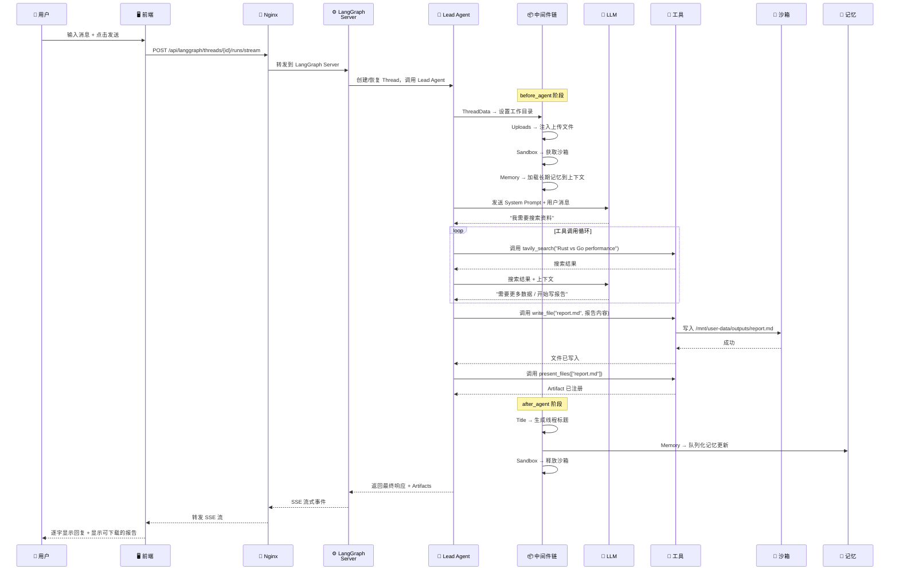

# 第 1 章 序言：全局视角

> **读完本章的收获**：你会对 DeerFlow 2.0 的定位、骨架、核心概念和典型交互有一张完整的心智地图。后续所有章节都是对这张地图的局部放大。

---

## 1.1 DeerFlow 是什么

DeerFlow（**D**eep **E**xploration and **E**fficient **R**esearch **Flow**）是一个开源的 **超级代理线束**（Super Agent Harness）。

"线束"这个词是关键——它不是一个框架让你拼装，而是一个**开箱即用的代理运行时**。给它一个任务，它能：

1. 用 **Lead Agent**（主代理）理解任务、制定计划
2. 将复杂任务拆解给多个 **Sub-Agent**（子代理）并行执行
3. 在隔离的 **Sandbox**（沙箱）里执行代码、操作文件
4. 通过 **Skills**（技能）调用预定义的工作流生成报告/网页/幻灯片
5. 利用 **长期记忆** 跨会话积累用户偏好和知识
6. 通过 **MCP** 协议接入任意外部工具

DeerFlow 2.0 是完全重写的版本，与 v1 无共享代码。它构建在 **LangGraph**（状态图代理框架）和 **LangChain**（LLM 工具链）之上。

---

## 1.2 设计哲学

DeerFlow 的设计围绕三个核心理念：

| 理念 | 体现 |
|------|------|
| **代理即执行者，不是聊天者** | 拥有自己的文件系统、沙箱、工具；能写文件、跑代码、生成制品 |
| **一切可配置，无需改代码** | 模型/工具/沙箱/记忆/技能全部通过 `config.yaml` 和 `extensions_config.json` 控制 |
| **渐进式加载，保持上下文窗口精简** | 技能按需加载，工具可延迟发现（Tool Search），历史消息可压缩（Summarization） |

---

## 1.3 架构全景图



**关键分工**：

- **Nginx** 是唯一对外端口，按 URL 路径分流
- **LangGraph Server** 负责代理运行（会话管理、状态持久化、流式输出）
- **Gateway API** 负责管理端（模型列表、技能管理、记忆读写、文件上传/下载）
- 两者共享同一个配置系统和包（`deerflow-harness`）

---

## 1.4 核心概念词典

### Lead Agent（主代理）

系统的唯一入口代理。每个用户请求都由它接收。



它运行在一个 **model_node ↔ tool_node** 的循环图上（LangGraph 构建）。真正的复杂度不在图的结构，而在包裹这个循环的 **中间件链**。

- **构建入口**：`backend/packages/harness/deerflow/agents/lead_agent/agent.py::make_lead_agent()`
- **系统提示词**：`backend/packages/harness/deerflow/agents/lead_agent/prompt.py`

### Middleware（中间件）

一组按顺序执行的处理器，每个都有 `before_agent()` 和 `after_agent()` 两个钩子。它们包裹了 LLM 调用的前后，负责注入状态、过滤内容、管理资源。

```mermaid
flowchart LR
    A["请求进入"] --> M1["ThreadData"]
    M1 --> M2["Uploads"]
    M2 --> M3["Sandbox"]
    M3 --> M4["Guardrail"]
    M4 --> M5["..."]
    M5 --> M6["LoopDetection"]
    M6 --> M7["Clarification"]
    M7 --> LLM["🧠 LLM 调用"]
    LLM --> M7r["Clarification"]
    M7r --> M6r["LoopDetection"]
    M6r --> M5r["..."]
    M5r --> M4r["Guardrail"]
    M4r --> M3r["Sandbox"]
    M3r --> M2r["Uploads"]
    M2r --> M1r["ThreadData"]
    M1r --> B["响应返回"]
```



- **代码位置**：`backend/packages/harness/deerflow/agents/middlewares/`

### ThreadState（线程状态）

每个会话（Thread）的完整状态快照，是一个 TypedDict。包含消息列表、沙箱信息、制品列表、待办事项、上传文件等。LangGraph 的 Checkpointer 会持久化它。

- **代码位置**：`backend/packages/harness/deerflow/agents/thread_state.py`

### Sandbox（沙箱）

代理的"个人电脑"——一个隔离的执行环境。支持三种模式：

| 模式 | 特点 |
|------|------|
| Local | 直接使用宿主文件系统（开发用） |
| Docker | 在 Docker 容器中执行（单机隔离） |
| K8s | 在 Kubernetes Pod 中执行（生产级隔离，通过 Provisioner 管理） |

沙箱内的目录结构：

```
/mnt/user-data/
├── uploads/          ← 用户上传的文件
├── workspace/        ← 代理的工作目录
└── outputs/          ← 最终交付的制品

/mnt/skills/
├── public/           ← 内置技能
└── custom/           ← 自定义技能
```

- **抽象接口**：`backend/packages/harness/deerflow/sandbox/sandbox.py`
- **Provider 工厂**：`backend/packages/harness/deerflow/sandbox/sandbox_provider.py`

### Skill（技能）

结构化的能力模块。每个技能是一个目录，核心是 `SKILL.md` 文件——用 Markdown 定义工作流、最佳实践和引用资源。

```yaml
# SKILL.md 前置元数据
---
name: research
description: Deep research on any topic
license: MIT
---
# 下方是工作流的详细说明...
```

技能 **渐进式加载**：只在任务需要时才加载到上下文，避免浪费 Token。

- **代码位置**：`backend/packages/harness/deerflow/skills/`
- **技能目录**：`skills/public/` 和 `skills/custom/`

### Sub-Agent（子代理）

Lead Agent 拆分复杂任务时创建的独立执行体。每个子代理：

- 有自己的隔离上下文（看不到主代理和其他子代理的上下文）
- 有自己的工具集（可 allow/deny 过滤）
- 有执行超时（默认 15 分钟）
- 禁止调用 `task` 工具（防止无限嵌套）

内置两种子代理：`general-purpose`（通用任务）和 `bash`（Shell 命令专家）。

- **注册表**：`backend/packages/harness/deerflow/subagents/registry.py`
- **执行器**：`backend/packages/harness/deerflow/subagents/executor.py`

### MCP（Model Context Protocol）

一种标准协议，让代理接入外部工具服务器。DeerFlow 支持三种传输方式：

- `stdio`：启动子进程通信
- `sse`：HTTP Server-Sent Events
- `http`：标准 HTTP 请求

配置在 `extensions_config.json` 中，支持 OAuth 认证。

- **代码位置**：`backend/packages/harness/deerflow/mcp/`

### Gateway（网关）

FastAPI 构建的 REST 服务，提供 LangGraph Server 之外的所有管理功能：

| 端点前缀 | 职责 |
|---------|------|
| `/api/models` | 可用模型列表与详情 |
| `/api/skills` | 技能管理（列举、启用/禁用、安装） |
| `/api/memory` | 长期记忆读写 |
| `/api/mcp` | MCP 服务器配置 |
| `/api/uploads` | 文件上传 |
| `/api/artifacts` | 制品下载 |
| `/api/agents` | 自定义代理 CRUD |
| `/api/suggestions` | AI 生成的后续建议 |
| `/api/channels` | IM 通道状态管理 |
| `/api/threads` | 线程数据清理 |

- **代码位置**：`backend/app/gateway/`

### Artifact（制品）

代理执行过程中生成的可下载文件——报告、网页、幻灯片、图片等。通过 Gateway 的 `/api/artifacts/{thread_id}/{path}` 端点提供下载，且 HTML/SVG 等活跃内容类型被强制为附件下载（防 XSS）。

### Channel（通道）

IM 平台的双向消息桥接。支持 Telegram（长轮询）、Slack（Socket Mode）、飞书（WebSocket）。每个通道将外部消息转换为 LangGraph 线程请求，并将代理响应格式化回平台格式。

- **代码位置**：`backend/app/channels/`

---

## 1.5 代码库地图

```
deer-flow/
├── Makefile                         # 根级命令：check / install / dev / stop
├── config.example.yaml              # 主配置模板
├── extensions_config.example.json   # MCP + Skills 配置模板
│
├── backend/                         # Python 后端
│   ├── langgraph.json              # LangGraph 服务器配置（指向 make_lead_agent）
│   ├── packages/harness/deerflow/  # 核心包 deerflow-harness
│   │   ├── agents/                 # 代理系统
│   │   │   ├── lead_agent/         #   主代理工厂 + 提示词
│   │   │   ├── middlewares/        #   15 个中间件
│   │   │   ├── memory/             #   记忆提取/存储
│   │   │   ├── thread_state.py     #   线程状态 Schema
│   │   │   └── checkpointer/       #   状态持久化
│   │   ├── sandbox/                # 沙箱抽象 + 本地实现
│   │   ├── subagents/              # 子代理注册 + 执行
│   │   ├── tools/builtins/         # 内置工具
│   │   ├── mcp/                    # MCP 协议集成
│   │   ├── models/                 # 模型工厂 + Provider
│   │   ├── skills/                 # 技能加载/解析
│   │   ├── config/                 # 19 个配置模块
│   │   ├── community/              # 社区工具（Tavily/Jina/Firecrawl…）
│   │   ├── reflection/             # 动态类加载
│   │   ├── utils/                  # 网络/可读性工具
│   │   └── client.py               # 嵌入式 Python 客户端
│   ├── app/                        # 应用层
│   │   ├── gateway/                #   FastAPI 网关
│   │   └── channels/               #   IM 通道集成
│   └── tests/                      # 测试套件
│
├── frontend/                        # Next.js 前端
│   └── src/
│       ├── app/                    # 路由和页面
│       ├── components/             # UI 组件
│       │   ├── ui/                 #   Radix UI 基础组件
│       │   ├── ai-elements/        #   聊天相关组件
│       │   ├── workspace/          #   工作空间布局
│       │   └── landing/            #   落地页
│       ├── core/                   # 应用逻辑
│       │   ├── threads/            #   会话管理 + useThreadStream
│       │   ├── api/                #   LangGraph 客户端
│       │   ├── models/             #   模型管理
│       │   ├── agents/             #   代理管理
│       │   ├── skills/             #   技能管理
│       │   ├── mcp/                #   MCP 配置
│       │   ├── memory/             #   记忆管理
│       │   ├── uploads/            #   文件上传
│       │   ├── artifacts/          #   制品获取
│       │   ├── tasks/              #   子任务追踪
│       │   ├── settings/           #   用户设置（localStorage）
│       │   └── i18n/               #   国际化
│       ├── hooks/                  # 全局快捷键等
│       └── server/                 # Better Auth 认证
│
├── skills/                          # 技能目录
│   ├── public/                     # 内置技能（research / report / slide / …）
│   └── custom/                     # 自定义技能（gitignored）
│
├── docker/                          # Docker 编排
│   ├── docker-compose-dev.yaml     # 开发环境
│   ├── nginx/                      # Nginx 配置
│   └── provisioner/                # K8s 沙箱 Provisioner
│
└── scripts/                         # 运维脚本
```

---

## 1.6 一次典型交互的极简全流程

场景：用户在浏览器中输入"帮我调研 Rust vs Go 的性能对比，写一份报告"。



**关键观察**：

1. **请求路径**：浏览器 → Nginx → LangGraph Server → Lead Agent → LLM + Tools
2. **流式输出**：LangGraph 通过 SSE 将中间状态实时推送给前端
3. **中间件是隐形骨架**：它们在代理前后注入了沙箱、记忆、文件等上下文，但对 LLM 来说是透明的
4. **沙箱是代理的手脚**：通过 `write_file`、`bash` 等工具，代理能实际操作文件
5. **记忆是异步更新**：不阻塞请求，而是在 after_agent 阶段队列化后台处理

---

## 1.7 全书路线图

本章给出了全景。后续章节将逐层深入：

| 章节 | 聚焦 | 你将理解 |
|------|------|---------|
| Ch2 数据流全景 | 5 种典型场景的完整数据流 | 数据在系统中如何流动 |
| Ch3 Lead Agent | 代理构建、图结构、提示词 | 代理是怎么被创建和运行的 |
| Ch4 中间件链 | 15 个中间件的职责和顺序 | 每次 LLM 调用的"前后包装" |
| Ch5 ThreadState | 状态 Schema、归并逻辑 | 一次会话的完整数据结构 |
| Ch6 模型抽象 | 多 Provider 适配、Thinking 模式 | 如何对接不同的 LLM |
| Ch7 工具体系 | 内置/社区/MCP 工具 | 代理能做什么 |
| Ch8 Skills | 技能定义、加载、映射 | 如何定义结构化能力 |
| Ch9 沙箱 | 三种模式、路径映射 | 代码在哪里执行 |
| Ch10 子代理 | 注册/执行/并发控制 | 任务如何被拆分并行 |
| Ch11 记忆 | 提取/存储/去抖更新 | 跨会话知识如何积累 |
| Ch12 配置 | 19 个模块、解析链 | 如何控制系统行为 |
| Ch13 Gateway | 10 个 Router、端点设计 | 管理 API 的全貌 |
| Ch14 前端 | React Query + SSE 流 | 用户界面如何与后端对接 |
| Ch15 通道 | Telegram/Slack/飞书 | IM 集成的架构 |
| Ch16 端到端追踪 | 3 个场景的代码级追踪 | 验证你是否真正掌握了全流程 |

---

### 质检报告

**完整性**
- [x] 项目定位与设计哲学 — 已覆盖
- [x] 架构全景图 — Mermaid flowchart 已提供
- [x] 核心概念词典 — 11 个概念全部配定义、关系和定位
- [x] 代码库地图 — 完整目录树已提供
- [x] 典型交互的极简全流程 — Mermaid sequenceDiagram 已提供
- [x] 全书路线图 — 表格导引已提供

**准确性**
- [x] 路径与仓库一致（已通过探索验证）
- [x] 架构图中的端口号和服务分工与 README/CLAUDE.md 一致
- [ ] 中间件数量标注为 15 [需源码验证确切数量，探索阶段发现 13-15 个]

**可读性**
- [x] 从"是什么" → "骨架" → "概念" → "地图" → "全流程" → "后续"，递进连贯
- [x] 所有术语首次出现均有中文解释
- [x] 无前序概念遗漏

**勘误建议**
- 无
