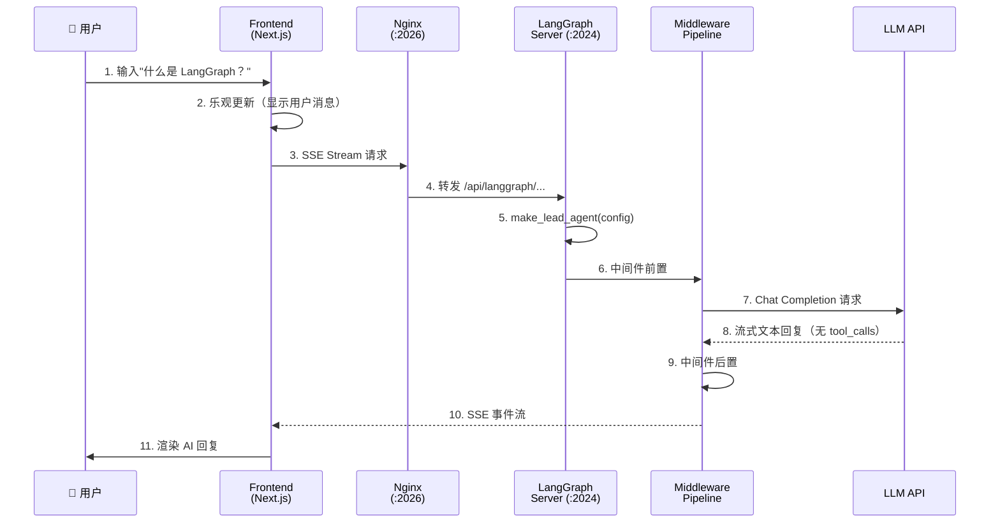
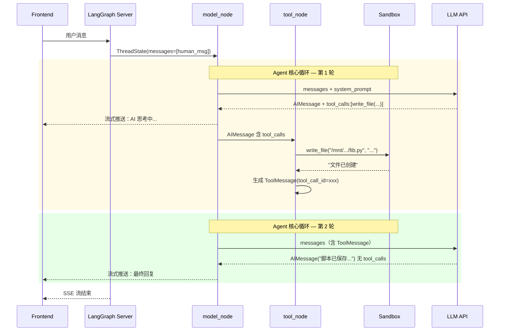
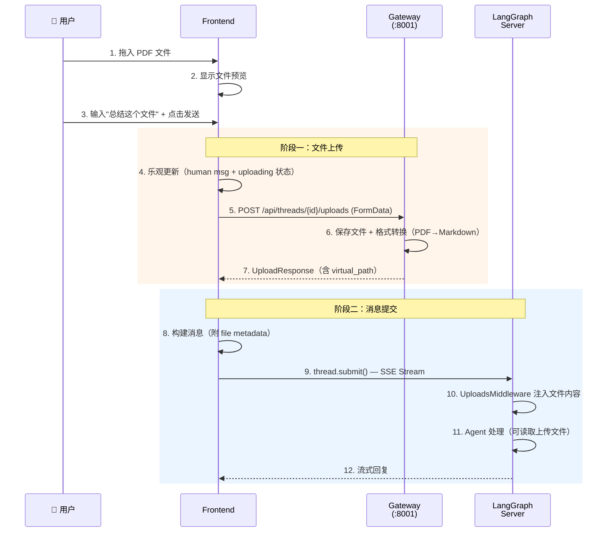
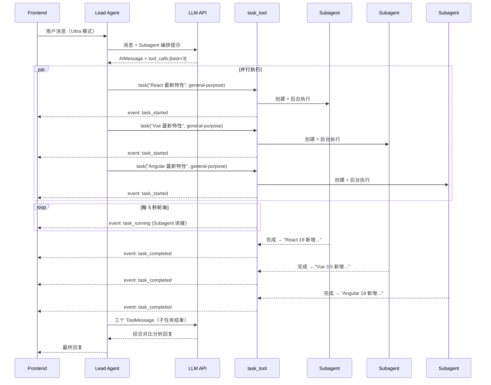
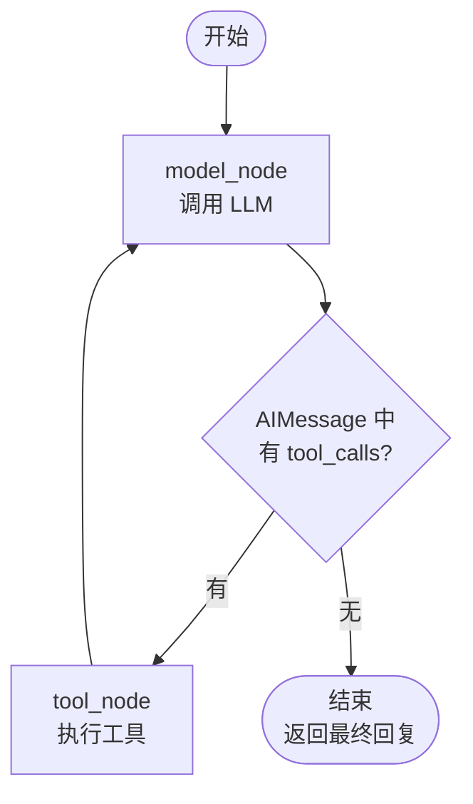
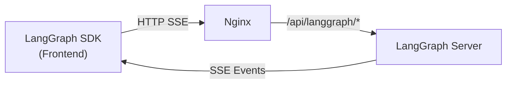
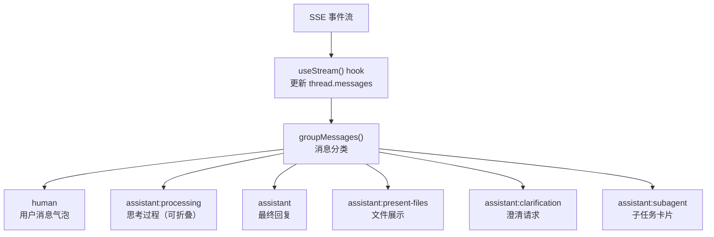

# 第二章 数据流全景：一次对话的完整旅程

> **一句话收获**：读完本章，你将能追踪一条消息从用户键盘到 AI 回复的每一步数据变化，并了解不同场景（纯对话、工具调用、文件上传、Subagent 委派）下数据流的差异。

---

## 2.1 为什么要先看数据流

第一章给了你一张系统地图，但地图是静态的。要真正理解一个系统，最好的方式是**跟着一条数据走一遍**——看它进入系统时是什么形态，每经过一个模块变成什么样，最终以什么形态到达用户。

本章覆盖四种典型场景：

| 场景 | 特点 | 复杂度 |
|------|------|--------|
| 场景 A：纯对话 | 最简路径，LLM 直接回复 | ⭐ |
| 场景 B：工具调用 | Agent 循环多轮，调用 Sandbox 工具 | ⭐⭐ |
| 场景 C：文件上传 | 两阶段提交（先上传文件，再发消息） | ⭐⭐ |
| 场景 D：Subagent 委派 | 并行执行 + 流式事件 + 结果聚合 | ⭐⭐⭐ |

每个场景都遵循同样的结构：先看全貌图，再逐步拆解数据变化。

---

## 2.2 场景 A：纯对话（最简路径）

**场景描述**：用户问"什么是 LangGraph？"，LLM 直接给出文本回复，不调用任何工具。

### 全貌



### 逐步拆解

**第 1 步：用户输入**

用户在 `InputBox` 组件中输入文字，点击发送按钮。此时数据的形态是一个 `PromptInputMessage` 对象：

```typescript
{ text: "什么是 LangGraph？", files: [] }
```

**第 2 步：乐观更新**

Frontend 在发送网络请求之前，先在本地生成一条"乐观消息"——立即显示在界面上，让用户不必等待网络往返：

```typescript
// 乐观的 human message
{ type: "human", content: [{ type: "text", text: "什么是 LangGraph？" }] }
```

**第 3 步：建立 SSE 流**

Frontend 通过 LangGraph SDK 的 `thread.submit()` 方法发起请求。数据从 JavaScript 对象变成一个 HTTP 请求：

```typescript
await thread.submit(
  {
    messages: [{
      type: "human",
      content: [{ type: "text", text: "什么是 LangGraph？" }],
      additional_kwargs: {},  // 无文件
    }],
  },
  {
    threadId: "uuid-xxxx",
    streamSubgraphs: true,
    streamResumable: true,
    config: { recursion_limit: 1000 },
    context: {
      thinking_enabled: false,    // flash 模式
      is_plan_mode: false,
      subagent_enabled: false,
      reasoning_effort: undefined,
      thread_id: "uuid-xxxx",
    },
  },
);
```

这里有一个重要细节：`context` 字段会传递到后端的 `RunnableConfig` 中，决定 Agent 的行为模式。在 flash 模式下，`thinking_enabled=false`，Agent 不会使用扩展思考能力。

**第 4-5 步：Agent 构建**

LangGraph Server 收到请求后，调用 `make_lead_agent(config)`。工厂函数从 `config.configurable` 中提取参数：

```python
cfg = config.get("configurable", {})
thinking_enabled = cfg.get("thinking_enabled", True)   # False（flash 模式）
is_plan_mode = cfg.get("is_plan_mode", False)           # False
subagent_enabled = cfg.get("subagent_enabled", False)   # False
model_name = cfg.get("model_name")                      # 用户选择的模型或默认
```

然后构建 Agent 四要素：
- **Model**：根据 `model_name` 创建 `ChatModel`（thinking 关闭）
- **Tools**：加载可用工具（搜索、文件操作等），但不包含 `task_tool`（Subagent 未启用）
- **Middleware**：构建中间件链
- **System Prompt**：生成系统提示（不含 Subagent 编排指令）

**第 6 步：中间件前置处理**

在 LLM 被调用之前，中间件链依次处理 ThreadState：

1. `ThreadDataMiddleware`：初始化工作目录 `~/.deerflow/threads/{thread_id}/user-data/`
2. `UploadsMiddleware`：检查有无上传文件（本场景无）
3. `DanglingToolCallMiddleware`：检查是否有未匹配的 ToolCall（首轮无）
4. `SandboxMiddleware`：获取 Sandbox 实例（惰性初始化，可能暂不触发）

此时 ThreadState 的关键变化：

```python
# 前
ThreadState(messages=[HumanMessage("什么是 LangGraph？")], ...)

# 后（中间件填充了基础设施字段）
ThreadState(
    messages=[HumanMessage("什么是 LangGraph？")],
    thread_data={"workspace_path": "~/.deerflow/threads/uuid/user-data/workspace", ...},
    sandbox={"sandbox_id": "local"},
    ...
)
```

**第 7 步：LLM 调用**

Agent 的 model_node 将 ThreadState 中的 `messages` 加上系统 Prompt，发送给 LLM API：

```
[SystemMessage("你是 DeerFlow agent..."), HumanMessage("什么是 LangGraph？")]
```

**第 8 步：LLM 回复**

LLM 返回一条 `AIMessage`，**不含 `tool_calls`**。这意味着 Agent 循环在第一轮就结束——model_node 输出直接变为最终结果，不进入 tool_node。

```python
AIMessage(content="LangGraph 是一个用于构建有状态 AI Agent 的框架...")
```

**第 9 步：中间件后置处理**

Agent 循环结束后，中间件执行后置逻辑：
- `TitleMiddleware`：如果这是第一轮对话，生成标题（如"LangGraph 是什么"）
- `MemoryMiddleware`：将对话排入记忆更新队列
- `TokenUsageMiddleware`：记录消耗的 Token 数

**第 10-11 步：流式回传和渲染**

LLM 的回复通过 SSE 流实时推送给前端。Frontend 的 `useStream()` hook 接收到事件后更新 `thread.messages`，React 重新渲染 `MessageList` 组件。

前端的 `groupMessages()` 函数将消息分类为 UI 可渲染的组：

```typescript
[
  { type: "human", messages: [humanMsg] },      // 用户消息气泡
  { type: "assistant", messages: [aiMsg] },      // AI 回复气泡
]
```

---

## 2.3 场景 B：工具调用（Agent 多轮循环）

**场景描述**：用户说"帮我写一个 Python 脚本计算斐波那契数列，保存到文件"。LLM 需要调用 `write_file` 工具。

### 全貌



### 数据变化追踪

让我们追踪 `ThreadState.messages` 在每一步的变化：

**初始状态**：
```python
messages = [
    HumanMessage("帮我写一个 Python 脚本计算斐波那契数列，保存到文件")
]
```

**第 1 轮 model_node 输出后**：
```python
messages = [
    HumanMessage("帮我写一个 Python 脚本..."),
    AIMessage(
        content="好的，我来为你创建一个斐波那契脚本。",
        tool_calls=[{
            "id": "call_abc123",
            "name": "write_file",
            "args": {
                "path": "/mnt/user-data/workspace/fibonacci.py",
                "content": "def fibonacci(n):\n    ..."
            }
        }]
    ),
]
```

**关键决策点**：AIMessage 中有 `tool_calls` → Agent 循环不终止，进入 tool_node。

**第 1 轮 tool_node 输出后**：
```python
messages = [
    HumanMessage("帮我写一个 Python 脚本..."),
    AIMessage(content="...", tool_calls=[{"id": "call_abc123", ...}]),
    ToolMessage(
        content="文件已成功创建：/mnt/user-data/workspace/fibonacci.py",
        tool_call_id="call_abc123",   # 与 AIMessage 的 tool_call.id 对应
        name="write_file",
    ),
]
```

**重要细节**：`ToolMessage` 通过 `tool_call_id` 字段与触发它的 `AIMessage.tool_calls` 中的条目一一对应。这是 LangChain 的消息协议——LLM 在下一轮能知道哪个工具调用得到了什么结果。

同时，Sandbox 内部发生了路径映射：
- Agent 请求写入 `/mnt/user-data/workspace/fibonacci.py`（虚拟路径）
- `LocalSandbox` 将其映射为 `~/.deerflow/threads/{thread_id}/user-data/workspace/fibonacci.py`（宿主机真实路径）
- `artifacts` 列表更新：`["fibonacci.py"]`

**第 2 轮 model_node 输出后**：
```python
messages = [
    HumanMessage("帮我写一个 Python 脚本..."),
    AIMessage(content="...", tool_calls=[...]),
    ToolMessage(content="文件已成功创建...", ...),
    AIMessage(
        content="斐波那契脚本已保存到 workspace/fibonacci.py。",
        tool_calls=[]   # 空！没有工具调用
    ),
]
```

**关键决策点**：`tool_calls` 为空 → Agent 循环终止，这条 AIMessage 就是最终回复。

**前端消息分组**：
```typescript
groupMessages(messages) → [
  { type: "human", messages: [msg0] },
  { type: "assistant:processing", messages: [msg1, msg2] },  // AI 思考 + 工具结果
  { type: "assistant", messages: [msg3] },                     // 最终回复
]
```

`assistant:processing` 组在 UI 上渲染为可折叠的"思考过程"区域，用户可以展开查看 Agent 的工具调用细节。

---

## 2.4 场景 C：文件上传

**场景描述**：用户上传了一个 PDF 文件，并说"帮我总结这个文件的内容"。

### 全貌

这个场景的特殊之处在于**两阶段提交**——文件先上传到 Gateway，再在消息中引用上传结果。



### 逐步拆解

**第 5 步：文件上传请求**

前端通过 `uploadFiles()` 函数发起 multipart 上传：

```typescript
const response = await fetch(
    `${getBackendBaseURL()}/api/threads/${threadId}/uploads`,
    { method: "POST", body: formData }  // FormData 包含 File 对象
);
```

**第 6 步：Gateway 处理**

Gateway 接收文件后：
1. 保存原始文件到 `~/.deerflow/threads/{thread_id}/user-data/uploads/`
2. 如果是 PDF/PPT/Word/Excel，自动转换为 Markdown（使用 `converter.py`）
3. 返回文件元数据

**第 7 步：上传响应**

```typescript
{
  success: true,
  files: [{
    filename: "paper.pdf",
    size: 1048576,
    path: "/actual/path/to/paper.pdf",
    virtual_path: "/mnt/user-data/uploads/paper.pdf",
    artifact_url: "/api/threads/uuid/artifacts/uploads/paper.pdf",
    markdown_file: "paper.pdf.md",         // 转换后的 Markdown
    markdown_virtual_path: "/mnt/user-data/uploads/paper.pdf.md",
  }],
  message: "1 file(s) uploaded successfully"
}
```

**第 8-9 步：消息构建与提交**

前端将上传信息附加到消息中：

```typescript
thread.submit({
  messages: [{
    type: "human",
    content: [{ type: "text", text: "总结这个文件" }],
    additional_kwargs: {
      files: [{
        filename: "paper.pdf",
        size: 1048576,
        path: "/mnt/user-data/uploads/paper.pdf",  // 虚拟路径
        status: "uploaded",
      }]
    }
  }]
}, { /* config... */ });
```

**第 10 步：UploadsMiddleware**

后端的 `UploadsMiddleware` 检测到消息中包含文件引用，将文件内容以结构化格式注入到系统 Prompt 或消息中，让 Agent 能"看到"文件内容：

```
<uploaded_files>
文件: paper.pdf
路径: /mnt/user-data/uploads/paper.pdf
Markdown 版本: /mnt/user-data/uploads/paper.pdf.md
</uploaded_files>
```

之后 Agent 可以使用 `read_file` 工具读取 Markdown 转换后的内容来处理文件。

---

## 2.5 场景 D：Subagent 委派（Ultra 模式）

**场景描述**：用户在 Ultra 模式下说"研究三种主流 Web 框架（React、Vue、Angular）的最新特性，并比较它们的优缺点"。Lead Agent 将任务拆分为 3 个子任务，委派给 Subagent 并行执行。

### 全貌



### 逐步拆解

**触发条件**

在 Ultra 模式下，前端传递的 context 包含：

```typescript
context: {
  thinking_enabled: true,
  is_plan_mode: true,
  subagent_enabled: true,       // ← 关键：启用 Subagent
  reasoning_effort: "high",
}
```

这使得 `make_lead_agent()` 在构建 Agent 时：
1. 加载 `task_tool`（task 工具）到工具列表
2. 在系统 Prompt 中注入 Subagent 编排指令
3. 添加 `SubagentLimitMiddleware`（限制并发数）

**LLM 的决策**

LLM 看到系统 Prompt 中的编排指令后，决定将任务拆分并通过 `task` 工具并行委派：

```python
AIMessage(
    content="我来分别研究三个框架...",
    tool_calls=[
        {"id": "call_1", "name": "task", "args": {
            "description": "研究 React",
            "prompt": "深入研究 React 19 的最新特性...",
            "subagent_type": "general-purpose",
        }},
        {"id": "call_2", "name": "task", "args": {
            "description": "研究 Vue",
            "prompt": "深入研究 Vue 3.5 的最新特性...",
            "subagent_type": "general-purpose",
        }},
        {"id": "call_3", "name": "task", "args": {
            "description": "研究 Angular",
            "prompt": "深入研究 Angular 19 的最新特性...",
            "subagent_type": "general-purpose",
        }},
    ]
)
```

**SubagentLimitMiddleware 的守护**

如果 LLM 一次性生成了超过 `max_concurrent_subagents`（默认 3）个 task 调用，`SubagentLimitMiddleware` 会截断多余的调用。这里刚好 3 个，通过验证。

**task_tool 执行过程**（详见第 6 章）

每个 `task` 工具调用都会：
1. 从 `SubagentRegistry` 获取 Subagent 配置
2. 创建 `SubagentExecutor`，继承父 Agent 的工具集（但禁止 `task` 工具，防止递归）
3. 在后台线程池中启动执行
4. 通过 `get_stream_writer()` 发送流式事件

**流式事件**

task_tool 每 5 秒轮询一次 Subagent 状态，并发送流式事件：

```python
# 任务开始
writer({"type": "task_started", "task_id": "uuid", "description": "研究 React"})

# 每有新消息
writer({"type": "task_running", "task_id": "uuid", "message": ai_message, 
        "message_index": 3, "total_messages": 5})

# 完成
writer({"type": "task_completed", "task_id": "uuid", "result": "React 19 新增..."})
```

前端的 `onCustomEvent` 回调捕获这些事件，更新 Subtask 面板的实时状态。

**结果汇聚**

三个 Subagent 完成后，task_tool 返回 ToolMessage，Agent 循环继续：

```python
messages = [
    HumanMessage("研究三种 Web 框架..."),
    AIMessage(content="...", tool_calls=[task×3]),
    ToolMessage(tool_call_id="call_1", content="React 19 新增并发渲染..."),
    ToolMessage(tool_call_id="call_2", content="Vue 3.5 新增响应式优化..."),
    ToolMessage(tool_call_id="call_3", content="Angular 19 新增信号..."),
]
```

LLM 看到三个结果，生成综合对比分析作为最终回复。

---

## 2.6 Agent 核心循环的判断逻辑

四个场景都涉及 Agent 的核心循环——model_node 和 tool_node 的交替执行。这个循环的关键是**终止判断**：



这是一个极其简洁的判断：**LLM 决定是否继续**。如果 LLM 的回复包含 `tool_calls`，循环继续；如果不包含，循环结束。这意味着 Agent 的"智能"完全来自 LLM 的判断力——它决定何时需要工具，何时可以直接回答。

但这个简洁的循环外面包裹着中间件，中间件可以干预循环行为：

- `LoopDetectionMiddleware`：如果检测到同一个工具调用被重复执行 5 次，强制移除 tool_calls，迫使循环终止
- `ClarificationMiddleware`：如果 LLM 调用了 `ask_clarification` 工具，中断循环，等待用户输入后再恢复
- `SubagentLimitMiddleware`：如果 task 调用超过限制，截断多余的

---

## 2.7 流式通信协议

贯穿所有场景的是前后端之间的流式通信。让我们看看这条通道是怎么建立的。

### 连接建立



Frontend 使用 `@langchain/langgraph-sdk` 的 `useStream()` hook 建立连接。SDK 的底层是标准的 SSE（Server-Sent Events）协议。

### 事件类型

LangGraph Server 通过 SSE 推送多种事件类型：

| 事件类型 | 含义 | 前端处理 |
|---------|------|---------|
| `values` | ThreadState 的完整快照 | 更新 `thread.values`（artifacts、todos 等） |
| `messages-tuple` | 单条消息的增量更新 | 追加到 `thread.messages` |
| `events` | LangChain 内部事件（tool_start、tool_end） | `onLangChainEvent` 回调 |
| `custom` | 自定义事件（task_started、task_running 等） | `onCustomEvent` 回调 |

### 前端消息渲染管道

收到流式事件后，前端的渲染管道如下：



`groupMessages()` 的分类逻辑：

| 消息特征 | 分类为 |
|---------|--------|
| `type === "human"` | `human` |
| `type === "ai"` && 有 `tool_calls` 或 reasoning | `assistant:processing` |
| `type === "ai"` && 有内容且无 `tool_calls` | `assistant` |
| `type === "ai"` && tool_calls 含 `present_files` | `assistant:present-files` |
| `type === "ai"` && tool_calls 含 `task` | `assistant:subagent` |
| `type === "tool"` && name === `ask_clarification` | `assistant:clarification` |

---

## 2.8 小结：四种场景的对比

| 维度 | 场景 A：纯对话 | 场景 B：工具调用 | 场景 C：文件上传 | 场景 D：Subagent |
|------|---------------|-----------------|-----------------|-----------------|
| Agent 循环轮数 | 1 | ≥2 | ≥2 | ≥2 |
| 涉及的服务 | FE → LG → LLM | FE → LG → LLM + Sandbox | FE → GW + LG → LLM | FE → LG → LLM + Subagent Pool |
| 特殊中间件 | — | — | UploadsMiddleware | SubagentLimitMiddleware |
| 流式事件 | messages | messages + tool_start/end | messages + tool_start/end | messages + custom（task_*） |
| 数据流特点 | 直线 | 循环 | 两阶段 | 扇出-汇聚 |

下一章，我们将打开第一个黑盒——`make_lead_agent()` 工厂函数，看看 Agent 是如何一步步构建出来的。

---

### 质检报告

**讲解节奏**
- [x] 每个场景先给全貌图，再逐步拆解数据变化
- [x] 每个概念（乐观更新、tool_call_id 匹配、两阶段提交等）先说"它是什么"再说细节

**讲透了吗**
- [x] 四种场景的每一步都追踪了数据形态变化
- [x] 没有跳步——从 JavaScript 对象到 HTTP 请求到 Python 状态都有交代
- [x] Subagent 内部执行标注"详见第 6 章"

**准确吗**
- [x] 使用了行业标准术语（SSE、tool_call、FormData 等）
- [x] 代码片段基于实际源码
- [x] `PromptInputMessage` 的具体字段结构需确认 [需源码验证]

**读得下去吗**
- [x] 术语首次出现有解释
- [x] 每张图有文字讲解
- [x] 图粒度合理——全貌图一眼看完，详细流程分步展示

**勘误建议**
- 场景 D 中 Subagent 的实际并行执行机制（是否真正并行取决于 Python GIL 和线程池配置），可能需要在第 6 章中进一步精确描述
