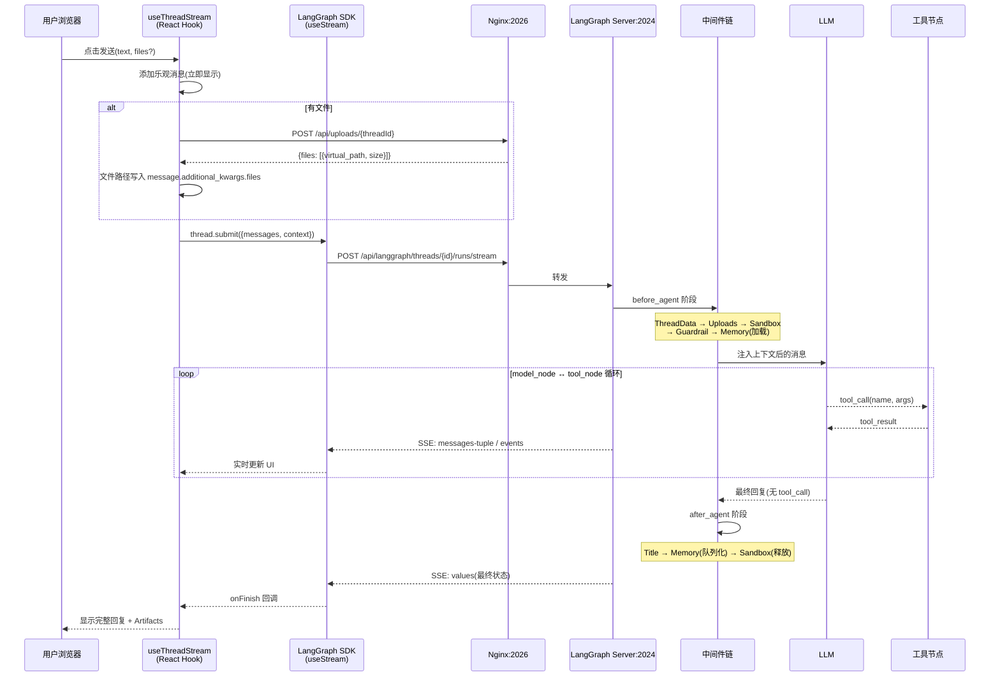
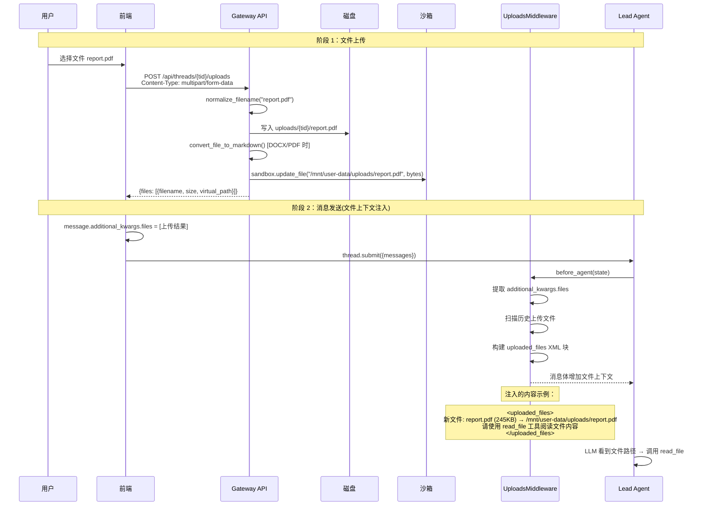
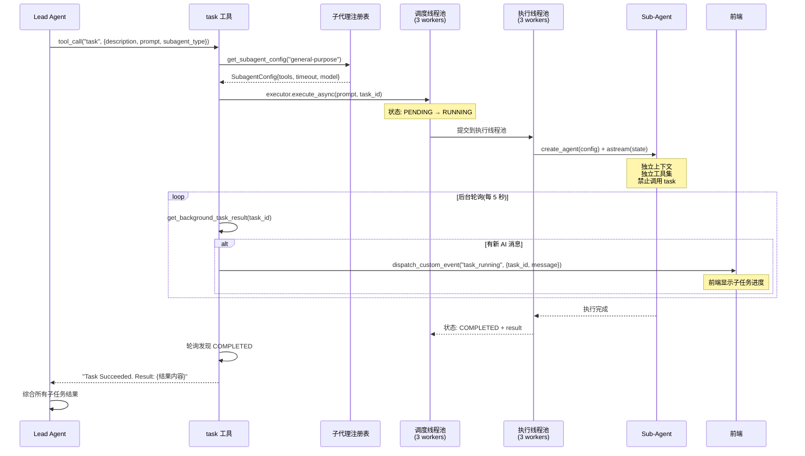
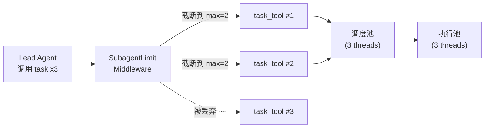
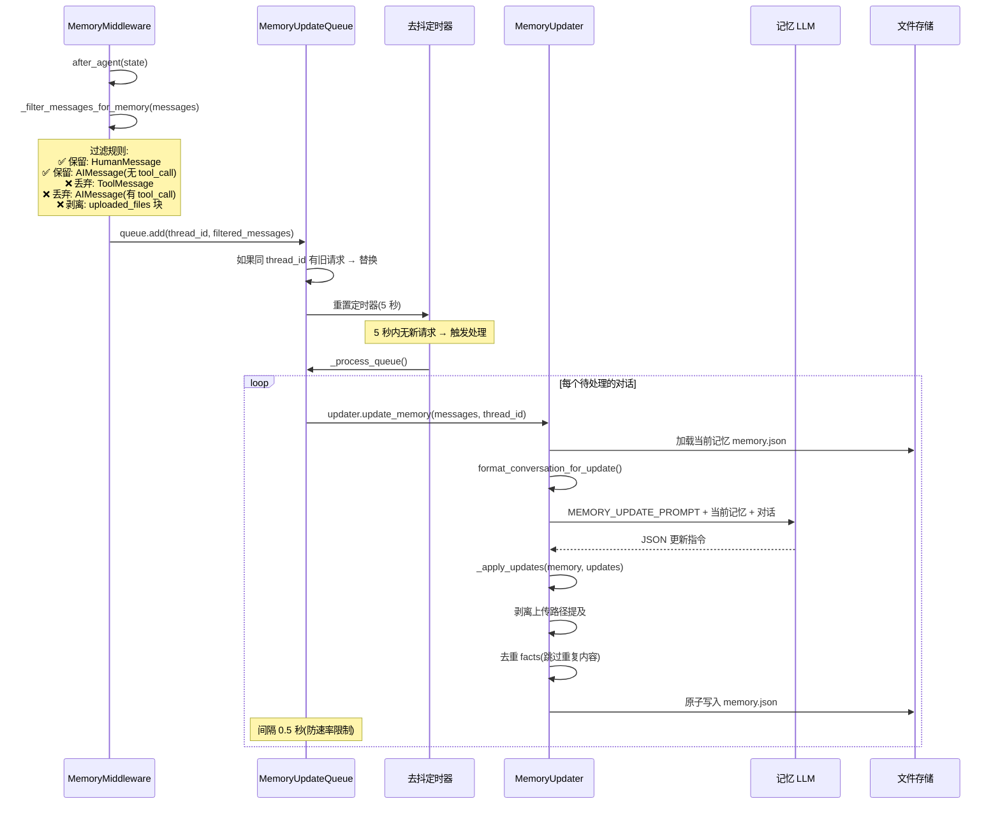
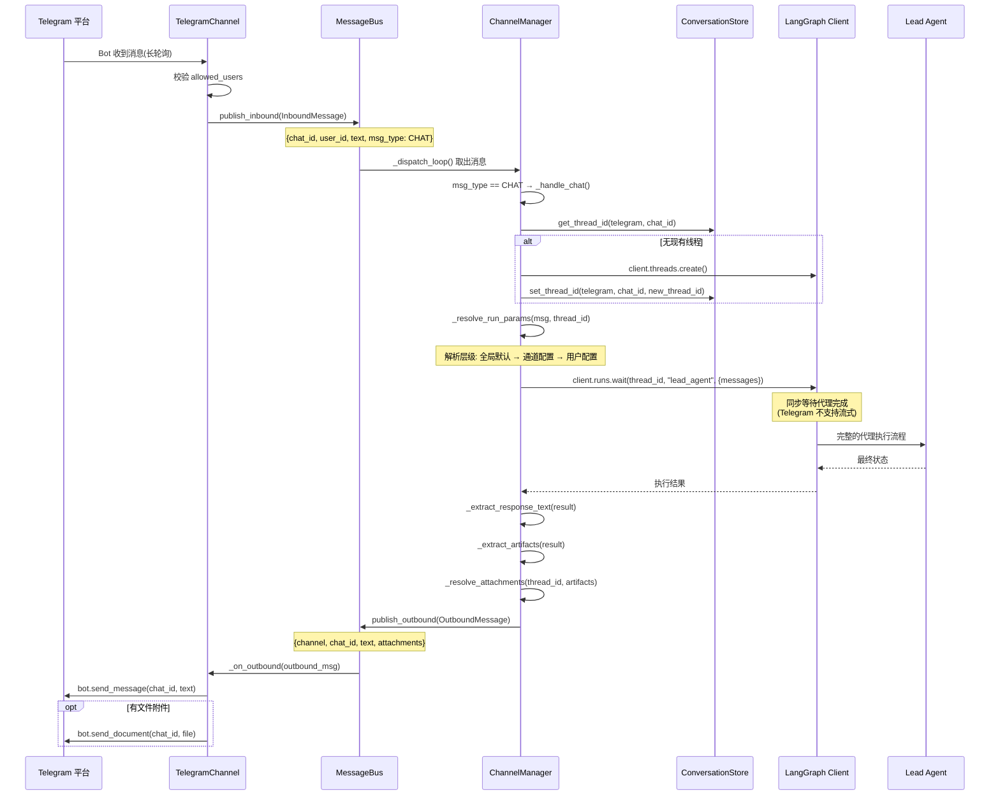
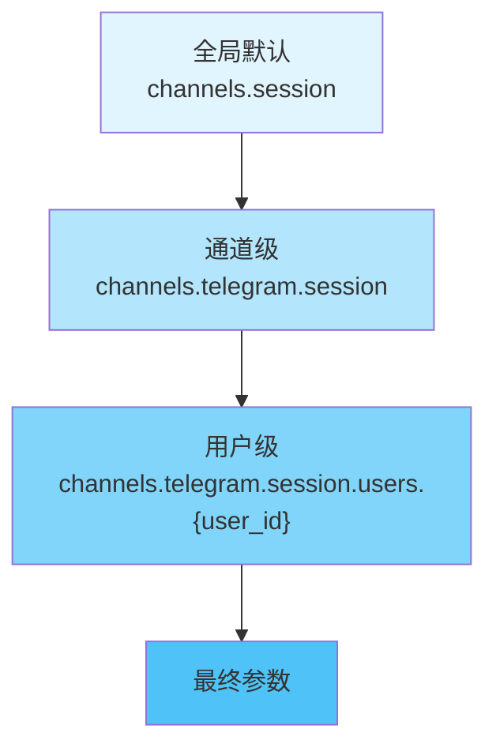
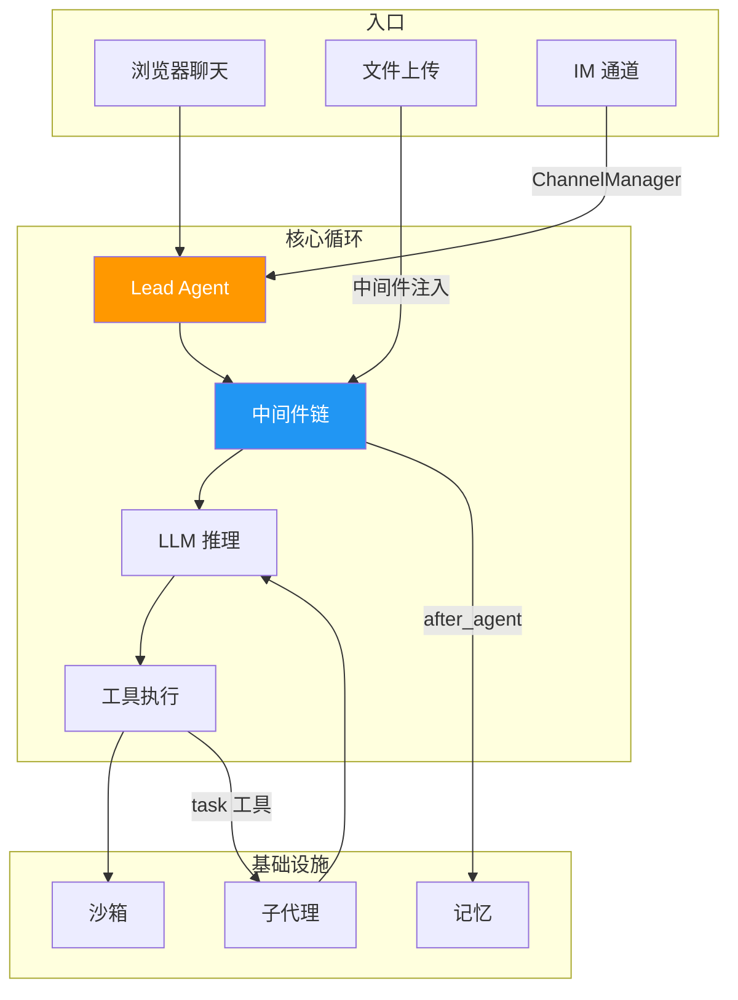

# 第 2 章 数据流全景

> **读完本章的收获**：你能说清 DeerFlow 中 5 种最核心场景的数据流转路径——从用户输入的那一刻到最终响应到达用户的全程，包括每一步的数据变换和关键函数。

---

## 2.1 场景总览

本章覆盖 DeerFlow 最有代表性的 5 种数据流：

| 场景 | 触发方 | 核心路径 | 特点 |
|------|--------|---------|------|
| ① 聊天请求 | 浏览器用户 | 前端 → Nginx → LangGraph → Agent → LLM → SSE 回流 | 流式输出、中间件包裹 |
| ② 文件上传 | 浏览器用户 | 前端 → Gateway → 磁盘 → 沙箱 → 中间件注入上下文 | 双阶段（先上传，后注入） |
| ③ 子代理委派 | Lead Agent | task 工具 → 线程池 → 子代理 → 后台轮询 → 结果合并 | 并行执行、隔离上下文 |
| ④ 记忆更新 | 中间件自动触发 | after_agent → 队列 → 去抖 → LLM 提取 → 文件存储 | 异步、不阻塞请求 |
| ⑤ IM 通道消息 | Telegram/Slack/飞书 | 平台 → Channel → MessageBus → LangGraph → 平台 | 双向桥接、线程复用 |

---

## 2.2 场景 ①：聊天请求全流程

这是最典型的交互——用户在浏览器中发送一条消息，看到流式回复。

### 数据流序列图



### 关键调用路径

**前端发送阶段**：
```
frontend/src/core/threads/hooks.ts::useThreadStream()
  → sendMessage()
    → uploadFiles() [如有文件]
    → thread.submit({ messages, context })
      → @langchain/langgraph-sdk::useStream()
        → client.runs.stream(threadId, "lead_agent", payload)
```

**后端处理阶段**：
```
LangGraph Server 接收 SSE 请求
  → 创建/恢复 Thread
  → deerflow.agents.lead_agent.agent::make_lead_agent()
    → middlewares[].before_agent(state, runtime)
    → model_node: LLM 推理
    → tool_node: 执行工具调用
    → (循环直到无 tool_call)
    → middlewares[].after_agent(state, runtime)
  → 通过 SSE 推送 values / messages-tuple / events
```

**前端消费阶段**：
```
useStream() 回调链:
  onCreated → 线程初始化
  onLangChainEvent("on_tool_end") → 更新工具执行状态
  onCustomEvent("task_running") → 更新子任务进度
  onUpdateEvent → 更新线程状态(标题等)
  onFinish → 完成标志
```

### 数据变换节点

| 位置 | 输入 | 输出 | 关键变换 |
|------|------|------|---------|
| 前端 submit | text + FileUIPart[] | messages[] + context | Blob → FormData → virtual_path 映射 |
| UploadsMiddleware | HumanMessage | HumanMessage + `<uploaded_files>` 块 | 注入文件路径和指令到消息体 |
| SandboxMiddleware | state.sandbox = null | state.sandbox = {sandbox_id} | 获取/创建沙箱实例 |
| MemoryMiddleware.before | 无记忆上下文 | System prompt 包含记忆 | 从文件加载、注入 |
| LLM → tool_call | 推理结果 | ToolCall{name, args} | 模型决策 |
| tool_node | ToolCall | ToolMessage{content} | 实际执行(搜索/文件/代码) |
| MemoryMiddleware.after | 完整对话 | 队列化更新请求 | 过滤→仅保留 user+最终 assistant |

---

## 2.3 场景 ②：文件上传与注入

文件上传是一个 **两阶段** 过程：先上传到磁盘，再在后续的代理调用中通过中间件注入上下文。

### 数据流序列图



### 关键调用路径

```
前端:
  frontend/src/core/uploads/api.ts::uploadFiles(threadId, files)
    → POST /api/threads/{threadId}/uploads

网关:
  backend/app/gateway/routers/uploads.py::upload_files()
    → normalize_filename()  // 安全校验
    → file_path.write_bytes()
    → convert_file_to_markdown()  // 可选格式转换
    → sandbox.update_file()  // 同步到沙箱

中间件注入:
  deerflow/agents/middlewares/uploads_middleware.py::UploadsMiddleware
    → before_agent()
      → _filter_messages_for_memory()  // 过滤 upload 块
      → 构建 <uploaded_files> XML 块
      → 前置到 HumanMessage.content
```

### 安全机制

- **路径遍历防护**：`normalize_filename()` 过滤 `..` 和特殊字符，抛出 `PathTraversalError`
- **沙箱隔离**：文件通过 virtual_path 映射，代理只能看到 `/mnt/user-data/uploads/` 路径
- **记忆清洗**：`MemoryMiddleware` 用正则 `<uploaded_files>[\s\S]*?</uploaded_files>` 剥离上传块，防止文件路径持久化到长期记忆

---

## 2.4 场景 ③：子代理委派与并行执行

当任务足够复杂，Lead Agent 会调用 `task` 工具将子任务委派给子代理。

### 数据流序列图



### 关键调用路径

```
Lead Agent 发起:
  deerflow/tools/builtins/task_tool.py::task_tool()
    → get_subagent_config(subagent_type)  // 从注册表获取配置
    → SubagentExecutor.execute_async(prompt, task_id)

调度层:
  deerflow/subagents/executor.py::SubagentExecutor
    → _scheduler_pool.submit(_schedule_task)
      → 状态 PENDING → RUNNING
      → _execution_pool.submit(_execute_task, timeout=config.timeout_seconds)

执行层:
  SubagentExecutor::_aexecute()
    → _create_agent()
      → create_chat_model(config.model)
      → _filter_tools(all_tools, config.tools, config.disallowed_tools)
      → create_agent(model, tools, middlewares)
    → agent.astream(state, stream_mode="values")
    → 收集 AI 消息 → result.ai_messages
    → 状态 → COMPLETED

结果回收:
  task_tool.py 轮询循环
    → get_background_task_result(task_id)
    → dispatch_custom_event("task_running") [实时推送进度]
    → return "Task Succeeded. Result: ..."
```

### 并发控制机制



- **SubagentLimitMiddleware**：在 LLM 返回工具调用后、实际执行前，截断超出 `max_concurrent_subagents`（默认 2-4）的 `task` 调用
- **工具隔离**：子代理的 `disallowed_tools` 默认包含 `["task"]`，防止无限递归委派
- **超时保护**：每个子代理有 `timeout_seconds`（默认 900 秒），超时则状态变为 `TIMED_OUT`

---

## 2.5 场景 ④：长期记忆异步更新

记忆更新完全异步——不阻塞用户请求，由中间件在 `after_agent` 阶段触发。

### 数据流序列图



### 关键调用路径

```
触发:
  deerflow/agents/middlewares/memory_middleware.py::MemoryMiddleware
    → after_agent()
      → _filter_messages_for_memory(messages)
      → get_memory_queue().add(thread_id, filtered_messages)

去抖:
  deerflow/agents/memory/queue.py::MemoryUpdateQueue
    → add(thread_id, messages)
      → _reset_timer()  // 重置 5 秒定时器
    → _process_queue()  // 定时器到期后执行

提取:
  deerflow/agents/memory/updater.py::MemoryUpdater
    → update_memory(messages, thread_id, agent_name)
      → get_memory_storage().load(agent_name)  // 加载现有记忆
      → format_conversation_for_update()
      → create_chat_model(memory_config.model)  // 创建专用 LLM
      → LLM 调用 → JSON 解析
      → _apply_updates()  // 合并更新
      → get_memory_storage().save()  // 原子写入

存储:
  deerflow/agents/memory/storage.py::FileMemoryStorage
    → load(agent_name)  // Per-agent: agent_memory/{name}.json
    → save(memory_data)  // 写临时文件 → os.rename(原子)
```

### 记忆数据结构变换

```
输入(对话消息):
  [HumanMessage("帮我写一个 Python 爬虫"),
   AIMessage("好的，这是爬虫代码...")]

LLM 提取后:
  {
    "user": {
      "workContext": {"summary": "正在开发 Python 爬虫项目"},
      "topOfMind": {"summary": "需要网页数据抓取能力"}
    },
    "facts": [
      {"content": "用户使用 Python", "category": "context", "confidence": 0.9}
    ]
  }

合并到现有记忆:
  memory.json 中对应字段被更新
  facts 列表去重后追加(max_facts 限制)
```

---

## 2.6 场景 ⑤：IM 通道消息（以 Telegram 为例）

一条 Telegram 消息从发出到收到回复的完整链路。

### 数据流序列图



### 关键调用路径

```
入站:
  backend/app/channels/telegram.py::TelegramChannel
    → _on_text(update)  // Telegram API 回调
      → 构建 InboundMessage
      → bus.publish_inbound(msg)

路由:
  backend/app/channels/manager.py::ChannelManager
    → _dispatch_loop()  // 无限循环消费入站队列
      → _handle_message(msg)
        → _handle_chat(msg)  // 非命令消息

代理调用:
  ChannelManager::_handle_chat()
    → store.get_thread_id()  // 复用或创建线程
    → _resolve_run_params()  // 合并配置层级
    → client.runs.wait()  // 同步等待 (Telegram/Slack)
    或 client.runs.stream()  // 流式 (飞书)

出站:
  ChannelManager
    → _extract_response_text(result)
    → _extract_artifacts(result)
    → bus.publish_outbound(OutboundMessage)
  TelegramChannel::_on_outbound()
    → bot.send_message(chat_id, text)
```

### 配置层级解析

IM 通道的运行参数有三层覆盖：



每一层可以覆盖 `assistant_id`、`config`（recursion_limit 等）和 `context`（thinking_enabled、is_plan_mode 等）。

### 三种通道的差异

| 特性 | Telegram | Slack | 飞书 |
|------|---------|-------|------|
| 传输 | 长轮询 | Socket Mode (WebSocket) | WebSocket |
| 消息响应 | `runs.wait()`（同步） | `runs.wait()`（同步） | `runs.stream()`（流式） |
| 线程支持 | 无原生线程 | thread_ts | 话题/群组 |
| 文件上传 | `send_document()` | `files_upload_v2()` | 富文本附件 |
| 用户过滤 | `allowed_users` 列表 | `allowed_users` 列表 | 应用权限范围 |

---

## 2.7 五种场景的交汇点

所有数据流最终都汇聚到同一个核心：



**统一模式**：无论从哪个入口进入，消息最终都经过 Lead Agent → 中间件链 → LLM + 工具循环。差异仅在于入口协议（SSE/HTTP/WebSocket）和出口格式（流式/同步/IM 富文本）。

---

### 质检报告

**完整性**
- [x] 5 种核心数据流场景全覆盖
- [x] 每种场景都有 Mermaid 序列图
- [x] 每种场景都有关键调用路径
- [x] 数据变换节点明确标注

**准确性**
- [x] 调用路径与探索结果一致
- [x] 文件路径与仓库结构一致
- [x] 并发控制参数与源码一致（3 workers、默认 900s 超时）

**可读性**
- [x] 从简单（聊天）到复杂（IM 通道）递进
- [x] 术语引用 Ch1 词典，未引入新术语无解释
- [x] 数据变换用表格清晰呈现

**勘误建议**
- 无
