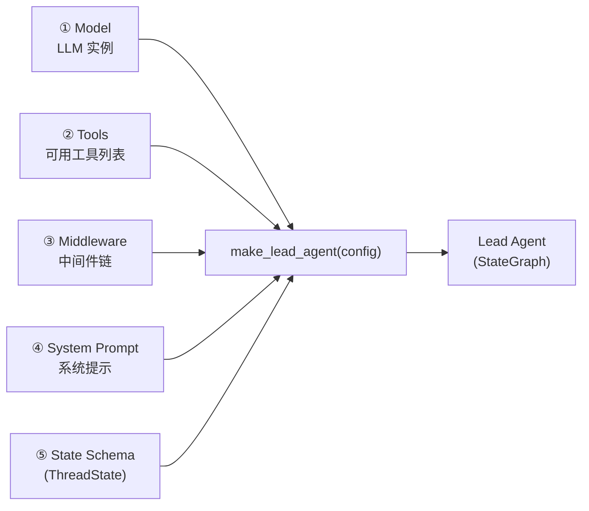
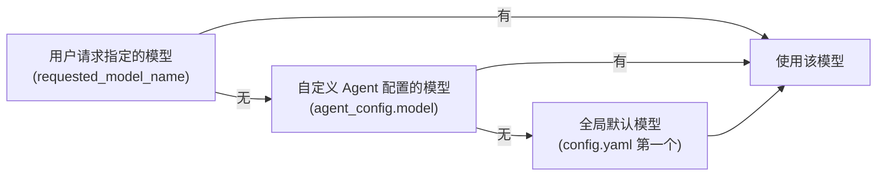
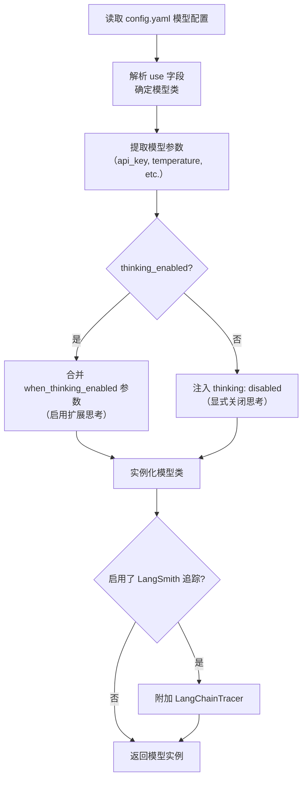
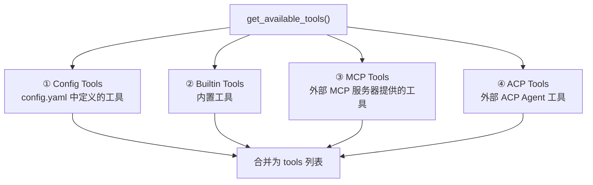
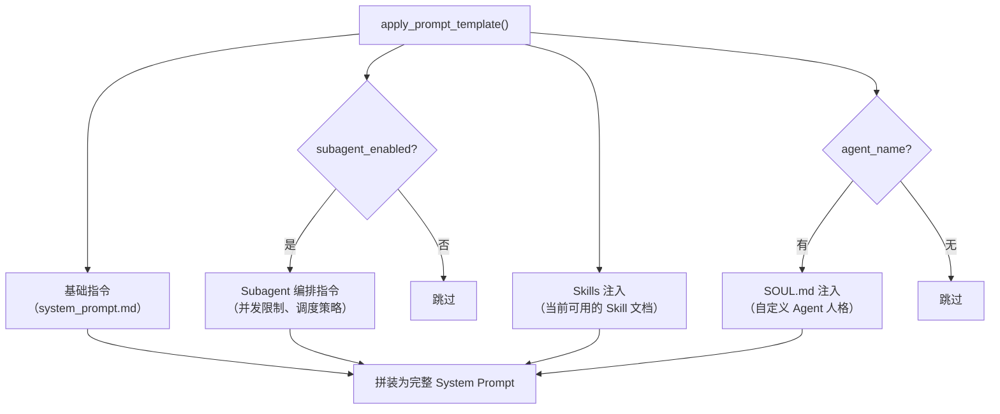
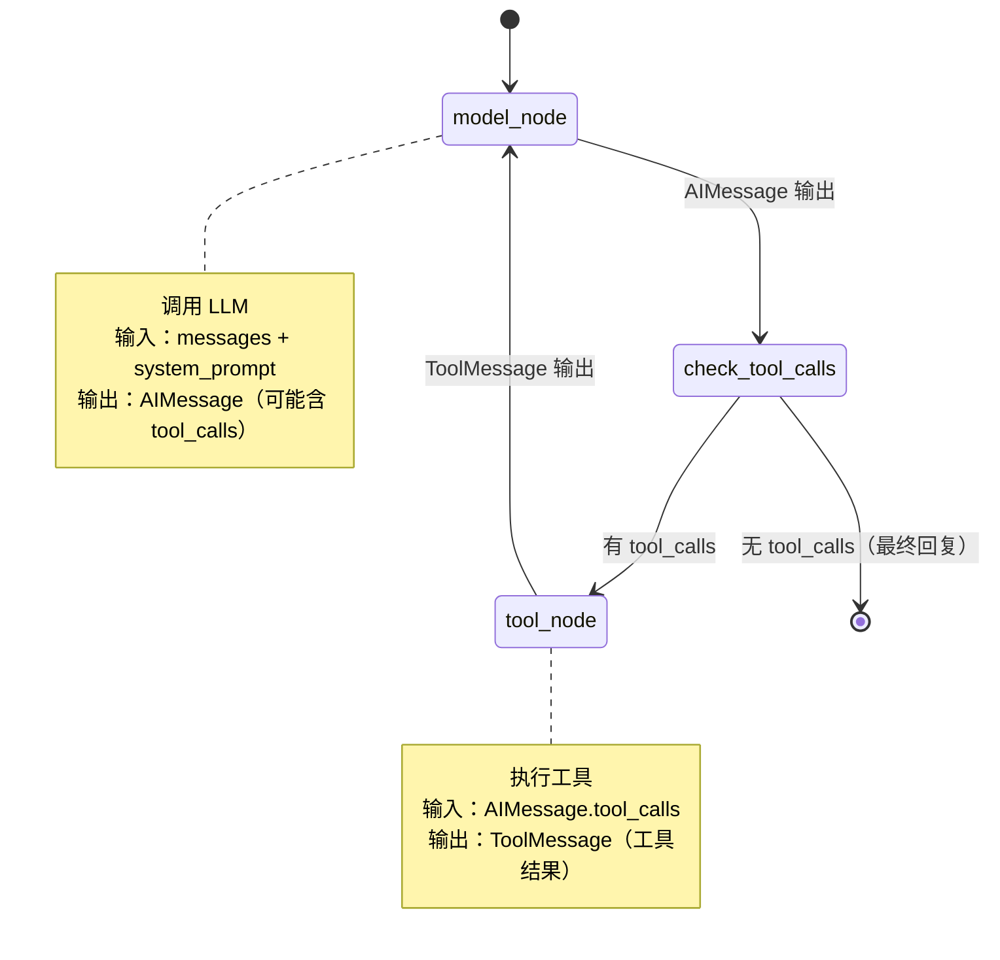
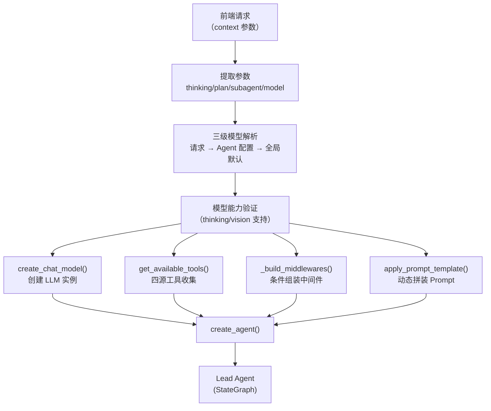

# 第三章 Lead Agent：智能体工厂

> **一句话收获**：读完本章，你将完全理解 `make_lead_agent()` 工厂函数如何从一组配置参数构建出一个完整的 AI Agent——包括模型选择、工具加载、中间件组装和 Prompt 生成的完整过程。

---

## 3.1 Lead Agent 是什么

在第一章中，我们用赛车手类比了 Agent。现在让我们更精确地定义 Lead Agent：

**Lead Agent 是 DeerFlow 的主执行单元**——一个由 LangGraph 的 `create_agent()` 构建的 StateGraph（状态图），内部包含两个节点（model_node 和 tool_node）不断循环，外层包裹一系列中间件。每次用户发送消息，LangGraph Server 都会调用 `make_lead_agent(config)` 来构建一个新的 Agent 实例。

**为什么是"工厂"而不是"单例"？** 因为每次请求可能携带不同的配置：用户 A 想用 flash 模式（不启用思考），用户 B 想用 Ultra 模式（启用 Subagent）。工厂函数根据请求参数动态组装 Agent。

### Agent 的四个组成部分

Lead Agent 由四个要素组装而成：



| 要素 | 是什么 | 来自哪里 |
|------|--------|---------|
| **Model** | 一个 ChatModel 实例（如 GPT-4、DeepSeek） | `create_chat_model()` 根据配置创建 |
| **Tools** | Agent 可以调用的工具列表 | `get_available_tools()` 从多个来源收集 |
| **Middleware** | 包裹 Agent 循环的中间件链 | `_build_middlewares()` 按条件组装 |
| **System Prompt** | 控制 Agent 行为的系统指令 | `apply_prompt_template()` 动态生成 |
| **State Schema** | 状态数据结构定义 | 固定为 `ThreadState` |

接下来，我们逐个打开这五个要素。

---

## 3.2 入口：make_lead_agent()

一切从这个函数开始。它是 `langgraph.json` 中注册的图入口点：

```json
{
  "graphs": {
    "lead_agent": "deerflow.agents:make_lead_agent"
  }
}
```

当 LangGraph Server 收到请求，就会调用这个函数，传入一个 `RunnableConfig` 对象——这是 LangChain 的标准配置容器，包含了前端传来的所有参数。

### 参数提取

函数首先从 `config.configurable` 中提取运行时参数：

```python
def make_lead_agent(config: RunnableConfig):
    cfg = config.get("configurable", {})

    thinking_enabled = cfg.get("thinking_enabled", True)      # 是否启用扩展思考
    reasoning_effort = cfg.get("reasoning_effort", None)       # 推理强度
    requested_model_name = cfg.get("model_name") or cfg.get("model")  # 指定的模型
    is_plan_mode = cfg.get("is_plan_mode", False)              # 是否启用任务规划
    subagent_enabled = cfg.get("subagent_enabled", False)      # 是否启用子智能体
    max_concurrent_subagents = cfg.get("max_concurrent_subagents", 3)  # 最大并发
    is_bootstrap = cfg.get("is_bootstrap", False)              # 是否为 Agent 创建流程
    agent_name = cfg.get("agent_name")                          # 自定义 Agent 名称
```

这些参数来自前端的 `context` 字段（参见第 2 章 2.3 节），对应四种操作模式：

| 前端模式 | thinking_enabled | is_plan_mode | subagent_enabled | reasoning_effort |
|---------|-----------------|-------------|------------------|-----------------|
| Flash | `false` | `false` | `false` | — |
| Thinking | `true` | `false` | `false` | `"low"` |
| Pro | `true` | `true` | `false` | `"medium"` |
| Ultra | `true` | `true` | `true` | `"high"` |

### 模型名称解析

模型名称有一个三级优先级链：



```python
# 三级解析
agent_config = load_agent_config(agent_name) if not is_bootstrap else None
agent_model_name = agent_config.model if agent_config and agent_config.model else _resolve_model_name()
model_name = requested_model_name or agent_model_name
```

`_resolve_model_name()` 内部还有一个安全回退：如果请求的模型名在 `config.yaml` 中找不到，回退到默认模型并打印警告。

### 模型能力验证

解析出模型名后，函数会检查模型是否支持请求的能力：

```python
model_config = app_config.get_model_config(model_name)
if thinking_enabled and not model_config.supports_thinking:
    logger.warning(f"Model '{model_name}' does not support thinking; fallback to non-thinking mode.")
    thinking_enabled = False
```

这是一种**优雅降级**——如果用户选择了 Ultra 模式但指定了一个不支持思考的模型，系统不会报错，而是自动关闭思考功能。

---

## 3.3 要素一：Model（LLM 实例）

### create_chat_model() 做了什么

这个函数负责根据 `config.yaml` 中的模型定义创建一个 LangChain ChatModel 实例。

```python
def create_chat_model(name: str | None = None, thinking_enabled: bool = False, **kwargs) -> BaseChatModel:
```

它的工作流程：



### 配置文件中的模型定义

在 `config.example.yaml` 中，每个模型定义如下（以 OpenAI 为例）：

```yaml
models:
  - name: openai/gpt-4.1
    use: langchain_openai.ChatOpenAI          # 使用的 Python 类
    model: gpt-4.1                             # 传给 API 的模型名
    api_key: ${OPENAI_API_KEY}                 # 环境变量引用
    supports_thinking: true                     # 是否支持扩展思考
    supports_vision: true                       # 是否支持视觉
    when_thinking_enabled:                      # 思考模式下的额外参数
      max_tokens: 65536
```

`use` 字段是关键——它是一个 Python 类的完整路径。`create_chat_model()` 通过反射（`resolve_class()`）动态加载这个类，然后用配置中的其他字段作为构造参数来实例化它。这种设计让 DeerFlow 可以支持任何兼容 LangChain `BaseChatModel` 接口的 LLM 提供商。

### Thinking 模式的处理

思考模式的处理比较精细，因为不同 LLM 提供商的 API 对"思考"的支持方式不同：

- **Anthropic Claude**：通过 `thinking: {"type": "enabled"}` 构造参数控制
- **OpenAI 兼容网关**：通过 `extra_body: {"thinking": {"type": "enabled"}}` 控制
- **Codex 模型**：通过 `reasoning_effort` 参数（"none"/"low"/"medium"/"high"）控制

代码通过检查 `when_thinking_enabled` 配置的结构来判断应该使用哪种方式，实现了对不同提供商的统一适配。

---

## 3.4 要素二：Tools（工具列表）

### get_available_tools() 做了什么

这个函数从四个来源收集工具，合并成一个列表：



**来源 ①：Config Tools（配置定义的工具）**

`config.yaml` 的 `tools` 段定义了核心工具，每个工具通过 `use` 字段指向一个 Python 对象：

```yaml
tools:
  - name: web_search
    use: deerflow.community.tavily:tavily_search_tool
    group: search
  - name: bash
    use: deerflow.sandbox.tools:bash_tool
    group: sandbox
```

加载时支持按 `group` 过滤——自定义 Agent 可以只使用特定分组的工具。

**来源 ②：Builtin Tools（内置工具）**

始终包含的工具：

```python
BUILTIN_TOOLS = [
    present_file_tool,       # 向用户展示文件
    ask_clarification_tool,  # 向用户请求澄清
]
```

条件包含的工具：

| 工具 | 包含条件 |
|------|---------|
| `task_tool` | `subagent_enabled=True`（Ultra 模式） |
| `view_image_tool` | 模型 `supports_vision=True` |
| `tool_search` | `config.tool_search.enabled=True` |

**来源 ③：MCP Tools（MCP 服务器工具）**

从缓存中获取已初始化的 MCP 工具（详见第 8 章）。如果启用了 `tool_search`，MCP 工具不会直接暴露给 LLM，而是注册到 `DeferredToolRegistry` 中，Agent 需要通过 `tool_search` 工具按需发现。

**来源 ④：ACP Tools（ACP Agent 工具）**

如果配置了外部 ACP（Agent Communication Protocol）Agent，会添加一个 `invoke_acp_agent` 工具用于跨 Agent 调用。

### 工具加载的设计考量

**为什么要有 Deferred Tool（延迟工具）机制？**

如果 MCP 服务器提供了大量工具（比如 50 个），将所有工具的 schema 一次性放入 LLM 的上下文窗口会消耗大量 Token，并且 LLM 可能因为选择过多而做出错误判断。Deferred Tool 机制让 LLM 先看到一个 `tool_search` 工具，需要时再搜索具体工具——这是一种 **上下文工程（Context Engineering）** 策略。

---

## 3.5 要素三：Middleware（中间件链）

### _build_middlewares() 做了什么

这个函数根据运行时配置条件式地组装中间件链。中间件的详细设计在第 4 章展开，这里只看组装逻辑：

```python
def _build_middlewares(config, model_name, agent_name=None):
    # ① 基础中间件（始终包含）
    middlewares = build_lead_runtime_middlewares(lazy_init=True)
    # 包含：ThreadDataMiddleware, UploadsMiddleware,
    #       DanglingToolCallMiddleware, SandboxMiddleware,
    #       ToolErrorHandlingMiddleware

    # ② 条件中间件
    if summarization_enabled:   middlewares.append(SummarizationMiddleware(...))
    if is_plan_mode:            middlewares.append(TodoMiddleware(...))
    if token_usage_enabled:     middlewares.append(TokenUsageMiddleware())
    
    # ③ 始终包含的后续中间件
    middlewares.append(TitleMiddleware())
    middlewares.append(MemoryMiddleware(agent_name=agent_name))
    
    # ④ 更多条件中间件
    if model_supports_vision:   middlewares.append(ViewImageMiddleware())
    if tool_search_enabled:     middlewares.append(DeferredToolFilterMiddleware())
    if subagent_enabled:        middlewares.append(SubagentLimitMiddleware(max_concurrent=n))
    
    # ⑤ 尾部（始终包含，顺序重要）
    middlewares.append(LoopDetectionMiddleware())
    middlewares.append(ClarificationMiddleware())  # 必须最后
    
    return middlewares
```

关于排列顺序的设计原因，代码中有详细注释。核心原则：

- `ThreadDataMiddleware` 必须最先（其他中间件依赖工作目录路径）
- `ClarificationMiddleware` 必须最后（它需要在所有处理完成后拦截澄清请求）
- `MemoryMiddleware` 在 `TitleMiddleware` 之后（记忆存储时需要标题信息）

---

## 3.6 要素四：System Prompt（系统提示）

### apply_prompt_template() 做了什么

系统提示是 Agent 的"行为说明书"——告诉 LLM 它是谁、能做什么、该怎么做。`apply_prompt_template()` 根据当前配置动态拼装这份说明书。



### Subagent 编排指令

当 `subagent_enabled=True` 时，系统 Prompt 会注入一大段编排指令，告诉 LLM 如何作为"任务调度器"：

```markdown
**🚀 SUBAGENT MODE ACTIVE - DECOMPOSE, DELEGATE, SYNTHESIZE**

Your role is to be a **task orchestrator**:
1. DECOMPOSE: Break complex tasks into parallel sub-tasks
2. DELEGATE: Launch multiple subagents simultaneously using parallel `task` calls
3. SYNTHESIZE: Collect and integrate results into a coherent answer

⛔ HARD CONCURRENCY LIMIT: MAXIMUM {n} `task` CALLS PER RESPONSE.
```

这段指令精心设计了多批次执行策略（当子任务超过并发限制时，如何分批执行），是 DeerFlow 将 LLM 的"自然语言理解能力"转化为"任务编排能力"的关键机制。

### Skills 注入

可用的 Skills 会被注入到 Prompt 中，为 Agent 提供领域知识（详见第 8 章）。

### SOUL.md（自定义 Agent 人格）

如果请求指定了 `agent_name`，会从 `~/.deerflow/agents/{name}/SOUL.md` 读取该 Agent 的人格定义并注入。SOUL.md 可以包含任何指导 Agent 行为的内容——角色定位、回答风格、专业领域、禁止事项等。

---

## 3.7 最终组装：create_agent()

四个要素准备好后，调用 LangChain 的 `create_agent()` 完成最终组装：

```python
return create_agent(
    model=create_chat_model(name=model_name, thinking_enabled=thinking_enabled, reasoning_effort=reasoning_effort),
    tools=get_available_tools(model_name=model_name, groups=..., subagent_enabled=subagent_enabled),
    middleware=_build_middlewares(config, model_name=model_name, agent_name=agent_name),
    system_prompt=apply_prompt_template(subagent_enabled=subagent_enabled, ...),
    state_schema=ThreadState,
)
```

`create_agent()` 返回一个 **LangGraph StateGraph**——一个可执行的有向图。这个图的内部结构如下：



**model_node**：将 ThreadState 中的消息历史发送给 LLM，得到 AIMessage。

**tool_node**：遍历 AIMessage 中的 `tool_calls`，逐个查找对应工具并执行，每个结果生成一条 ToolMessage。

**条件边**：检查 AIMessage 是否包含 `tool_calls`——有则继续循环，无则结束。

中间件链包裹在这个核心循环之外，在每次循环迭代前后执行（详见第 4 章）。

---

## 3.8 Bootstrap 模式：特殊的 Agent 创建流程

`make_lead_agent()` 有一条特殊分支——`is_bootstrap=True` 时创建的 Bootstrap Agent。这是用户通过 UI 创建新自定义 Agent 时使用的特殊 Agent：

```python
if is_bootstrap:
    return create_agent(
        model=create_chat_model(name=model_name, thinking_enabled=thinking_enabled),
        tools=get_available_tools(...) + [setup_agent],  # 额外添加 setup_agent 工具
        middleware=_build_middlewares(config, model_name=model_name),
        system_prompt=apply_prompt_template(..., available_skills=set(["bootstrap"])),
        state_schema=ThreadState,
    )
```

Bootstrap Agent 与普通 Agent 的区别：
- 额外拥有 `setup_agent` 工具（用于创建自定义 Agent 配置）
- 系统 Prompt 只加载 "bootstrap" Skill
- 不加载自定义 Agent 配置（因为它是用来创建配置的）

---

## 3.9 小结：Agent 构建的完整流程

把整个过程串起来：



**核心设计思想**：Agent 不是一个固定的实体，而是一个根据请求参数动态组装的图结构。不同的模式、不同的模型、不同的自定义 Agent，最终都通过同一个工厂函数生产出不同配置的 Agent 实例。这种设计让 DeerFlow 能用一套代码支持极其多样的使用场景。

下一章，我们将深入 Middleware Pipeline——看看包裹 Agent 核心循环的那层"增强外壳"是怎么工作的。

---

### 质检报告

**讲解节奏**
- [x] 先讲 Lead Agent 整体是什么、做什么（3.1），再逐个打开五个要素
- [x] 每个要素也遵循"是什么 → 做什么 → 怎么做"的节奏

**讲透了吗**
- [x] make_lead_agent() 的完整逻辑链都有追踪
- [x] 模型解析的三级优先级链有图解
- [x] 工具加载的四个来源和 Deferred Tool 的设计动机都有解释
- [x] 中间件组装的条件逻辑和排序原因都有交代
- [x] 复杂节点（Middleware 详情、MCP、Skills）标注了后续章节

**准确吗**
- [x] 代码片段直接来自源码 agent.py、factory.py、tools.py
- [x] `create_agent()` 来自 `langchain.agents`，返回 StateGraph 的具体内部节点命名（model_node/tool_node）需进一步确认 [需源码验证]
- [x] 使用了行业标准术语

**读得下去吗**
- [x] 每个概念首次出现有解释
- [x] 图和表格辅助理解
- [x] 模式对比表格直观

**勘误建议**
- `create_agent()` 的确切返回类型和内部节点命名需确认（可能是 `agent` 和 `tools` 而非 `model_node` 和 `tool_node`）
