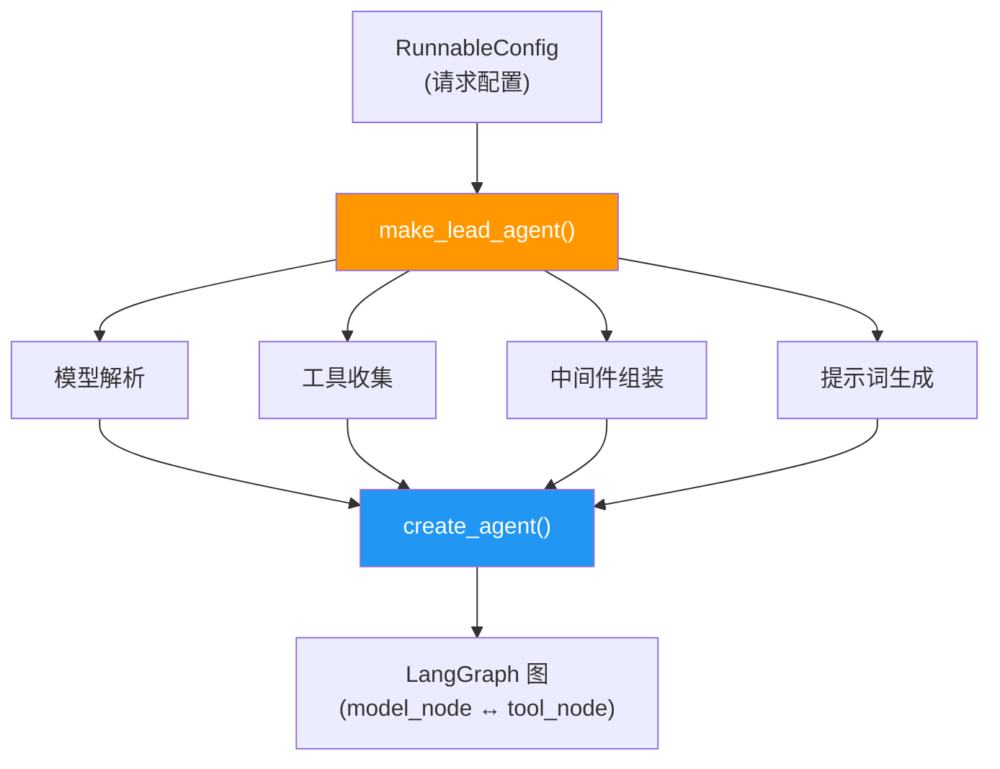
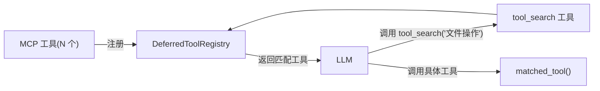
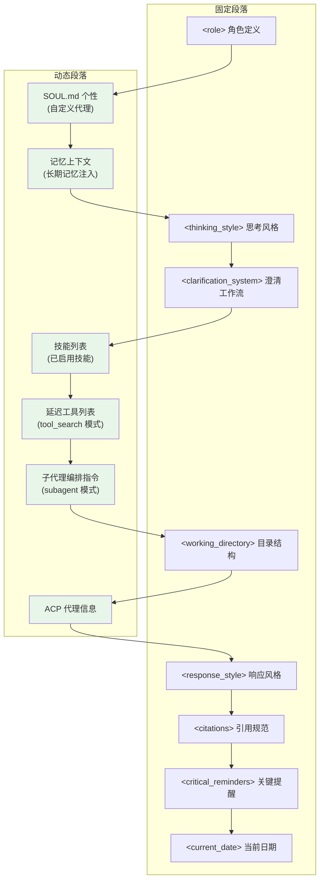
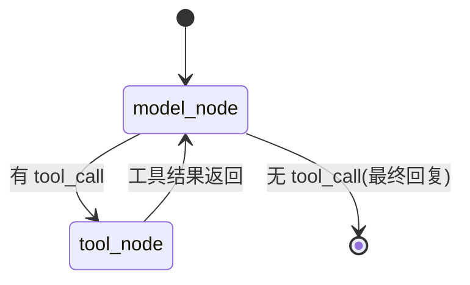
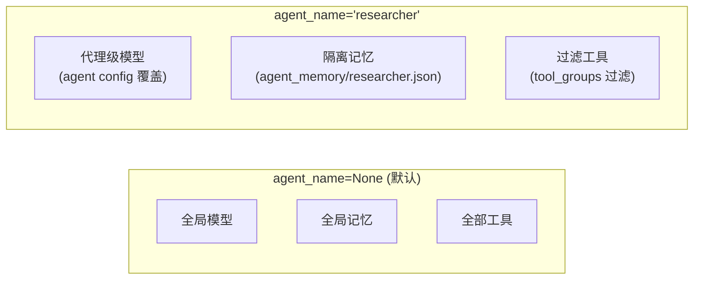

# 第 3 章 Lead Agent 与 LangGraph 运行时

> **读完本章的收获**：你能完整描述 DeerFlow 主代理的构建过程——从 `make_lead_agent()` 工厂函数开始，理解模型解析、工具收集、中间件组装、提示词生成的每一步，以及 LangGraph 图的运行机制。

---

## 3.1 全景：Lead Agent 的构成

Lead Agent 是 DeerFlow 的"大脑"。它不是一个静态对象，而是每次请求时由工厂函数 **动态构建** 的——根据请求配置决定用什么模型、开启什么工具、启用哪些中间件。



**入口文件**：`backend/packages/harness/deerflow/agents/lead_agent/agent.py`

---

## 3.2 工厂函数：make_lead_agent

### 签名与配置键

```python
def make_lead_agent(config: RunnableConfig):
```

`config["configurable"]` 中支持的键：

| 键 | 类型 | 默认值 | 作用 |
|---|------|-------|------|
| `thinking_enabled` | bool | True | 是否启用模型扩展思考 |
| `reasoning_effort` | str \| None | None | 推理强度（low/medium/high/xhigh） |
| `model_name` / `model` | str \| None | None | 覆盖模型选择 |
| `is_plan_mode` | bool | False | 启用 TodoList 中间件 |
| `subagent_enabled` | bool | False | 启用子代理委派 |
| `max_concurrent_subagents` | int | 3 | 最大并发子代理数 |
| `is_bootstrap` | bool | False | Bootstrap 模式（用于创建自定义代理） |
| `agent_name` | str \| None | None | 指定代理名（隔离模型/记忆/工具） |

### 构建流程

```mermaid
flowchart TB
    subgraph "1. 模型解析"
        MN["requested_model_name"]
        AC["agent_config.model"]
        GD["全局默认(第一个模型)"]
        MN -->|"有效?"| Check1{在 config 中?}
        Check1 -->|是| Use1["使用请求模型"]
        Check1 -->|否| AC
        AC -->|"有值?"| Check2{存在?}
        Check2 -->|是| Use2["使用代理配置模型"]
        Check2 -->|否| GD
    end

    subgraph "2. 工具收集"
        CT["config.tools"] --> Filter["按 groups 过滤"]
        Filter --> BT["+ 内置工具"]
        BT --> VT["+ view_image? (vision)"]
        VT --> ST["+ task? (subagent)"]
        ST --> MT["+ MCP 工具"]
        MT --> AT["+ ACP 工具"]
    end

    subgraph "3. 中间件组装"
        RM["运行时基础中间件(6)"]
        CM["+ 条件中间件(按配置)"]
        FM["+ 固定中间件(Title/Memory/Loop/Clarification)"]
        RM --> CM --> FM
    end

    subgraph "4. 提示词生成"
        TP["模板框架"]
        MP["+ 记忆上下文"]
        SP["+ 技能列表"]
        SAP["+ 子代理指令"]
        TP --> MP --> SP --> SAP
    end
```



### 模型解析的三级优先级

```
请求级覆盖 > 代理级配置 > 全局默认
```

这是 DeerFlow 中反复出现的 **配置覆盖模式**——请求参数 > 代理特定配置 > 应用全局配置。

---

## 3.3 工具收集：get_available_tools

工具是分层收集的，每层独立控制。

### 收集顺序与条件

```python
def get_available_tools(
    groups: list[str] | None = None,     # 工具组过滤
    include_mcp: bool = True,
    model_name: str | None = None,
    subagent_enabled: bool = False,
) -> list[BaseTool]:
```

| 层 | 来源 | 条件 | 典型工具 |
|---|------|------|---------|
| 配置工具 | `config.yaml → tools` | 按 `groups` 过滤 | tavily_search, jina_reader, firecrawl… |
| 内置工具 | 硬编码 | 始终包含 | present_files, ask_clarification |
| 视觉工具 | 模型能力 | `model.supports_vision=True` | view_image |
| 子代理工具 | 请求配置 | `subagent_enabled=True` | task |
| MCP 工具 | extensions_config.json | `include_mcp=True` 且有启用的服务器 | 动态（来自 MCP 服务器） |
| ACP 工具 | config.yaml → acp_agents | 有 ACP 配置 | invoke_acp_agent |

### 动态类加载（Reflection）

配置工具和模型都通过 **反射系统** 加载：

```
config.yaml:
  tools:
    - use: "deerflow.community.tavily.tools:tavily_search_tool"

↓ resolve_variable("deerflow.community.tavily.tools:tavily_search_tool", BaseTool)
↓ importlib.import_module("deerflow.community.tavily.tools")
↓ getattr(module, "tavily_search_tool")
↓ 返回工具实例
```

**代码位置**：`backend/packages/harness/deerflow/reflection/resolvers.py`

反射系统还维护了一个 **依赖提示映射**，当动态加载失败时给出安装建议：

```python
MODULE_TO_PACKAGE_HINTS = {
    "langchain_google_genai": "langchain-google-genai",
    "langchain_anthropic": "langchain-anthropic",
    "langchain_openai": "langchain-openai",
    ...
}
```

### 工具搜索（Deferred Tool）

当 `tool_search.enabled=True` 时，MCP 工具不直接绑定到模型——而是注册到 `DeferredToolRegistry`，由一个 `tool_search` 元工具让 LLM 按需发现：



**设计目的**：避免大量 MCP 工具的 Schema 占据上下文窗口。LLM 只看到 `tool_search` 一个工具，需要时才搜索具体工具。

---

## 3.4 内置工具清单

| 工具名 | 模块 | 条件 | 功能 |
|--------|------|------|------|
| `present_files` | `present_file_tool.py` | 始终 | 将文件注册为 Artifact，展示给用户 |
| `ask_clarification` | `clarification_tool.py` | 始终 | 向用户请求澄清（5 种类型） |
| `view_image` | `view_image_tool.py` | 视觉模型 | 将图片加载为 base64 供 LLM 分析 |
| `task` | `task_tool.py` | subagent 开启 | 委派子任务到子代理 |
| `tool_search` | `tool_search.py` | tool_search 开启 | 按关键词搜索延迟注册的工具 |
| `setup_agent` | `setup_agent_tool.py` | Bootstrap 模式 | 创建自定义代理配置 |
| `invoke_acp_agent` | `invoke_acp_agent_tool.py` | ACP 配置存在 | 调用外部 ACP 代理 |

### ask_clarification 的五种类型

| 类型 | 场景 |
|------|------|
| `missing_info` | 缺少关键信息 |
| `ambiguous_requirement` | 需求不明确 |
| `approach_choice` | 有多种方案需用户选择 |
| `risk_confirmation` | 高风险操作需确认 |
| `suggestion` | 提供建议供用户参考 |

---

## 3.5 系统提示词工程

### 提示词模板结构

系统提示词由 `apply_prompt_template()` 动态生成，包含多个可插拔段落：



### 关键动态段落

**记忆上下文注入**：从文件加载持久化的用户记忆，注入到提示词中。

```
调用路径:
  prompt.py::apply_prompt_template()
    → _get_memory_context(agent_name)
      → get_memory_storage().load(agent_name)
      → 格式化为提示词段落
```

**技能列表注入**：只注入已启用的技能名和描述（不注入完整 SKILL.md 内容——那是渐进式加载的）。

**子代理编排指令**：当 `subagent_enabled=True` 时，注入详细的任务分解策略：
- 如何识别可并行的子任务
- 最大并发数限制（`max_concurrent_subagents`）
- 如何综合子代理结果

### 工作流优先级

提示词中明确规定了代理的决策优先级：

```
CLARIFY → PLAN → ACT
```

即：先确认需求不模糊 → 制定计划 → 执行。这个优先级由 `<clarification_system>` 段落强制执行。

---

## 3.6 LangGraph 图结构

### 运行时图

Lead Agent 使用 LangChain 的 `create_agent()` 构建，生成的图结构是标准的 ReAct 循环：



**只有两个节点**：
- `model_node`：LLM 推理，输出文本或工具调用
- `tool_node`：执行工具调用，返回结果

**复杂度在哪**？不在图结构，而在：
1. **中间件链**（Ch4）——包裹每次 LLM 调用的前后处理
2. **工具体系**（Ch7）——工具内部可能触发子代理、文件操作、网络搜索
3. **状态管理**（Ch5）——ThreadState 的归并、持久化

### 状态持久化：Checkpointer

LangGraph 通过 Checkpointer 在每个节点执行后持久化 ThreadState。

```python
# backend/packages/harness/deerflow/agents/checkpointer/async_provider.py
@contextlib.asynccontextmanager
async def make_checkpointer() -> AsyncIterator[Checkpointer]:
```

支持三种后端：

| 后端 | 配置 | 适用场景 |
|------|------|---------|
| InMemorySaver | 默认（无配置） | 开发/测试 |
| AsyncSqliteSaver | `checkpointer.use: sqlite` | 单机持久化 |
| AsyncPostgresSaver | `checkpointer.use: postgres` | 生产环境 |

Checkpointer 在 `langgraph.json` 中指定：

```json
{
  "checkpointer": {
    "path": "./packages/harness/deerflow/agents/checkpointer/async_provider.py:make_checkpointer"
  }
}
```

---

## 3.7 Bootstrap 模式

当 `is_bootstrap=True` 时，构建一个精简的代理用于创建自定义代理：

| 特性 | 标准模式 | Bootstrap 模式 |
|------|---------|---------------|
| 工具集 | 完整工具链 | 仅 `setup_agent` + 基础工具 |
| 提示词 | 完整系统提示 | 最小化提示 |
| 中间件 | 全量中间件链 | 基础中间件 |
| 用途 | 执行用户任务 | 交互式创建自定义代理 |

Bootstrap 模式通过 `setup_agent` 工具让用户交互式地定义代理的名称、个性（SOUL.md）和配置。

---

## 3.8 代理隔离机制

`agent_name` 参数启用 **Per-Agent 隔离**：



隔离维度：
- **模型选择**：`agents_config` 中可为每个代理指定不同模型
- **记忆存储**：`agent_memory/{agent_name}.json` 独立文件
- **工具集合**：通过 `tool_groups` 过滤可用工具

---

## 3.9 设计取舍

**为什么用工厂函数而不是静态配置？**
- 每次请求的配置可能不同（不同模型、不同模式）
- 中间件和工具需要根据请求动态组合
- 支持 Bootstrap 模式这种完全不同的代理形态

**为什么图结构如此简单（只有两个节点）？**
- LangGraph 的复杂度在状态管理和检查点，不在图拓扑
- 中间件链提供了足够的扩展点，不需要复杂的图分支
- 简单图 + 丰富中间件 = 易于理解和调试

**为什么提示词是动态生成的？**
- 技能列表随配置变化
- 记忆内容随会话积累
- 子代理指令按需注入
- 固定提示词无法适应这种运行时多样性

---

### 质检报告

**完整性**
- [x] make_lead_agent 的完整构建流程
- [x] 工具收集的分层机制
- [x] 系统提示词的动态段落
- [x] LangGraph 图结构和 Checkpointer
- [x] Bootstrap 模式和代理隔离
- [x] 反射系统的工作原理

**准确性**
- [x] 函数签名与源码一致
- [x] 配置键清单与源码一致
- [x] 中间件组装顺序与源码一致

**可读性**
- [x] 从全景 → 工厂函数 → 工具 → 提示词 → 图结构 → 特殊模式，递进清晰
- [x] 引用 Ch1 术语，无新术语未解释
- [x] 核心流程均有图

**勘误建议**
- 无
