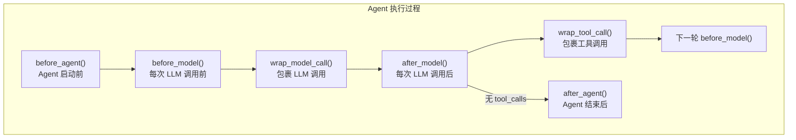
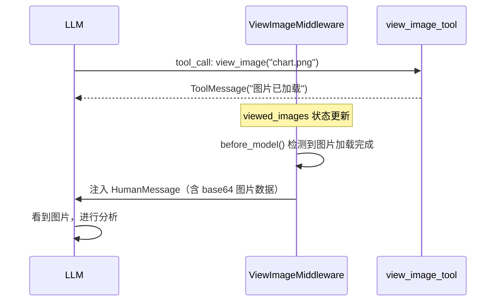
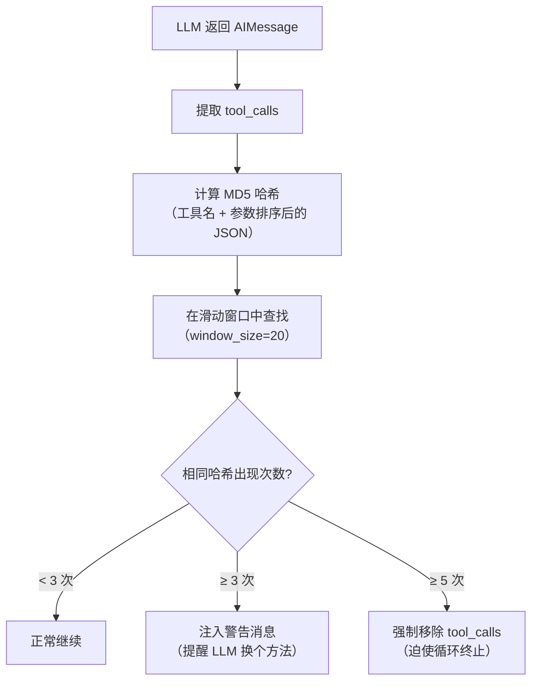

# 第四章 Middleware Pipeline：中间件链

> **一句话收获**：读完本章，你将理解 DeerFlow 如何用 ~15 个中间件为 Agent 核心循环注入标题生成、记忆存储、循环检测、错误处理等横切能力，以及每个中间件在什么时机、对什么数据、做了什么操作。

---

## 4.1 中间件链是什么

在第三章中，我们看到 `make_lead_agent()` 构建 Agent 时传入了一个 `middleware` 参数。这个参数是一个中间件列表，它们像**洋葱皮**一样一层层包裹在 Agent 的核心循环（model_node ↔ tool_node）之外。

用一个类比：核心循环是"赛车在跑圈"，中间件是"每圈经过的各种检查站"——有的检查油量（TokenUsage），有的检查是否绕圈（LoopDetection），有的在终点挂横幅（Title），有的负责事后写日志（Memory）。

### 中间件可以做什么

LangChain 的 Agent Middleware 框架提供了多个 Hook 点（拦截时机）：



| Hook | 执行时机 | 典型用途 |
|------|---------|---------|
| `before_agent()` | Agent 整个执行开始前（只执行一次） | 初始化资源（工作目录、Sandbox） |
| `before_model()` | 每次调用 LLM 之前 | 注入上下文（图片、文件信息） |
| `wrap_model_call()` | 包裹 LLM 调用（可修改输入/输出） | 过滤工具列表、修补消息 |
| `after_model()` | 每次 LLM 返回之后 | 检测循环、限制 Subagent 数量、记录 Token |
| `wrap_tool_call()` | 包裹每个工具调用（可拦截） | 错误处理、拦截澄清请求 |
| `after_agent()` | Agent 整个执行结束后（只执行一次） | 生成标题、排队记忆更新、释放 Sandbox |

---

## 4.2 完整中间件列表与执行顺序

以下是 DeerFlow 中所有中间件，按 `_build_middlewares()` 中的添加顺序排列：

```mermaid
flowchart LR
    subgraph "基础层（build_lead_runtime_middlewares）"
        TD["ThreadData<br/>工作目录"]
        UP["Uploads<br/>文件注入"]
        DT["DanglingToolCall<br/>消息修补"]
        SB["Sandbox<br/>沙箱生命周期"]
        TE["ToolErrorHandling<br/>工具错误"]
    end
    
    subgraph "功能层（条件添加）"
        SM["Summarization<br/>上下文摘要"]
        TODO["Todo<br/>任务规划"]
        TU["TokenUsage<br/>Token 统计"]
    end
    
    subgraph "管理层（始终添加）"
        TI["Title<br/>标题生成"]
        MEM["Memory<br/>记忆排队"]
    end
    
    subgraph "能力层（条件添加）"
        VI["ViewImage<br/>图片注入"]
        DTF["DeferredToolFilter<br/>延迟工具过滤"]
        SL["SubagentLimit<br/>并发限制"]
    end
    
    subgraph "守护层（始终添加）"
        LD["LoopDetection<br/>循环检测"]
        CL["Clarification<br/>澄清中断"]
    end
    
    TD --> UP --> DT --> SB --> TE --> SM --> TODO --> TU --> TI --> MEM --> VI --> DTF --> SL --> LD --> CL
```



| # | 中间件 | 条件 | 主要 Hook | 一句话职责 |
|---|--------|------|----------|-----------|
| 1 | ThreadDataMiddleware | 始终 | `before_agent` | 初始化线程工作目录路径 |
| 2 | UploadsMiddleware | 始终 | `before_agent` | 将上传文件信息注入消息 |
| 3 | DanglingToolCallMiddleware | 始终 | `wrap_model_call` | 修补缺失的 ToolMessage |
| 4 | SandboxMiddleware | 始终 | `before/after_agent` | 获取和释放 Sandbox |
| 5 | ToolErrorHandlingMiddleware | 始终 | `wrap_tool_call` | 捕获工具异常转为错误消息 |
| 6 | SummarizationMiddleware | 配置启用 | (LangChain 内置) | 上下文窗口接近上限时自动摘要 |
| 7 | TodoMiddleware | Plan 模式 | `before_model` | 注入任务列表提醒 |
| 8 | TokenUsageMiddleware | 配置启用 | `after_model` | 记录每次 LLM 调用的 Token 用量 |
| 9 | TitleMiddleware | 始终 | `after_model` | 第一轮对话后自动生成标题 |
| 10 | MemoryMiddleware | 始终 | `after_agent` | 将对话排入记忆更新队列 |
| 11 | ViewImageMiddleware | 模型支持视觉 | `before_model` | 将已查看的图片 base64 注入消息 |
| 12 | DeferredToolFilterMiddleware | tool_search 启用 | `wrap_model_call` | 隐藏延迟加载工具的 schema |
| 13 | SubagentLimitMiddleware | subagent 启用 | `after_model` | 截断超出限制的 task 调用 |
| 14 | LoopDetectionMiddleware | 始终 | `after_model` | 检测重复工具调用并干预 |
| 15 | ClarificationMiddleware | 始终 | `wrap_tool_call` | 拦截澄清请求并中断执行 |

---

## 4.3 基础层：生存必需品

这五个中间件是 Agent 正常运行的基础设施，无论什么模式都会加载。

### ThreadDataMiddleware — 建立工作根基

**它是什么**：为每个对话线程创建独立的文件系统工作空间。

**为什么需要它**：Agent 执行过程中会读写文件（代码、输出、上传），每个对话需要隔离的目录，避免相互干扰。

**它做了什么**：在 `before_agent()` 时，根据 `thread_id` 计算三个目录路径并写入 ThreadState：

```python
thread_data = {
    "workspace_path": "~/.deerflow/threads/{thread_id}/user-data/workspace",
    "uploads_path":   "~/.deerflow/threads/{thread_id}/user-data/uploads",
    "outputs_path":   "~/.deerflow/threads/{thread_id}/user-data/outputs",
}
```

默认是**惰性初始化**——只计算路径，不创建目录。目录在首次被 Sandbox 工具访问时才创建。

### UploadsMiddleware — 让 Agent 看到上传文件

**它是什么**：将用户上传的文件信息注入到消息中，让 LLM 知道有哪些文件可用。

**它做了什么**：在 `before_agent()` 时，检查最后一条 HumanMessage 的 `additional_kwargs.files`，并构造一个结构化的文件清单：

```
<uploaded_files>
The following files were uploaded in this message:
- report.pdf (50.5 KB)
  Path: /mnt/user-data/uploads/report.pdf

The following files were uploaded in previous messages and are still available:
- data.csv (12.3 KB)
  Path: /mnt/user-data/uploads/data.csv

You can read these files using the `read_file` tool with the paths shown above.
</uploaded_files>
```

这段文本被**前置到用户消息内容之前**，所以 LLM 在看到用户问题时，同时也看到了可用文件列表。

### DanglingToolCallMiddleware — 修补残缺消息

**它是什么**：一个"清洁工"——修补历史消息中缺失的 ToolMessage。

**为什么需要它**：在以下情况下，AIMessage 中的 `tool_calls` 可能没有对应的 ToolMessage：
- 用户中途取消了请求
- 系统崩溃或超时
- 之前的执行被中断

LLM 在看到一个有 `tool_calls` 但没有对应 ToolMessage 的对话历史时会困惑甚至报错。

**它做了什么**：在 `wrap_model_call()` 中（每次 LLM 调用前），扫描所有消息，找到"悬空"的 tool_call，并插入一条合成的错误 ToolMessage：

```python
ToolMessage(
    content="[Tool call was interrupted and did not return a result.]",
    tool_call_id=tc.get("id"),
    name=tc.get("name", "unknown"),
    status="error",
)
```

### SandboxMiddleware — 沙箱生命周期

**它是什么**：管理 Sandbox 的获取和释放。

**它做了什么**：
- `before_agent()`：获取 Sandbox 实例（默认惰性——推迟到首次工具调用时）
- `after_agent()`：释放 Sandbox（不销毁，同一线程可复用）

### ToolErrorHandlingMiddleware — 工具异常守护

**它是什么**：捕获工具执行中的异常，将其转化为结构化的 ToolMessage（而非让整个 Agent 崩溃）。

**它做了什么**：在 `wrap_tool_call()` 中包裹每个工具调用：

```python
def wrap_tool_call(self, request, handler):
    try:
        return handler(request)
    except GraphBubbleUp:
        raise   # LangGraph 的控制流异常不拦截
    except Exception as exc:
        return ToolMessage(
            content=f"Tool execution error: {exc}",
            tool_call_id=request.tool_call.get("id"),
            status="error",
        )
```

这样 LLM 会收到一条"工具执行失败"的消息，可以据此调整策略（比如换一种方式或告知用户），而不是直接崩溃。

---

## 4.4 功能层：按需启用的能力

### SummarizationMiddleware — 上下文窗口管理

**它是什么**：当对话历史接近 LLM 的上下文窗口上限时，自动将较早的消息摘要为一条简洁的总结。

**这不是 DeerFlow 自己写的**——它直接使用 LangChain 的 `SummarizationMiddleware`，通过 `config.yaml` 的 `summarization` 段配置触发条件和摘要模型。

**为什么需要它**：长对话（尤其是涉及大量工具调用的任务）会迅速消耗上下文窗口。不做摘要的话，Token 成本飙升且可能超出模型限制。

### TodoMiddleware — 任务规划守护

**它是什么**：在 Plan 模式（Pro/Ultra）下，确保 LLM 始终能看到当前的任务列表。

**为什么需要它**：摘要中间件可能会将包含 `write_todos` 工具调用的消息摘要掉，导致 LLM "忘了" 自己的任务清单。

**它做了什么**：在 `before_model()` 时检查——如果 ThreadState 中有 `todos` 但当前消息窗口中看不到它们了，就注入一条提醒消息：

```
<system_reminder>
Your todo list is no longer visible in the current context window:

1. ✅ 搜索 React 最新特性
2. 🔄 搜索 Vue 最新特性
3. ⏳ 搜索 Angular 最新特性

Continue tracking...
</system_reminder>
```

### TokenUsageMiddleware — Token 消耗追踪

**它是什么**：在每次 LLM 调用后，从响应元数据中提取并记录 Token 使用量。

**它做了什么**：纯记录，不修改状态。在 `after_model()` 中从 AIMessage 的 `usage_metadata` 提取 input/output/total tokens 并写入日志。

---

## 4.5 管理层：始终运行的管家

### TitleMiddleware — 对话标题自动生成

**它是什么**：在第一轮完整对话（用户提问 + AI 回答）完成后，自动为对话生成一个简短标题。

**触发条件**：
1. 配置启用（`title.enabled`）
2. 当前还没有标题（`state.title` 为空）
3. 恰好有 1 条用户消息和至少 1 条 AI 消息

**生成过程**：提取第一条用户消息和第一条 AI 消息（各取前 500 字符），交给一个轻量级 LLM 生成标题。如果 LLM 调用失败，回退为用户消息的前 50 个字符。

生成的标题写入 `ThreadState.title`，前端通过 `onUpdateEvent` 回调捕获更新并显示在侧边栏。

### MemoryMiddleware — 记忆排队

**它是什么**：在 Agent 执行结束后，将对话内容排入异步记忆更新队列。

**为什么不直接保存**：记忆更新涉及 LLM 调用（从对话中提取关键信息），如果同步执行会延迟响应。MemoryMiddleware 只负责排队，实际的记忆提取和存储由后台异步完成（详见第 7 章）。

**数据过滤**：不是所有消息都进入记忆。中间件会过滤掉：
- 工具消息（中间结果）
- 带 tool_calls 的 AI 消息（中间步骤）
- 消息中的 `<uploaded_files>` 临时标记

只保留用户的实际问题和 AI 的最终回答。

---

## 4.6 能力层：模式驱动的增强

### ViewImageMiddleware — 让 LLM 看到图片

**它是什么**：当 Agent 调用了 `view_image` 工具后，将图片的 base64 数据注入到下一次 LLM 调用中，让支持视觉的 LLM 能"看到"图片。

**工作流程**：



### DeferredToolFilterMiddleware — 上下文节省

**它是什么**：当 `tool_search` 功能启用时，从 LLM 的工具绑定中移除"延迟加载"工具的 schema。

**为什么需要它**：虽然延迟工具在 ToolNode 中仍然可执行（LLM 通过 `tool_search` 发现后可以调用），但它们的 schema 不应该出现在 LLM 的上下文中——这会浪费 Token 且干扰选择。

### SubagentLimitMiddleware — 并发守卫

**它是什么**：在 LLM 返回后检查 `task` 工具调用的数量，如果超过并发限制就截断多余的。

**为什么要在中间件做而不是在 Prompt 中限制**：即使 Prompt 中明确告知了限制（"最多 3 个 task 调用"），LLM 仍然可能违反——它是概率模型，不保证遵守硬约束。这个中间件是**安全网**，确保系统层面的硬约束。

**实现**：保留前 N 个 task 调用，丢弃后面的。限制范围固定在 [2, 4]。

---

## 4.7 守护层：安全保障

### LoopDetectionMiddleware — 打破无限循环

**它是什么**：检测 Agent 是否陷入了重复调用相同工具的死循环。

**为什么需要它**：LLM 有时会陷入模式——反复调用同一个工具、传同样的参数，期望得到不同的结果。如果不干预，Agent 会一直循环直到达到 `recursion_limit`，浪费大量 Token。

**检测机制**：



**三级响应**：
1. **< 3 次**：正常通过
2. **≥ 3 次（警告）**：注入一条 HumanMessage 警告 LLM"你在重复同样的操作，请换个方法"
3. **≥ 5 次（硬停止）**：直接从 AIMessage 中移除 `tool_calls`，迫使 Agent 循环终止

**每线程追踪**：使用 OrderedDict 为每个 thread_id 维护独立的追踪状态，最多追踪 100 个线程（LRU 淘汰）。

### ClarificationMiddleware — 优雅中断

**它是什么**：当 LLM 调用 `ask_clarification` 工具时，中断 Agent 执行，把问题展示给用户，等待用户回答后恢复。

**为什么必须是最后一个中间件**：它通过 LangGraph 的 `Command(goto=END)` 机制中断整个图执行。如果其他中间件在它后面，它们就没机会执行了。放在最后确保所有前置处理都已完成。

**实现**：

```python
def wrap_tool_call(self, request, handler):
    if request.tool_call.get("name") != "ask_clarification":
        return handler(request)  # 非澄清工具，正常执行
    
    # 格式化澄清消息（支持中英文、多种类型）
    formatted = self._format_clarification_message(args)
    
    # 返回 Command 中断执行
    return Command(
        update={"messages": [ToolMessage(content=formatted, ...)]},
        goto=END,
    )
```

用户在前端看到澄清问题后回答，回答作为新的 HumanMessage 恢复 Agent 执行。

---

## 4.8 中间件顺序的设计逻辑

中间件的排列顺序不是随意的，它遵循一个清晰的依赖链：

```
ThreadData → UploadsMiddleware 需要 thread_data 中的路径
ThreadData → SandboxMiddleware 需要 thread_id
Summarization → 在其他处理前压缩上下文（减少后续 Token 消耗）
TodoMiddleware → 在 Clarification 前（避免任务列表被中断吞掉）
TitleMiddleware → MemoryMiddleware 需要标题信息
ViewImage → 在 Clarification 前（图片注入后再判断是否需要澄清）
LoopDetection → 在 Clarification 前（循环检测优先级高于澄清）
Clarification → 必须最后（它中断执行，后续中间件无法运行）
```

---

## 4.9 小结

DeerFlow 的中间件系统体现了一个重要的架构原则：**核心保持简单，复杂性向外推**。

Agent 的核心循环只做两件事——调 LLM 和执行工具。所有的运维关注点（标题、记忆、错误处理、循环检测、并发限制、上下文管理）都由中间件处理。这种设计让核心逻辑清晰可测，而横切关注点可以独立开发、独立启用。

下一章，我们将深入 Tool 系统和 Sandbox——看看 Agent 调用工具时到底发生了什么。

---

### 质检报告

**讲解节奏**
- [x] 先讲中间件链整体是什么（4.1），再分层逐个展开
- [x] 每个中间件先说"它是什么"、"为什么需要它"，再说"它做了什么"

**讲透了吗**
- [x] 15 个中间件都有覆盖，关键中间件（LoopDetection、Clarification、DanglingToolCall）有详细实现剖析
- [x] 中间件顺序的依赖逻辑有专门章节解释
- [x] Hook 点的分类表格清晰

**准确吗**
- [x] 代码片段基于实际源码
- [x] 使用了行业标准术语（Middleware、Hook、Pipeline）
- [x] SummarizationMiddleware 确认来自 LangChain 而非自定义

**读得下去吗**
- [x] 用"洋葱皮"和"检查站"类比引入概念
- [x] 分层组织避免一次性抛出 15 个中间件
- [x] 每张图有文字讲解

**勘误建议**
- `build_lead_runtime_middlewares()` 返回的中间件列表中是否包含 GuardrailMiddleware 需确认（代码中注释提到"optional"）
