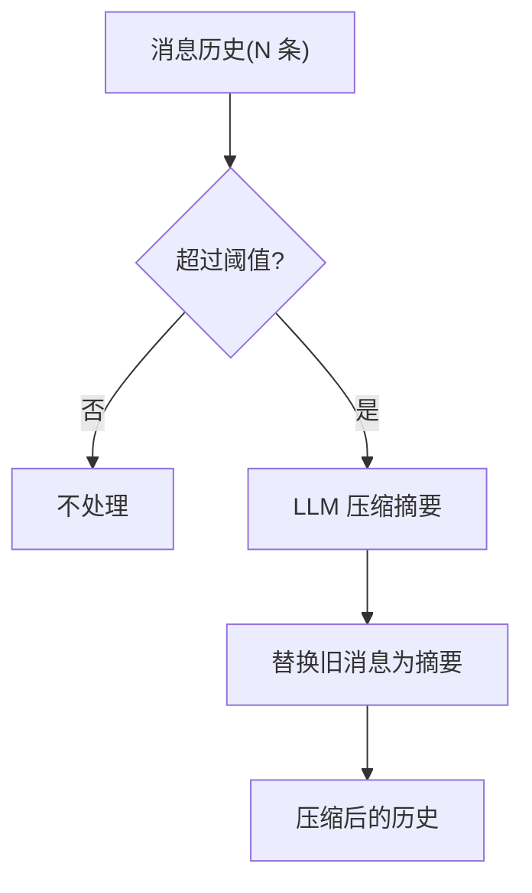
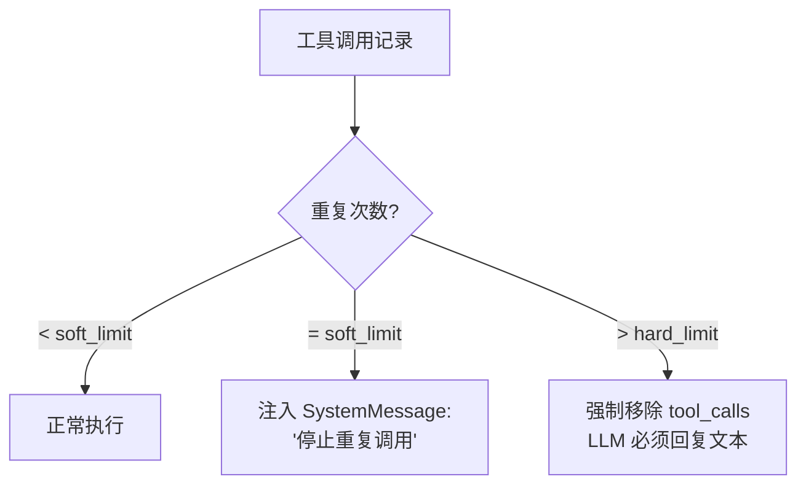
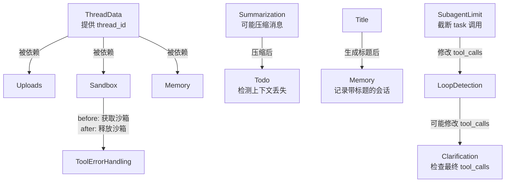

# 第 4 章 中间件链

> **读完本章的收获**：你能说清 DeerFlow 中每一个中间件的职责、触发条件和执行时机，理解它们如何协作形成代理的"隐形骨架"。

---

## 4.1 中间件的本质

中间件是一组 **包裹 LLM 调用** 的可组合处理器。每个中间件都有两个钩子：

- `before_agent(state, runtime)` — 在 LLM 推理前执行
- `after_agent(state, runtime)` — 在 LLM 推理后执行

它们按链式顺序执行，形成"洋葱模型"：

```mermaid
flowchart LR
    subgraph "before_agent (顺序执行)"
        B1["①ThreadData"]
        B2["②Uploads"]
        B3["③Sandbox"]
        B4["④DanglingToolCall"]
        B5["⑤Guardrail"]
        B6["⑥ToolErrorHandling"]
        B7["⑦Summarization"]
        B8["⑧Todo"]
        B9["⑨TokenUsage"]
        B10["⑩Title"]
        B11["⑪Memory"]
        B12["⑫ViewImage"]
        B13["⑬DeferredToolFilter"]
        B14["⑭SubagentLimit"]
        B15["⑮LoopDetection"]
        B16["⑯Clarification"]
    end
    
    B1 --> B2 --> B3 --> B4 --> B5 --> B6 --> B7 --> B8 --> B9 --> B10 --> B11 --> B12 --> B13 --> B14 --> B15 --> B16
    
    B16 --> LLM["🧠 LLM 推理 + 工具循环"]
    
    LLM --> A16["⑯Clarification"]
    A16 --> A15["⑮LoopDetection"]
    A15 --> A14["..."]
    A14 --> A1["①ThreadData"]
```



**代码位置**：`backend/packages/harness/deerflow/agents/middlewares/`

---

## 4.2 中间件总览

| # | 中间件 | 条件 | before_agent | after_agent |
|---|--------|------|-------------|-------------|
| 1 | ThreadDataMiddleware | 始终 | 设置工作目录路径 | — |
| 2 | UploadsMiddleware | 始终 | 注入上传文件上下文 | 剥离临时 upload 块 |
| 3 | SandboxMiddleware | 始终(lazy) | 获取沙箱实例 | 释放沙箱 |
| 4 | DanglingToolCallMiddleware | 始终 | 修补缺失的 ToolMessage | — |
| 5 | GuardrailMiddleware | 配置启用 | 内容安全过滤 | — |
| 6 | ToolErrorHandlingMiddleware | 始终 | — | 工具异常 → 错误 ToolMessage |
| 7 | SummarizationMiddleware | 配置启用 | 压缩历史消息 | — |
| 8 | TodoMiddleware | plan_mode | 注入待办事项提醒 | 更新待办状态 |
| 9 | TokenUsageMiddleware | 配置启用 | — | 记录 Token 消耗 |
| 10 | TitleMiddleware | 始终 | — | 生成线程标题 |
| 11 | MemoryMiddleware | 始终 | 加载记忆到上下文 | 队列化记忆更新 |
| 12 | ViewImageMiddleware | 视觉模型 | 提取图片元数据 | — |
| 13 | DeferredToolFilterMiddleware | tool_search | 隐藏延迟工具 Schema | — |
| 14 | SubagentLimitMiddleware | subagent | — | 截断多余 task 调用 |
| 15 | LoopDetectionMiddleware | 始终 | — | 检测/中断工具循环 |
| 16 | ClarificationMiddleware | 始终(最后) | — | 拦截澄清请求 |

---

## 4.3 基础运行时中间件（始终加载）

### ① ThreadDataMiddleware

**职责**：初始化线程的工作目录结构。

```
before_agent:
  → 从 runtime.context 获取 thread_id
  → 设置 state.thread_data:
    workspace_path: data/threads/{thread_id}/workspace
    uploads_path:   data/threads/{thread_id}/uploads
    outputs_path:   data/threads/{thread_id}/outputs
  → 创建目录（如不存在）
```

**为什么排第一**：其他中间件（Sandbox、Uploads、Memory）都依赖 `thread_id` 和路径信息。

### ② UploadsMiddleware

**职责**：将用户上传的文件信息注入到 HumanMessage 中，让 LLM 知道有哪些文件可用。

```
before_agent:
  → 提取 message.additional_kwargs.files（新上传的文件）
  → 扫描 uploads_path 目录（历史文件）
  → 构建 <uploaded_files> XML 块
  → 前置到 HumanMessage.content

after_agent:
  → 从持久化消息中剥离 <uploaded_files> 块
  → 防止临时块污染消息历史
```

注入的内容示例：
```xml
<uploaded_files>
新上传: report.pdf (245KB) → /mnt/user-data/uploads/report.pdf
历史文件: data.csv → /mnt/user-data/uploads/data.csv
使用 read_file 工具读取文件内容。
</uploaded_files>
```

### ③ SandboxMiddleware

**职责**：管理沙箱的获取和释放生命周期。

```
before_agent (lazy_init):
  → 调用 SandboxProvider.acquire(thread_id)
  → 获取 sandbox_id
  → 存入 state.sandbox = {sandbox_id: "..."}
  → 后续工具调用通过 sandbox_id 找到沙箱实例

after_agent:
  → 调用 SandboxProvider.release(sandbox_id)
  → 清理资源（Docker 模式下停止容器）
```

**Lazy Init**：沙箱在首次实际需要时才创建，避免每次简单对话都启动容器。

### ④ DanglingToolCallMiddleware

**职责**：修补消息历史中缺失的 ToolMessage。

当 LLM 上下文中存在 `AIMessage(tool_calls=[...])` 但没有对应的 `ToolMessage` 时（例如上次会话被中断），LLM 会困惑。此中间件检测并注入占位 ToolMessage。

### ⑥ ToolErrorHandlingMiddleware

**职责**：捕获工具执行时的异常，将其转换为错误 ToolMessage 返回给 LLM。

```
工具抛出异常
  → 捕获 Exception
  → 创建 ToolMessage(content="Error: {异常信息}", status="error")
  → LLM 收到错误信息，可以决定重试或换方案
```

**设计目的**：防止一个工具的崩溃导致整个代理运行失败。LLM 有机会从错误中恢复。

---

## 4.4 条件中间件

### ⑤ GuardrailMiddleware

**触发条件**：`config.guardrails.enabled = True`

通过可配置的 Provider 实现内容安全过滤。Provider 通过反射系统加载（`resolve_variable(guardrails_config.provider.use)`）。

### ⑦ SummarizationMiddleware

**触发条件**：`config.summarization.enabled = True`



**配置项**：
- `trigger`：触发条件（消息数量 / Token 总量）
- `keep`：保留最近多少条消息不压缩
- `model`：用于摘要的 LLM（可以是小模型以节约成本）

### ⑧ TodoMiddleware

**触发条件**：`is_plan_mode = True`

用于复杂任务的计划模式——LLM 会维护一个待办事项列表。

```
before_agent:
  → 检查 state.todos 是否存在
  → 如果待办事项被 Summarization 压缩出上下文
    → 注入提醒 SystemMessage："你有未完成的待办事项"
  → 让 LLM 使用 write_todos 工具管理任务状态

after_agent:
  → 更新 state.todos（pending/in_progress/completed）
```

### ⑨ TokenUsageMiddleware

**触发条件**：`config.token_usage.enabled = True`

在 `after_agent` 阶段记录 LLM 的 Token 消耗（input_tokens、output_tokens、cache_tokens）。用于成本监控。

### ⑫ ViewImageMiddleware

**触发条件**：当前模型 `supports_vision = True`

```
before_agent:
  → 扫描消息中引用的图片路径
  → 读取图片 → base64 编码
  → 存入 state.viewed_images[path] = {base64, mime_type}
  → LLM 推理时可以"看到"图片
```

### ⑬ DeferredToolFilterMiddleware

**触发条件**：`config.tool_search.enabled = True`

```
before_agent:
  → 从 model.bind_tools() 中移除 DeferredToolRegistry 中的工具 Schema
  → LLM 只看到 tool_search 工具
  → 节省上下文 Token
```

---

## 4.5 行为控制中间件

### ⑭ SubagentLimitMiddleware

**触发条件**：`subagent_enabled = True`

```
after_agent:
  → 检查 LLM 返回的 tool_calls
  → 计数 name="task" 的调用
  → 如果超过 max_concurrent_subagents
    → 截断多余的 task 调用
    → 只保留前 N 个
```

### ⑮ LoopDetectionMiddleware

**始终启用**。检测 LLM 陷入工具循环的情况（相同工具 + 相同参数反复调用）。



两级保护：
- **软限制**：注入提醒消息，给 LLM 一次自我纠正的机会
- **硬限制**：直接从响应中移除 tool_calls，强制终止循环

### ⑯ ClarificationMiddleware（始终最后）

**职责**：拦截 `ask_clarification` 工具调用。

```
after_agent:
  → 检查 LLM 是否调用了 ask_clarification
  → 如果是：
    → 将问题展示给用户
    → 暂停代理执行
    → 等待用户回复
    → 用户回复后恢复执行
```

**为什么必须是最后一个**：它需要看到所有其他中间件处理后的最终 tool_calls 列表，并且它可能会中断执行流。

---

## 4.6 中间件的组装逻辑

`_build_middlewares()` 函数体现了一个关键设计：**顺序即依赖**。

```python
def _build_middlewares(config, model_name, agent_name=None):
    middlewares = []
    
    # 第一层：基础运行时（始终需要）
    middlewares.extend(build_lead_runtime_middlewares(lazy_init=True))
    # → ThreadData, Uploads, Sandbox, DanglingToolCall, Guardrail, ToolErrorHandling
    
    # 第二层：条件性功能中间件
    if config.summarization.enabled:
        middlewares.append(_create_summarization_middleware())
    if is_plan_mode:
        middlewares.append(_create_todo_list_middleware())
    if config.token_usage.enabled:
        middlewares.append(TokenUsageMiddleware())
    
    # 第三层：固定功能中间件
    middlewares.append(TitleMiddleware())
    middlewares.append(MemoryMiddleware(agent_name=agent_name))
    
    # 第四层：模型相关中间件
    if model_config.supports_vision:
        middlewares.append(ViewImageMiddleware())
    if tool_search.enabled:
        middlewares.append(DeferredToolFilterMiddleware())
    
    # 第五层：行为控制中间件
    if subagent_enabled:
        middlewares.append(SubagentLimitMiddleware(max_concurrent_subagents))
    middlewares.append(LoopDetectionMiddleware())
    
    # 最后：Clarification 必须在最后
    middlewares.append(ClarificationMiddleware())
    
    return middlewares
```

### 顺序依赖关系



---

## 4.7 设计取舍

**为什么用中间件链而不是图节点？**
- 中间件是 **横切关注点**（cross-cutting concerns）：记忆、安全、监控等不属于业务逻辑
- 图节点适合表达 **业务流程**（推理→工具→推理）
- 中间件可以动态组合，图结构在运行时难以改变

**为什么有些中间件是条件性的？**
- 最小化上下文开销：不需要的功能不加载
- 配置驱动：用户可以按需开关功能
- 性能优化：减少不必要的处理步骤

**为什么 Clarification 必须在最后？**
- 它可能中断执行流（暂停等待用户输入）
- 需要看到所有其他中间件处理后的最终状态
- 如果放在前面，后续中间件的修改可能使澄清请求无效

---

### 质检报告

**完整性**
- [x] 16 个中间件全覆盖（含 DanglingToolCallMiddleware）
- [x] 每个中间件的职责、触发条件、before/after 行为
- [x] 组装逻辑和顺序依赖
- [x] 设计取舍

**准确性**
- [x] 中间件列表和顺序与 _build_middlewares 源码一致
- [x] 触发条件与配置项对应

**可读性**
- [x] 总览表 → 逐个详解 → 组装逻辑 → 设计取舍，递进清晰
- [x] 洋葱模型图和依赖关系图辅助理解

**勘误建议**
- Ch1 中标注中间件为"15 个"，实际 `_build_middlewares` 中可能加入 16 个（含 DanglingToolCallMiddleware）。Ch1 的"15 层"是近似值，精确数量取决于条件配置。
