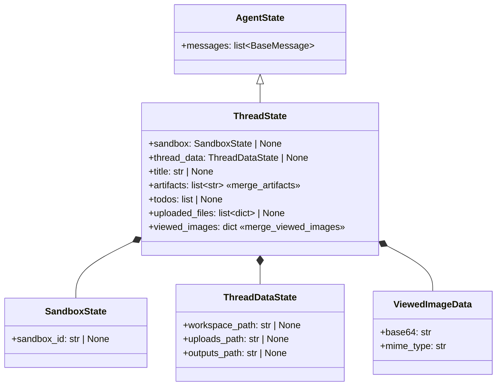
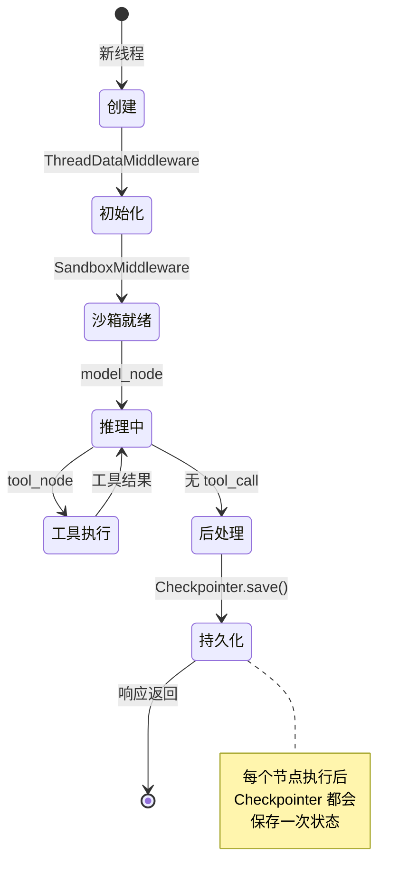

# 第 5 章 ThreadState 与状态管理

> **读完本章的收获**：你能准确描述 DeerFlow 会话状态的完整数据结构、每个字段的用途、归并逻辑、以及 Checkpointer 如何实现持久化。

---

## 5.1 ThreadState 是什么

ThreadState 是一次会话（Thread）的 **完整状态快照**。它是一个 TypedDict，继承自 LangChain 的 `AgentState`，每次 LangGraph 节点执行后都会被更新和持久化。

**代码位置**：`backend/packages/harness/deerflow/agents/thread_state.py`

---

## 5.2 字段解析



| 字段 | 类型 | 来源中间件 | 用途 |
|------|------|-----------|------|
| `messages` | `list[BaseMessage]` | AgentState 继承 | 完整对话历史 |
| `sandbox` | `SandboxState \| None` | SandboxMiddleware | 当前沙箱实例的 ID |
| `thread_data` | `ThreadDataState \| None` | ThreadDataMiddleware | 线程工作目录路径 |
| `title` | `str \| None` | TitleMiddleware | 自动生成的线程标题 |
| `artifacts` | `list[str]` | present_files 工具 | 已注册的制品 ID 列表（去重） |
| `todos` | `list \| None` | TodoMiddleware | 计划模式的待办事项 |
| `uploaded_files` | `list[dict] \| None` | UploadsMiddleware | 上传文件的元数据 |
| `viewed_images` | `dict[str, ViewedImageData]` | ViewImageMiddleware | 已加载的图片缓存 |

---

## 5.3 Reducer 机制

LangGraph 的状态更新不是简单覆盖——通过 `Annotated[type, reducer_fn]`，每个字段可以定义自己的 **归并函数**。

### merge_artifacts

```python
Annotated[list[str], merge_artifacts]
```

归并策略：**去重且保序**。

```
现有: ["report.md", "chart.png"]
新增: ["chart.png", "slides.pptx"]
结果: ["report.md", "chart.png", "slides.pptx"]
```

**为什么需要去重**：同一个文件可能在多次工具调用中被 `present_files` 注册。

### merge_viewed_images

```python
Annotated[dict[str, ViewedImageData], merge_viewed_images]
```

归并策略：**合并字典，但空 dict 触发清除**。

```
现有: {"/img/a.png": {base64: "...", mime_type: "image/png"}}
新增: {"/img/b.png": {base64: "...", mime_type: "image/jpeg"}}
结果: {"/img/a.png": {...}, "/img/b.png": {...}}

新增: {}  ← 空字典
结果: {}  ← 清除所有缓存
```

**设计目的**：图片数据很大，需要在 LLM 处理完后清除缓存，避免上下文膨胀。

### messages（来自 AgentState）

默认归并策略：**追加**。新消息追加到列表末尾。SummarizationMiddleware 可能会替换旧消息为摘要。

---

## 5.4 状态生命周期



**关键点**：Checkpointer 在 **每个节点执行后** 都保存状态，不仅仅是最终结果。这意味着即使代理中途崩溃，也可以从最近的检查点恢复。

---

## 5.5 Checkpointer 实现

```
backend/packages/harness/deerflow/agents/checkpointer/async_provider.py
  → make_checkpointer()
```

| 后端 | 类 | 适用场景 |
|------|---|---------|
| 内存 | `InMemorySaver` | 开发/测试（进程重启丢失） |
| SQLite | `AsyncSqliteSaver` | 单机持久化 |
| PostgreSQL | `AsyncPostgresSaver` | 生产环境 |

配置方式（`config.yaml`）：

```yaml
checkpointer:
  use: "langgraph.checkpoint.sqlite.aio:AsyncSqliteSaver"
  conn_string: "data/checkpoints.db"
```

Checkpointer 通过 `langgraph.json` 中的 `checkpointer.path` 指定，LangGraph Server 在启动时调用。

---

## 5.6 设计取舍

**为什么 ThreadState 用 TypedDict 而不是 Pydantic Model？**
- LangGraph 要求状态 Schema 是 TypedDict（与其 Reducer 机制兼容）
- TypedDict 是纯类型注解，运行时开销更小
- 与 LangChain 的 AgentState 保持继承兼容

**为什么 artifacts 需要去重 Reducer？**
- 工具调用是幂等的设计——多次 `present_files` 同一个文件不应产生重复
- 前端展示制品列表时不应有重复项

---

### 质检报告

**完整性**
- [x] 所有字段及其类型、来源、用途
- [x] Reducer 机制（merge_artifacts, merge_viewed_images）
- [x] Checkpointer 三种后端
- [x] 状态生命周期

**准确性**
- [x] 字段定义与 thread_state.py 一致
- [x] Reducer 行为与源码一致

**可读性**
- [x] 类图清晰展示结构关系
- [x] 状态图展示生命周期
- [x] 引用前序章节的中间件概念

**勘误建议**
- 无
