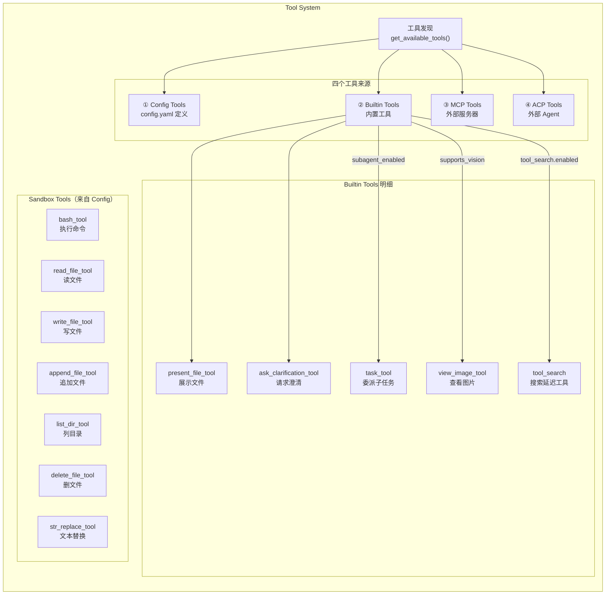
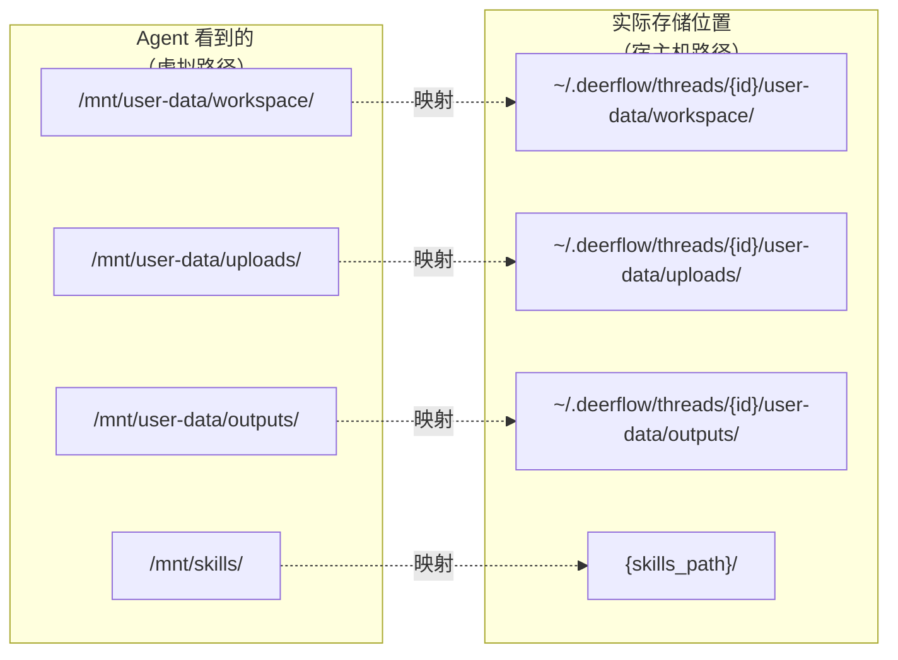
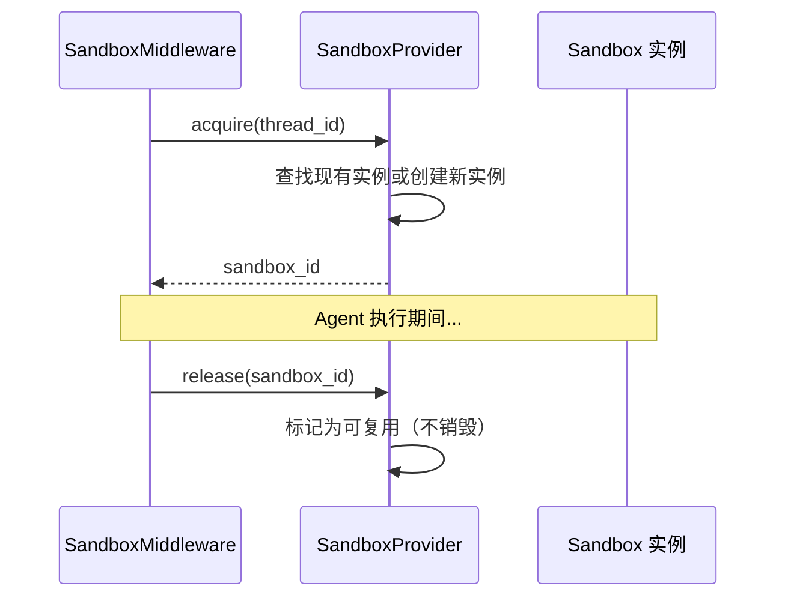

# 第五章 Tool 系统与 Sandbox

> **一句话收获**：读完本章，你将理解 DeerFlow 的工具体系是如何从四个来源收集工具、通过虚拟路径映射让 Agent 安全地在 Sandbox 中执行代码和操作文件的。

---

## 5.1 Tool 系统是什么

在前几章中，我们多次提到 Agent 的核心循环：LLM 决定调用什么工具 → tool_node 执行工具 → 结果返回给 LLM。Tool 系统就是这个循环中"执行工具"那一环的全部实现。

用一个类比：如果 LLM 是大脑（决策），Tool 系统就是手脚（执行）。大脑说"搜索一下这个关键词"，手就去操作搜索引擎；大脑说"在文件里写入这段代码"，手就去操作文件系统。

### Tool 系统的整体结构



---

## 5.2 工具发现：get_available_tools()

这个函数是整个 Tool 系统的入口——它从四个来源收集工具，合并成一个扁平列表返回给 `create_agent()`。

### 来源一：Config Tools

`config.yaml` 的 `tools` 段声明了通过反射加载的工具：

```yaml
tools:
  - name: web_search
    use: deerflow.community.tavily:tavily_search_tool    # Python 路径
    group: search                                          # 所属分组
  - name: bash
    use: deerflow.sandbox.tools:bash_tool
    group: sandbox
  - name: read_file
    use: deerflow.sandbox.tools:read_file_tool
    group: sandbox
```

`use` 字段是一个 Python 模块路径，`resolve_variable()` 通过反射加载这个对象。加载时可以按 `group` 过滤——自定义 Agent 可以配置 `tool_groups: ["search"]` 只使用搜索类工具，排除 Sandbox 工具。

### 来源二：Builtin Tools

始终包含 `present_file_tool` 和 `ask_clarification_tool`。其他根据条件决定：

```python
if subagent_enabled:        builtin_tools.extend([task_tool])
if model_supports_vision:   builtin_tools.append(view_image_tool)
if tool_search_enabled:     builtin_tools.append(tool_search_tool)
```

### 来源三：MCP Tools

从缓存中获取已初始化的 MCP 工具。如果启用了 `tool_search`，MCP 工具不直接暴露，而是注册到 `DeferredToolRegistry`：

```python
if config.tool_search.enabled:
    registry = DeferredToolRegistry()
    for t in mcp_tools:
        registry.register(t)       # 注册到延迟工具表
    set_deferred_registry(registry)
    builtin_tools.append(tool_search_tool)  # 添加搜索工具
```

这样 LLM 只看到一个 `tool_search` 工具，需要时通过它按名称或描述搜索具体的 MCP 工具。

### 来源四：ACP Tools

如果配置了外部 ACP Agent，添加 `invoke_acp_agent` 工具。

### 最终合并

```python
return loaded_tools + builtin_tools + mcp_tools + acp_tools
```

四个列表直接拼接，形成 Agent 可用的完整工具集。

---

## 5.3 Sandbox 是什么

Sandbox（沙箱）是 Agent 执行文件操作和 bash 命令的隔离环境。它解决的核心问题是：**如何让 AI Agent 安全地操作文件系统和执行代码，而不污染宿主机？**

### Sandbox 的抽象接口

DeerFlow 定义了一个抽象基类 `Sandbox`，规定了所有沙箱实现必须提供的能力：

```python
class Sandbox(ABC):
    def __init__(self, id: str): ...
    
    @abstractmethod
    def execute_command(self, command: str) -> str: ...
    
    @abstractmethod
    def read_file(self, path: str) -> str: ...
    
    @abstractmethod
    def list_dir(self, path: str, max_depth=2) -> list[str]: ...
    
    @abstractmethod
    def write_file(self, path: str, content: str, append: bool = False) -> None: ...
    
    @abstractmethod
    def update_file(self, path: str, content: bytes) -> None: ...
```

五个操作覆盖了 Agent 的所有文件系统需求。这个接口足够简单，使得不同的沙箱后端（本地文件系统、Docker 容器、远程服务）可以互换。

### 两种 Sandbox 实现

| 实现 | 配置值 | 隔离级别 | 适用场景 |
|------|--------|---------|---------|
| `LocalSandbox` | `sandbox.type: local` | 进程级（路径映射） | 本地开发 |
| `AioSandbox` (Docker) | `sandbox.type: aio` | 容器级（真正隔离） | 生产部署 |

本章聚焦 `LocalSandbox`（默认实现），Docker 沙箱的思路类似但隔离更彻底。

---

## 5.4 虚拟路径映射：Sandbox 的核心机制

LocalSandbox 最核心的设计是**虚拟路径映射**——Agent 看到的路径是容器风格的虚拟路径，实际操作的是宿主机上的真实路径。

### 为什么要做路径映射

Agent 的系统 Prompt 告诉它可以操作 `/mnt/user-data/` 下的文件。但在本地开发时，文件实际存储在 `~/.deerflow/threads/{thread_id}/user-data/` 下。路径映射让 Agent 不需要知道宿主机的真实目录结构。

### 映射规则



LocalSandbox 的路径解析逻辑：

1. Agent 请求操作 `/mnt/user-data/workspace/script.py`
2. `_resolve_path()` 识别 `/mnt/user-data/` 前缀
3. 替换为 `~/.deerflow/threads/{thread_id}/user-data/`
4. 最终操作 `~/.deerflow/threads/abc123/user-data/workspace/script.py`

反向映射也同样重要——当 bash 命令的输出包含宿主机真实路径时，`_reverse_resolve_paths_in_output()` 用正则表达式将它们替换回虚拟路径，保持 Agent 视角的一致性。

---

## 5.5 Sandbox 工具详解

Sandbox 工具是 Agent 操作文件系统的"手"。它们定义在 `deerflow/sandbox/tools.py` 中，每个工具都是 LangChain 的 `@tool` 装饰器标注的函数。

### bash_tool — 执行 Shell 命令

**它是什么**：在 Sandbox 环境中执行任意 bash 命令并返回输出。

**输入 → 输出**：
```
输入：command: str（如 "python script.py"）
输出：命令的标准输出/错误输出（str）
```

**内部流程**：
1. 从 ThreadState 中获取 Sandbox 实例
2. 如果命令包含虚拟路径，先做正向映射
3. 调用 `sandbox.execute_command(command)`
4. 对输出做反向路径映射（宿主机路径 → 虚拟路径）
5. 返回处理后的输出

**关键细节**：bash_tool 会过滤掉系统路径前缀（`/bin/`、`/usr/bin/` 等），只对用户数据路径做映射。

### read_file_tool — 读取文件

**输入 → 输出**：
```
输入：path: str（虚拟路径，如 "/mnt/user-data/uploads/data.csv"）
输出：文件内容（str）
```

支持读取三种区域的文件：
- `/mnt/user-data/` — 用户数据（工作区、上传、输出）
- `/mnt/skills/` — Skill 文件（只读）
- `/mnt/acp-workspace/` — ACP Agent 工作区

### write_file_tool — 写入文件

**输入 → 输出**：
```
输入：path: str, content: str
输出：确认消息（str）
```

写入后，如果路径在 outputs 目录下，自动将文件路径添加到 `ThreadState.artifacts` 列表，前端可以展示这些产出文件。

### 其他文件工具

| 工具 | 职责 |
|------|------|
| `append_file_tool` | 追加内容到文件末尾 |
| `list_dir_tool` | 列出目录内容（支持 max_depth） |
| `delete_file_tool` | 删除文件或目录 |
| `str_replace_tool` | 在文件中做文本替换（精确匹配） |

### 工具如何获取 Sandbox 实例

每个 Sandbox 工具通过 LangChain 的 `ToolRuntime` 机制访问当前 ThreadState：

```python
@tool
def bash_tool(command: str, *, runtime: ToolRuntime[ThreadState]) -> str:
    state = runtime.state
    sandbox_id = state.get("sandbox", {}).get("sandbox_id")
    sandbox = get_sandbox_provider().get(sandbox_id)
    # 使用 sandbox 执行命令...
```

`ToolRuntime` 是 LangChain 注入的上下文对象，包含当前的 ThreadState。工具通过它获取 Sandbox ID，再从 SandboxProvider 获取实际的 Sandbox 实例。

---

## 5.6 内置功能工具

除了 Sandbox 工具，DeerFlow 还有几个不依赖 Sandbox 的内置工具。

### present_file_tool — 向用户展示文件

**它是什么**：让 Agent 将生成的文件"呈现"给用户——在前端触发文件预览面板。

**为什么需要独立工具**：Agent 执行过程中可能生成多个文件，但不是所有文件都需要展示给用户。`present_file_tool` 让 Agent 显式选择哪些文件值得展示。

调用后，前端的 `groupMessages()` 会将包含 `present_files` 工具调用的 AIMessage 分类为 `assistant:present-files` 组，触发专门的文件展示 UI。

### ask_clarification_tool — 向用户请求信息

**它是什么**：当 Agent 发现缺少关键信息时，通过这个工具向用户提问。

**它的特殊性**：这是唯一一个**不真正执行**的工具——它被 `ClarificationMiddleware` 拦截，转化为 LangGraph 的 `Command(goto=END)` 中断 Agent 执行。用户在前端看到问题、回答后，Agent 从中断点恢复。

支持多种澄清类型：
- `missing_info`：缺少必要信息
- `ambiguous_requirement`：需求不明确
- `approach_choice`：多种方案选择
- `risk_confirmation`：风险确认
- `suggestion`：建议确认

### view_image_tool — 查看图片

**它是什么**：将图片加载到 `ThreadState.viewed_images` 缓存中。

**工作流程**：Agent 调用 → 图片 base64 写入状态 → `ViewImageMiddleware` 在下一次 LLM 调用前注入图片数据 → LLM 能"看到"图片。

### task_tool — 委派子任务

这是 Subagent 系统的入口，将在第 6 章详细展开。

### tool_search — 搜索延迟工具

**它是什么**：在 Deferred Tool Registry 中按名称或描述搜索工具。

**为什么需要它**：当 MCP 服务器提供大量工具时，直接暴露所有工具 schema 会浪费上下文窗口。通过 `tool_search`，LLM 先描述需要什么能力，系统返回匹配的工具列表，LLM 再调用具体工具。

---

## 5.7 SandboxProvider：沙箱的生命周期管理

Sandbox 实例不是直接创建的，而是通过 `SandboxProvider` 管理：



**LocalSandboxProvider** 的特点：
- **单例模式**：同一个 thread_id 始终获得同一个 Sandbox 实例
- **Release ≠ 销毁**：释放只是标记，下次同一线程的请求可以复用
- **路径映射配置**：从 `config.yaml` 读取 skills 目录等映射规则

---

## 5.8 小结

Tool 系统的设计体现了两个关键原则：

1. **统一接口，多元来源**：无论工具来自配置文件、内置代码、MCP 服务器还是 ACP Agent，对 LLM 来说都是同样的接口——名称、描述、参数 schema。

2. **虚拟化隔离**：通过路径映射，Agent 始终操作虚拟路径，宿主机细节被完全屏蔽。切换到 Docker Sandbox 只需替换 Provider 实现，Agent 代码无需任何改动。

下一章，我们将深入 Subagent 系统——看看 `task_tool` 背后的并行执行引擎。

---

### 质检报告

**讲解节奏**
- [x] 先讲 Tool 系统整体是什么（5.1），再分别展开工具发现和 Sandbox
- [x] Sandbox 先讲"是什么"和"解决什么问题"，再讲路径映射机制

**讲透了吗**
- [x] 四个工具来源的收集逻辑完整
- [x] 虚拟路径映射有图解和具体示例
- [x] 每个 Sandbox 工具都解释了输入输出
- [x] Deferred Tool 的设计动机（上下文节省）有解释

**准确吗**
- [x] Sandbox 抽象类的五个方法直接来自源码
- [x] 工具发现代码基于 tools.py 实际实现
- [x] 使用了行业标准术语（Sandbox、Provider、Registry）

**读得下去吗**
- [x] "大脑和手脚"的类比引入概念
- [x] 路径映射用图表直观展示
- [x] 工具列表用表格组织

**勘误建议**
- `str_replace_tool` 的具体实现细节未展开（是否使用了精确匹配还是正则）
