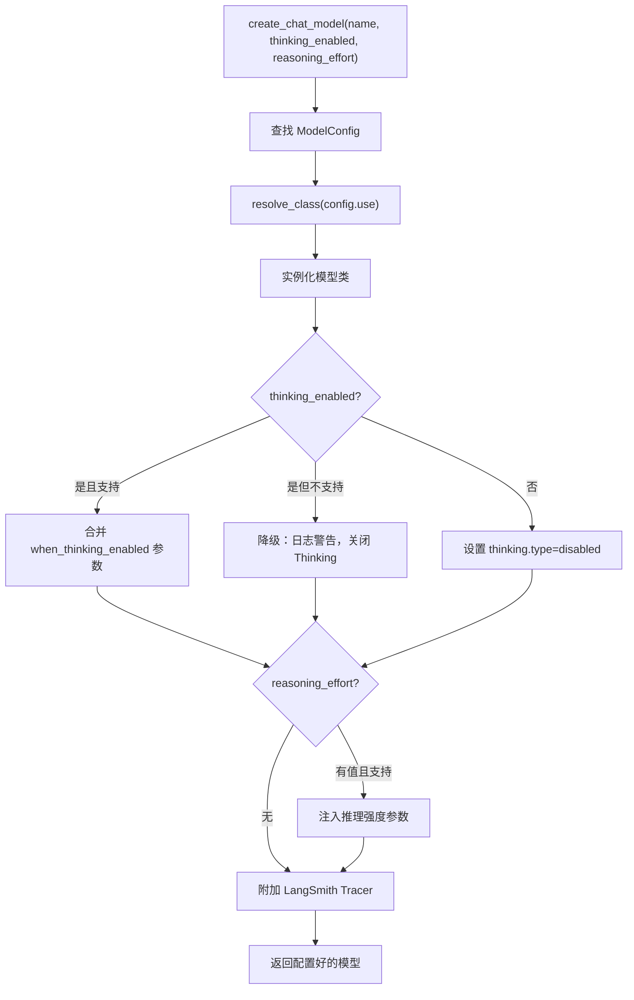

# 第 6 章 模型抽象层

> **读完本章的收获**：你能描述 DeerFlow 如何用一套统一的抽象对接多种 LLM Provider，理解 Thinking 模式、Vision 支持、Reasoning Effort 的工作方式。

---

## 6.1 模型抽象的目标

DeerFlow 是 **模型无关** 的——它不绑定特定 LLM。任何实现 OpenAI 兼容 API 的模型都可以接入。但不同模型有不同的能力（扩展思考、视觉输入、推理强度），模型抽象层负责统一处理这些差异。

**代码位置**：`backend/packages/harness/deerflow/models/`

---

## 6.2 ModelConfig

每个模型在 `config.yaml` 中声明，映射为 `ModelConfig` 对象：

| 字段 | 类型 | 作用 |
|------|------|------|
| `name` | str | 唯一标识符 |
| `display_name` | str \| None | UI 展示名 |
| `use` | str | 类路径（如 `langchain_openai:ChatOpenAI`） |
| `model` | str | 模型标识符（如 `gpt-4`, `claude-3-opus`） |
| `api_key` | str \| None | API 密钥（支持 `$ENV_VAR` 引用） |
| `base_url` | str \| None | API 端点（用于 OpenRouter 等兼容网关） |
| `supports_thinking` | bool | 是否支持扩展思考 |
| `supports_reasoning_effort` | bool | 是否支持推理强度参数 |
| `supports_vision` | bool | 是否支持图片输入 |
| `when_thinking_enabled` | dict | Thinking 模式下的额外参数 |
| `use_responses_api` | bool | 是否使用 OpenAI /responses 端点 |
| `output_version` | str | 结构化输出格式 |

**额外字段**：`ConfigDict(extra="allow")` 允许模型特定的任意参数透传。

---

## 6.3 模型工厂：create_chat_model



### 关键调用路径

```
deerflow/models/factory.py::create_chat_model()
  → get_app_config().get_model_config(name)  // 查找配置
  → resolve_class(config.use)  // 动态加载类
  → cls(**params)  // 实例化
  → _apply_thinking(model, config)  // Thinking 模式处理
  → _apply_reasoning_effort(model, config)  // 推理强度
  → _attach_tracer(model)  // LangSmith（如果启用）
```

---

## 6.4 Thinking 模式

"扩展思考"让 LLM 在正式回复前进行内部推理。不同 Provider 的实现方式不同。

| Provider | Thinking 实现 | 参数 |
|----------|-------------|------|
| OpenAI (o1/o3) | 原生支持 | `reasoning_effort: low/medium/high` |
| Anthropic (Claude) | Extended Thinking | `thinking: {type: enabled, budget_tokens: N}` |
| Codex | Responses API | `reasoning_effort: none/low/medium/high` |
| 其他 | 不支持 | 降级为普通模式 |

**降级机制**：如果用户请求 `thinking_enabled=True` 但模型不支持：
1. 日志记录警告
2. 自动降级为非 Thinking 模式
3. 不抛异常，不中断请求

---

## 6.5 多 Provider 适配

DeerFlow 提供了几个自定义 Provider 类，处理标准 LangChain 接口无法覆盖的场景：

| Provider | 模块 | 特点 |
|----------|------|------|
| OpenAI 标准 | `langchain_openai:ChatOpenAI` | 直接使用 LangChain 原生类 |
| OpenAI Codex | `openai_codex_provider.py` | CLI 模式，读取 `~/.codex/auth.json` |
| Claude Code | `claude_provider.py` | OAuth token，支持多种认证路径 |
| DeepSeek | `patched_deepseek.py` | 定制化参数处理 |
| MiniMax | `patched_minimax.py` | 定制化参数处理 |

### 认证路径优先级（Claude Code 为例）

```
$CLAUDE_CODE_OAUTH_TOKEN
  → $ANTHROPIC_AUTH_TOKEN
    → $CLAUDE_CODE_OAUTH_TOKEN_FILE_DESCRIPTOR
      → $CLAUDE_CODE_CREDENTIALS_PATH
        → ~/.claude/.credentials.json
```

---

## 6.6 环境变量替换

`config.yaml` 中的 `api_key: $OPENAI_API_KEY` 会在加载时被替换为环境变量的实际值。这个替换发生在配置系统的 YAML 解析阶段（Ch12 详述）。

---

## 6.7 设计取舍

**为什么用动态类加载（反射）而不是硬编码 Provider？**
- 新 Provider 只需在 `config.yaml` 中声明 `use: module:Class`，不需要修改代码
- 社区可以贡献自定义 Provider 作为独立包

**为什么 Thinking 模式用降级而不是报错？**
- 用户体验优先——宁可用普通模式回复，也不中断工作
- 前端可以在配置了 Thinking 但模型不支持时给出 UI 提示

---

### 质检报告

**完整性**
- [x] ModelConfig 字段完整
- [x] 工厂函数流程
- [x] Thinking/Vision/Reasoning Effort 三种能力
- [x] 多 Provider 适配

**准确性**
- [x] 字段与 model_config.py 一致
- [x] Provider 列表与 models/ 目录一致

**可读性**
- [x] 从配置 → 工厂 → 能力适配 → Provider 递进
- [x] 降级机制的流程图清晰

**勘误建议**
- 无
