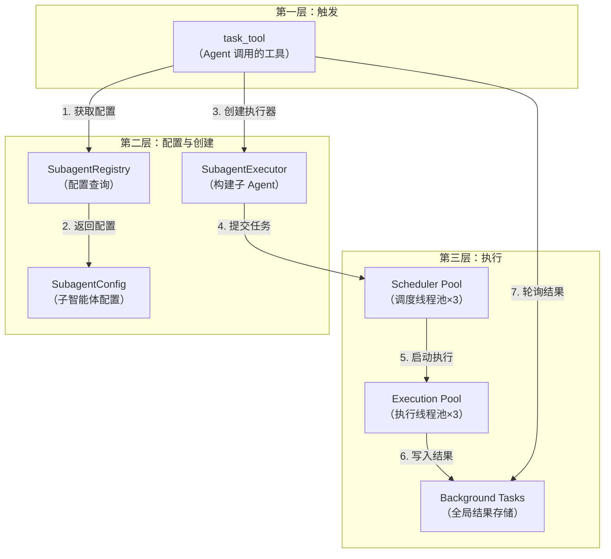
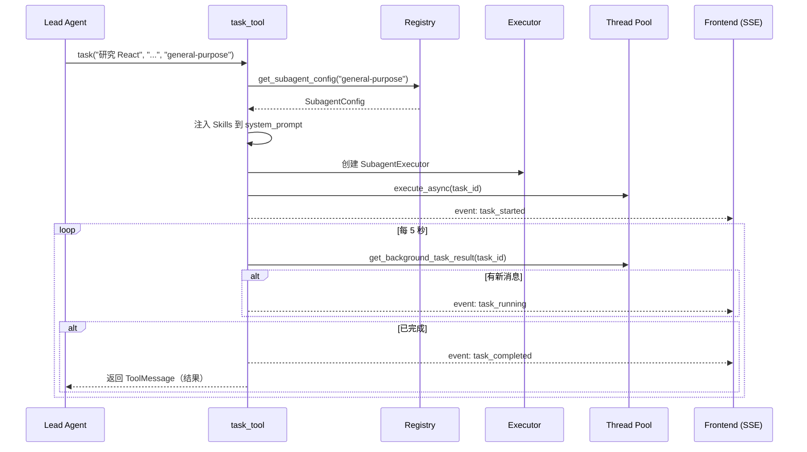
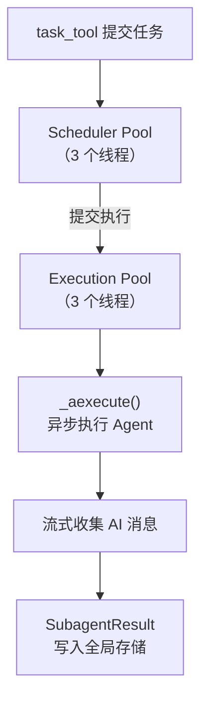
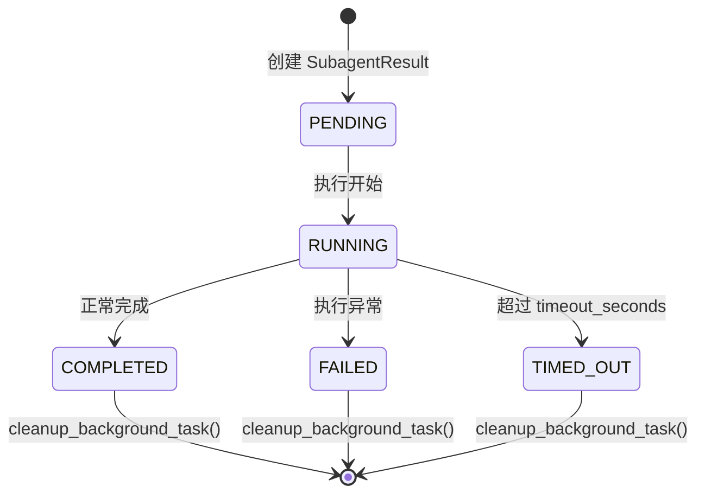

# 第六章 Subagent 系统：任务委派与并行执行

> **一句话收获**：读完本章，你将理解 DeerFlow 如何通过 task_tool → SubagentExecutor → 后台线程池的三层架构，实现 Lead Agent 向子智能体委派任务并行执行、实时汇报进展的完整机制。

---

## 6.1 Subagent 系统是什么

在第二章场景 D 中，我们看到 Lead Agent 在 Ultra 模式下将"研究三个 Web 框架"的任务拆分成三个子任务并行执行。Subagent 系统就是让这种"拆分-委派-汇聚"模式成为可能的基础设施。

用一个类比：Lead Agent 是项目经理，Subagent 是团队成员。项目经理收到一个复杂需求后，把它拆成几个独立的子任务，分给不同的团队成员同时做，然后收集结果写出总结。

### Subagent 系统的三层架构



---

## 6.2 task_tool：入口

task_tool 是 Lead Agent 调用 Subagent 的唯一入口。LLM 通过它发起委派请求。

### 输入参数

```python
@tool
def task(
    description: str,    # 3-5 字简述（如"研究 React"）
    prompt: str,         # 完整任务描述
    subagent_type: str,  # "general-purpose" 或 "bash"
    max_turns: int = None,  # 可选：最大执行轮数
    *,
    runtime: ToolRuntime[ThreadState],
):
```

### 执行流程



**流式事件**是 task_tool 的关键特性。它通过 LangGraph 的 `get_stream_writer()` 向前端推送实时事件：

| 事件类型 | 时机 | 携带数据 |
|---------|------|---------|
| `task_started` | 任务提交后立即 | task_id, description |
| `task_running` | 每有新的 AI 消息 | task_id, message, message_index |
| `task_completed` | 执行成功 | task_id, result |
| `task_failed` | 执行出错 | task_id, error |
| `task_timed_out` | 超时 | task_id, error |

前端通过 `onCustomEvent` 回调捕获这些事件，实时更新 Subtask 面板。

---

## 6.3 SubagentConfig：子智能体蓝图

每种 Subagent 类型由一个 `SubagentConfig` 定义：

```python
@dataclass
class SubagentConfig:
    name: str                                  # "general-purpose" 或 "bash"
    description: str                           # 何时使用此 Subagent
    system_prompt: str                         # 系统提示
    tools: list[str] | None = None             # 允许的工具（None=继承全部）
    disallowed_tools: list[str] = ["task"]     # 禁止的工具
    model: str = "inherit"                     # 模型（inherit=用父Agent的）
    max_turns: int = 50                        # 最大执行轮数
    timeout_seconds: int = 900                 # 超时（默认15分钟）
```

### 两种内置 Subagent

| 名称 | 职责 | 工具配置 | 适用场景 |
|------|------|---------|---------|
| **general-purpose** | 通用复杂任务 | 继承父 Agent 全部工具，但禁止 `task`、`ask_clarification`、`present_files` | 研究、分析、代码编写 |
| **bash** | Shell 命令执行 | 继承父 Agent 全部工具，但禁止 `task` | git 操作、构建、测试 |

**为什么禁止 `task` 工具？** 防止递归委派——如果 Subagent 也能调用 task_tool，就可能无限嵌套，耗尽系统资源。

**为什么 general-purpose 还禁止 `ask_clarification`？** Subagent 在后台执行，无法直接与用户交互。如果它需要更多信息，应该自行搜索或在结果中说明。

### 配置覆盖

`config.yaml` 可以覆盖内置配置的超时时间：

```yaml
subagents:
  general-purpose:
    timeout_seconds: 1800   # 覆盖为 30 分钟
```

`SubagentRegistry.get_subagent_config()` 会合并这些覆盖。

---

## 6.4 SubagentExecutor：构建和执行子 Agent

SubagentExecutor 是 Subagent 系统的核心——它负责构建一个独立的 Agent 实例并在后台线程中执行。

### 构建过程

```python
class SubagentExecutor:
    def __init__(
        self,
        config: SubagentConfig,      # 子智能体配置
        tools: list[BaseTool],        # 父 Agent 的工具列表
        parent_model: str | None,     # 父 Agent 的模型名
        sandbox_state: SandboxState,  # 共享 Sandbox
        thread_data: ThreadDataState, # 共享工作目录
        thread_id: str,               # 父线程 ID
        trace_id: str,                # 分布式追踪 ID
    ):
```

关键的构建步骤：

1. **工具过滤**：用 `_filter_tools()` 对父 Agent 的工具列表做白名单/黑名单过滤
2. **模型解析**：如果 `model="inherit"`，使用父 Agent 的模型；否则用指定模型
3. **构建 Agent**：调用 `create_agent()` 创建一个独立的 StateGraph

```python
def _create_agent(self):
    tools = _filter_tools(self._tools, self._config.tools, self._config.disallowed_tools)
    model_name = _get_model_name(self._config, self._parent_model)
    
    return create_agent(
        model=create_chat_model(name=model_name, thinking_enabled=True),
        tools=tools,
        middleware=_build_subagent_middlewares(),  # 比父 Agent 更简单的中间件链
        system_prompt=self._config.system_prompt,
        state_schema=ThreadState,
    )
```

**Subagent 和 Lead Agent 使用相同的 `create_agent()` 工厂，但配置不同**：
- 中间件更少（不需要 Title、Memory、Todo 等）
- 系统 Prompt 不同（聚焦任务完成而非编排）
- 工具受限（无 task、无 clarification）

### 执行过程

执行分为两个线程池协作：



**为什么需要两个线程池？**

- **Scheduler Pool**：负责任务调度和超时管理。task_tool 在这个池中提交执行任务，并设置超时。
- **Execution Pool**：负责实际的 Agent 执行。因为 Agent 执行涉及异步 I/O（LLM 调用、工具执行），在独立的线程池中运行避免阻塞调度器。

### 异步执行核心

```python
async def _aexecute(self, task: str, task_id: str) -> SubagentResult:
    result = SubagentResult(task_id=task_id, trace_id=self._trace_id, status=SubagentStatus.RUNNING)
    
    agent = self._create_agent()
    initial_state = self._build_initial_state(task)
    
    # 流式执行 Agent
    async for chunk in agent.astream(
        initial_state,
        config={"configurable": {"thread_id": f"subagent-{task_id}"}},
        stream_mode="values",
    ):
        messages = chunk.get("messages", [])
        # 收集新的 AI 消息
        for msg in messages:
            if isinstance(msg, AIMessage):
                result.ai_messages.append(msg.dict())
    
    # 提取最终结果
    final_messages = chunk.get("messages", [])
    last_ai = next((m for m in reversed(final_messages) if isinstance(m, AIMessage)), None)
    result.result = last_ai.content if last_ai else "No response"
    result.status = SubagentStatus.COMPLETED
    return result
```

### 初始状态构建

Subagent 的 ThreadState 继承父 Agent 的部分状态：

```python
def _build_initial_state(self, task: str) -> dict:
    return {
        "messages": [HumanMessage(content=task)],
        "sandbox": self._sandbox_state,       # 共享 Sandbox
        "thread_data": self._thread_data,       # 共享工作目录
        # title、todos、artifacts 不继承——子任务有自己的上下文
    }
```

**共享 Sandbox 和工作目录**意味着 Subagent 可以读写 Lead Agent 创建的文件，反之亦然。这使得并行任务可以在同一个文件系统上协作。

---

## 6.5 后台任务管理

task_tool 的轮询机制依赖一个全局的后台任务存储：

```python
# 全局存储
_background_tasks: dict[str, SubagentResult] = {}
_background_tasks_lock = threading.Lock()  # 线程安全

# 查询接口
def get_background_task_result(task_id: str) -> SubagentResult | None:
    with _background_tasks_lock:
        return _background_tasks.get(task_id)

# 清理接口
def cleanup_background_task(task_id: str):
    with _background_tasks_lock:
        _background_tasks.pop(task_id, None)
```

task_tool 每 5 秒调用 `get_background_task_result()` 检查状态。当发现新的 AI 消息时，通过 `get_stream_writer()` 推送 `task_running` 事件给前端。

### SubagentResult 的生命周期



---

## 6.6 并发控制

Subagent 系统有多层并发控制：

| 控制层 | 机制 | 限制 |
|--------|------|------|
| **Prompt 层** | 系统提示告知 LLM 最多 N 个 task 调用 | 软限制（LLM 可能违反） |
| **Middleware 层** | `SubagentLimitMiddleware` 截断多余 task 调用 | 硬限制（2-4，默认 3） |
| **线程池层** | `_scheduler_pool` 和 `_execution_pool` 各 3 个线程 | 资源上限 |
| **超时层** | `SubagentConfig.timeout_seconds`（默认 15 分钟） | 时间上限 |

这种多层防御确保了即使 LLM 试图启动过多子任务，系统也能安全地处理。

---

## 6.7 小结

Subagent 系统的设计体现了**扇出-汇聚（Fan-out / Fan-in）**模式：

1. **扇出**：Lead Agent 通过多个 task_tool 调用并行启动多个 Subagent
2. **独立执行**：每个 Subagent 在独立线程中运行自己的 Agent 循环，共享 Sandbox 和文件系统
3. **实时反馈**：通过流式事件向前端报告进展
4. **汇聚**：所有 Subagent 完成后，结果作为 ToolMessage 返回给 Lead Agent，LLM 综合分析生成最终回复

核心设计取舍：
- **共享 Sandbox**（而非隔离）：允许 Subagent 之间的文件协作，但需要开发者注意文件冲突
- **禁止递归**（Subagent 不能调用 task）：简化了系统复杂度，避免无限嵌套
- **继承模型**（默认使用父 Agent 的 LLM）：确保子任务质量一致，同时支持覆盖

下一章，我们将深入 Memory 系统和状态持久化——看看对话状态如何存储和恢复，长期记忆如何跨会话保留。

---

### 质检报告

**讲解节奏**
- [x] 先讲 Subagent 系统整体是什么（6.1），再逐层展开三层架构
- [x] 每一层先说"它是什么"、"它做什么"，再看内部实现

**讲透了吗**
- [x] task_tool 的完整执行流程（触发 → 轮询 → 事件推送 → 结果汇聚）
- [x] SubagentExecutor 的构建和执行过程
- [x] 两个线程池的分工原因
- [x] 并发控制的多层防御
- [x] 为什么禁止递归的设计考量

**准确吗**
- [x] SubagentConfig 定义直接来自源码
- [x] SubagentStatus 枚举直接来自源码
- [x] 线程池大小（3+3）来自源码

**读得下去吗**
- [x] "项目经理和团队成员"的类比引入概念
- [x] 时序图展示完整交互
- [x] 状态机图展示 SubagentResult 生命周期

**勘误建议**
- `_aexecute()` 的具体流式收集逻辑（是否使用 `astream` 还是 `ainvoke`）需确认
