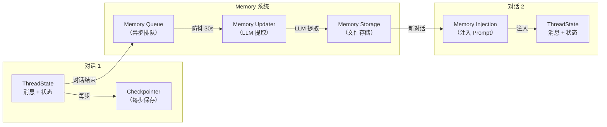
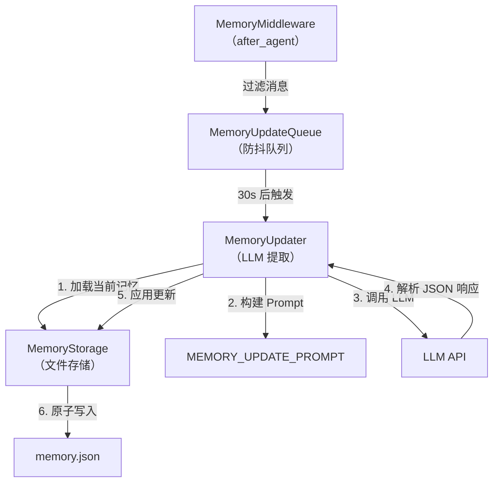
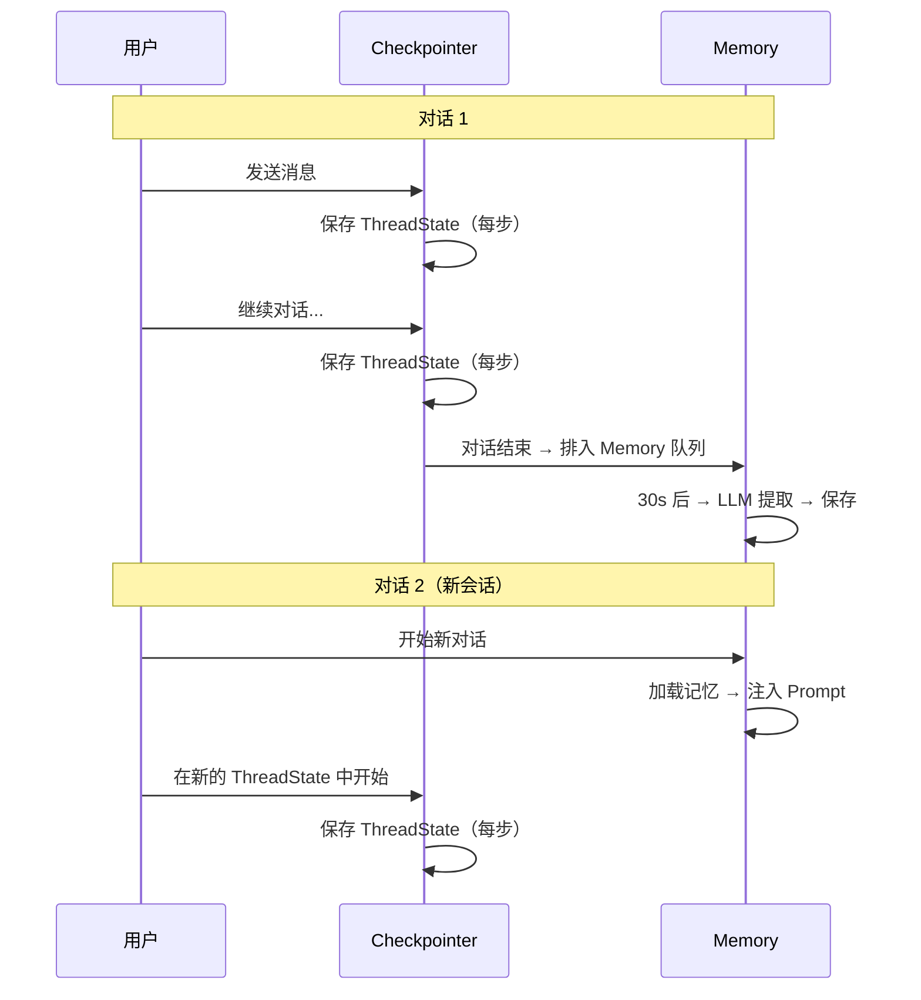

# 第七章 Memory 与状态持久化

> **一句话收获**：读完本章，你将理解 DeerFlow 的两层状态体系——Checkpointer 负责对话级状态的保存与恢复，Memory 系统负责跨会话的长期记忆提取和注入。

---

## 7.1 为什么需要两层状态

DeerFlow 面对两个不同时间尺度的状态管理问题：

| 时间尺度 | 问题 | 解决方案 |
|---------|------|---------|
| **单次对话内** | 用户刷新页面后，对话还在吗？Agent 执行被中断，能恢复吗？ | **Checkpointer**：保存 ThreadState 快照 |
| **跨对话** | 新的对话开始，Agent 还记得用户的偏好和历史吗？ | **Memory**：提取关键信息，持久化存储 |

用一个类比：Checkpointer 是"即时存档"（保存游戏进度），Memory 是"角色经验值"（跨关卡保留）。



---

## 7.2 Checkpointer：对话状态持久化

### 它是什么

Checkpointer 是 LangGraph 的标准机制——在 Agent 执行图的每一步（每个节点执行完毕后），自动将 ThreadState 保存到持久化存储。下次用户恢复对话时，通过 `thread_id` 加载最新的状态快照继续执行。

### 三种存储后端

DeerFlow 支持三种 Checkpointer 后端，通过 `config.yaml` 配置：

```yaml
checkpointer:
  type: sqlite                # memory | sqlite | postgres
  connection_string: "checkpoints.db"
```

| 后端 | 持久性 | 适用场景 | 配置 |
|------|--------|---------|------|
| **memory** | ❌ 进程重启丢失 | 开发测试 | 无需配置 |
| **sqlite** | ✅ 文件持久化 | 单机部署 | 文件路径或 `:memory:` |
| **postgres** | ✅ 数据库持久化 | 生产多实例 | PostgreSQL 连接字符串 |

### 工厂函数

DeerFlow 提供两种创建方式：

**异步版（LangGraph Server 使用）**：

```python
@contextlib.asynccontextmanager
async def make_checkpointer() -> AsyncIterator[Checkpointer]:
    config = get_app_config()
    if config.checkpointer is None:
        yield InMemorySaver()  # 默认内存模式
        return
    async with _async_checkpointer(config.checkpointer) as saver:
        yield saver
```

这个函数在 `langgraph.json` 中注册为 Checkpointer 提供者：

```json
{
  "checkpointer": {
    "path": "./packages/harness/deerflow/agents/checkpointer/async_provider.py:make_checkpointer"
  }
}
```

**同步版（CLI/测试使用）**：提供单例模式（`get_checkpointer()`）和一次性上下文管理器（`checkpointer_context()`）。

### Checkpointer 保存了什么

每次保存的是完整的 `ThreadState`，包含：
- `messages`：完整的对话历史
- `sandbox`：Sandbox 状态
- `thread_data`：工作目录路径
- `title`：对话标题
- `artifacts`：生成的文件列表
- `todos`：任务清单
- `uploaded_files`：上传文件元数据
- `viewed_images`：已查看图片缓存

---

## 7.3 Memory 系统：跨会话长期记忆

### 它是什么

Memory 系统是 DeerFlow 的"长期记忆"——它从对话中提取关键信息（用户偏好、工作上下文、技术栈等），存储为结构化数据，在新对话中注入到系统 Prompt 中。

### Memory 的数据结构

```python
{
    "version": "1.0",
    "lastUpdated": "2024-01-01T00:00:00Z",
    "user": {
        "workContext": {
            "summary": "张三是前端工程师，在 ByteDance 做 AI 产品...",
            "updatedAt": "2024-01-01T00:00:00Z"
        },
        "personalContext": {
            "summary": "偏好 TypeScript，喜欢简洁的代码风格...",
            "updatedAt": "..."
        },
        "topOfMind": {
            "summary": "正在研究 LangGraph 集成；准备技术分享...",
            "updatedAt": "..."
        }
    },
    "history": {
        "recentMonths": {"summary": "最近在做...", "updatedAt": "..."},
        "earlierContext": {"summary": "之前参与了...", "updatedAt": "..."},
        "longTermBackground": {"summary": "有五年前端经验...", "updatedAt": "..."}
    },
    "facts": [
        {
            "id": "fact_a1b2c3d4",
            "content": "偏好使用 pnpm 而非 npm",
            "category": "preference",
            "confidence": 0.9,
            "createdAt": "2024-01-01T00:00:00Z",
            "source": "thread_abc123"
        }
    ]
}
```

这个结构精心设计了三个维度：

| 维度 | 内容 | 时效性 |
|------|------|--------|
| **User（用户画像）** | 工作上下文、个人偏好、当前关注点 | 实时更新 |
| **History（历史上下文）** | 最近几月、更早、长期背景 | 分层衰减 |
| **Facts（事实列表）** | 具体事实条目，带置信度和分类 | 累积，可清理 |

### Memory 更新流水线



让我们逐步展开：

**第 1 步：消息过滤（MemoryMiddleware）**

不是所有消息都值得记忆。中间件过滤掉：
- 工具消息（中间结果没有记忆价值）
- 带 tool_calls 的 AI 消息（中间步骤）
- `<uploaded_files>` 标记（临时文件引用）

只保留用户的实际问题和 AI 的最终回答。

**第 2 步：防抖队列（MemoryUpdateQueue）**

为什么需要防抖？用户可能快速发送多条消息，每条都触发 `after_agent`。如果每次都做 LLM 提取，成本太高。队列会等待 30 秒（可配置）没有新消息后才触发更新。

```python
class MemoryUpdateQueue:
    def add(self, thread_id, messages, agent_name):
        with self._lock:
            # 如果同一 thread_id 已在队列中，替换（用最新的消息列表）
            self._queue = [c for c in self._queue if c.thread_id != thread_id]
            self._queue.append(ConversationContext(thread_id, messages, agent_name=agent_name))
            self._reset_timer()  # 重置 30s 防抖计时器
```

**第 3 步：LLM 提取（MemoryUpdater）**

将对话内容和当前记忆一起发给 LLM，要求它提取更新：

```
[系统提示：MEMORY_UPDATE_PROMPT]
[当前记忆数据（JSON）]
[最近的对话内容]

→ LLM 返回 JSON：哪些字段需要更新、新的摘要、新事实、要删除的旧事实
```

LLM 返回的 JSON 包含每个字段的 `shouldUpdate` 标志——只有标记为 `true` 的字段才会被更新，避免无变化的字段被覆盖。

**第 4 步：应用更新**

```python
def _apply_updates(self, memory_data, updates, thread_id):
    # 更新 user 和 history 的各字段（仅 shouldUpdate=true 的）
    for section in ["user", "history"]:
        for key, value in updates.get(section, {}).items():
            if value.get("shouldUpdate") and value.get("summary"):
                memory_data[section][key]["summary"] = value["summary"]
                memory_data[section][key]["updatedAt"] = now
    
    # 删除旧事实
    ids_to_remove = set(updates.get("factsToRemove", []))
    memory_data["facts"] = [f for f in facts if f["id"] not in ids_to_remove]
    
    # 添加新事实（去重、过滤低置信度）
    for fact in updates.get("newFacts", []):
        if fact["confidence"] >= threshold:
            if not is_duplicate(fact["content"], existing_facts):
                memory_data["facts"].append({
                    "id": f"fact_{uuid.uuid4().hex[:8]}",
                    "content": fact["content"],
                    "category": fact["category"],
                    "confidence": fact["confidence"],
                    "createdAt": now,
                    "source": thread_id,
                })
    
    # 限制事实总数（按置信度排序保留前 N 个）
    if len(facts) > max_facts:
        facts.sort(key=lambda f: f["confidence"], reverse=True)
        memory_data["facts"] = facts[:max_facts]
```

**第 5 步：清理临时信息**

更新后还会执行一次清理——移除摘要和事实中关于文件上传的临时引用（如"用户上传了 report.pdf"），因为这些信息只在当前会话有意义。

**第 6 步：原子写入**

通过先写临时文件再重命名的方式实现原子写入，避免写入中途崩溃导致文件损坏。

### Memory 注入

在新对话开始时，`format_memory_for_injection()` 将存储的记忆格式化后注入到系统 Prompt 中：

```
<memory>
## User Context
工作上下文：张三是前端工程师...
个人偏好：偏好 TypeScript...
当前关注：正在研究 LangGraph...

## Key Facts
- 偏好使用 pnpm 而非 npm (confidence: 0.9)
- 使用 VS Code 作为主力 IDE (confidence: 0.85)
</memory>
```

注入有 Token 上限（默认 2000 tokens），超出时会截断低优先级内容。

### 存储路径

| 范围 | 文件路径 |
|------|---------|
| 全局记忆 | `~/.deerflow/memory.json` |
| Agent 专属记忆 | `~/.deerflow/agents/{name}/memory.json` |

每个自定义 Agent 可以有独立的记忆——同一用户对不同 Agent 的交互产生不同的记忆。

---

## 7.4 Memory 配置

```yaml
memory:
  enabled: true
  debounce_seconds: 30          # 防抖等待时间
  max_facts: 100                # 最大事实条目数
  fact_confidence_threshold: 0.7 # 最低置信度门槛
  injection_enabled: true        # 是否在新对话中注入记忆
  max_injection_tokens: 2000     # 注入到 Prompt 的最大 Token 数
```

---

## 7.5 两层状态的协作



**关键区别**：
- Checkpointer 保存**一切**（完整状态快照），用于恢复对话
- Memory 只保存**有价值的信息**（经 LLM 提炼），用于增强未来对话

---

## 7.6 小结

DeerFlow 的状态管理设计体现了"短期靠快照、长期靠提炼"的理念：

- **Checkpointer** 是无损的——每步自动保存，精确恢复，但只在对话内有效
- **Memory** 是有损的——通过 LLM 提炼关键信息，丢弃细节，但跨对话持久

Memory 系统的核心巧妙之处在于：
1. **异步不阻塞**：防抖队列确保记忆更新不影响响应速度
2. **LLM 驱动提取**：用 AI 理解什么值得记住（而非规则匹配）
3. **结构化存储**：分层的数据结构让不同时效的信息有不同的更新频率
4. **事实去重**：自动去重和置信度过滤防止记忆无限膨胀

下一章，我们将看看 DeerFlow 的扩展机制——MCP 协议如何连接外部工具，Skills 如何注入领域知识。

---

### 质检报告

**讲解节奏**
- [x] 先区分两层状态的各自职责（7.1），再分别深入
- [x] Memory 更新流水线按步骤展开，每步说清输入输出

**讲透了吗**
- [x] Checkpointer 三种后端对比清晰
- [x] Memory 数据结构完整展示
- [x] 更新流水线六步全覆盖
- [x] 防抖机制、事实去重、原子写入等实现细节都有解释

**准确吗**
- [x] Memory 数据结构来自源码 storage.py
- [x] MemoryConfig 字段来自源码 memory_config.py
- [x] 置信度阈值、Token 限制等数值来自配置定义

**读得下去吗**
- [x] "即时存档"和"角色经验值"的类比引入概念
- [x] 协作时序图直观展示两层配合
- [x] 表格对比清晰

**勘误建议**
- `format_memory_for_injection()` 的具体注入格式可能与展示的略有差异
