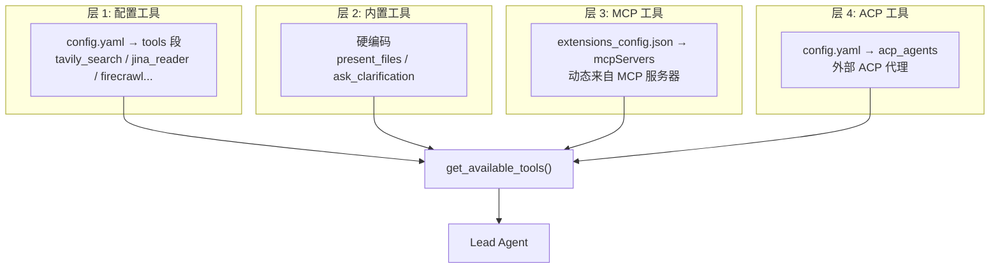
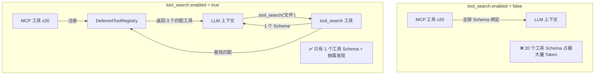
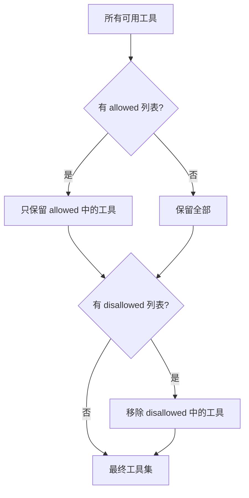

# 第 7 章 工具体系

> **读完本章的收获**：你能描述 DeerFlow 中工具的四个来源层、它们如何被收集和注册、延迟工具加载的设计，以及工具过滤策略。

---

## 7.1 工具的四个来源层

DeerFlow 的工具是分层收集的，每层独立配置、独立控制：



---

## 7.2 配置工具（Community Tools）

在 `config.yaml` 的 `tools` 段声明，通过反射系统（`resolve_variable`）动态加载。

| 工具 | 模块 | 功能 |
|------|------|------|
| tavily_search | `deerflow.community.tavily` | Tavily 搜索 API |
| ddg_search | `deerflow.community.ddg_search` | DuckDuckGo 搜索（免费） |
| jina_reader | `deerflow.community.jina_ai` | 网页内容提取 |
| firecrawl_scrape | `deerflow.community.firecrawl` | 网页抓取 |
| firecrawl_crawl | `deerflow.community.firecrawl` | 网站爬取 |
| infoquest | `deerflow.community.infoquest` | 聚合搜索 |
| image_search | `deerflow.community.image_search` | Google 图片搜索 |

### 工具组（Tool Groups）

工具可以按 `group` 分类。自定义代理通过 `tool_groups` 字段指定只使用哪些组：

```yaml
# config.yaml
tools:
  - name: tavily_search
    use: "deerflow.community.tavily:tavily_search_tool"
    group: search

agents:
  researcher:
    tool_groups: [search]  # 只使用 search 组的工具
```

---

## 7.3 内置工具

始终可用，不可关闭：

| 工具 | 用途 | 关键行为 |
|------|------|---------|
| `present_files` | 将文件注册为 Artifact | 写入 state.artifacts，前端展示下载按钮 |
| `ask_clarification` | 暂停执行请求用户澄清 | 被 ClarificationMiddleware 拦截处理 |

条件性内置工具：

| 工具 | 条件 | 用途 |
|------|------|------|
| `view_image` | `supports_vision=True` | base64 编码图片供 LLM 分析 |
| `task` | `subagent_enabled=True` | 委派子任务（详见 Ch10） |
| `tool_search` | `tool_search.enabled=True` | 搜索延迟注册的工具 |
| `setup_agent` | `is_bootstrap=True` | 创建自定义代理配置 |
| `invoke_acp_agent` | ACP 配置存在 | 调用外部 ACP 代理 |

---

## 7.4 MCP 工具

MCP（Model Context Protocol）工具来自外部服务器，通过 `extensions_config.json` 配置：


### 三种传输方式

| 类型 | 配置 | 通信方式 |
|------|------|---------|
| `stdio` | command + args | 启动子进程，通过 stdin/stdout 通信 |
| `sse` | url + headers | HTTP Server-Sent Events |
| `http` | url + headers | 标准 HTTP 请求-响应 |

### OAuth 支持

HTTP/SSE 类型的 MCP 服务器支持 OAuth 认证：
- `client_credentials` 流程
- `refresh_token` 流程
- Token 自动刷新

### 缓存机制

```python
get_cached_mcp_tools() -> list[BaseTool]
# 进程级缓存，跨线程共享
# 当 ExtensionsConfig 变更时重新加载
```

---

## 7.5 延迟工具加载（Tool Search）

当 MCP 工具数量很多时，将所有工具的 Schema 绑定到模型会浪费大量上下文 Token。Tool Search 机制解决这个问题。



**DeferredToolFilterMiddleware** 在 `before_agent` 阶段将延迟工具的 Schema 从 `model.bind_tools()` 中移除。LLM 只看到 `tool_search` 一个工具。

---

## 7.6 工具过滤策略

子代理（Sub-Agent）和自定义代理使用工具过滤来限制可用工具：



**关键规则**：子代理的 `disallowed_tools` 默认包含 `["task"]`——防止子代理再创建子代理，避免无限递归。

---

## 7.7 沙箱工具

沙箱提供的工具不在 `get_available_tools` 中直接出现——它们由沙箱中间件注入，作为代理的文件系统操作能力：

| 工具 | 功能 |
|------|------|
| `bash` | 执行 Bash 命令 |
| `ls` | 列出目录内容 |
| `read_file` | 读取文本文件 |
| `write_file` | 写入/追加文件 |
| `str_replace` | 字符串替换编辑 |

这些工具通过 `state.sandbox.sandbox_id` 找到对应的沙箱实例来执行操作。

---

## 7.8 设计取舍

**为什么分四层而不是统一配置？**
- 内置工具不可关闭（保证代理基础能力）
- 配置工具可灵活开关（按需启用搜索/爬虫）
- MCP 工具来自外部（独立的配置文件和缓存机制）
- ACP 工具是不同的协议（需要特殊的调用方式）

**为什么 Tool Search 用关键词搜索而不是语义搜索？**
- 工具名和描述通常足够区分，关键词匹配高效且可预测
- 语义搜索需要额外的向量化成本和延迟
- 工具数量通常在几十个级别，不需要复杂检索

---

### 质检报告

**完整性**
- [x] 四层工具来源
- [x] 配置工具清单
- [x] 内置工具清单（含条件性工具）
- [x] MCP 三种传输 + OAuth + 缓存
- [x] Tool Search 延迟加载机制
- [x] 工具过滤策略
- [x] 沙箱工具

**准确性**
- [x] 工具列表与 community/ 和 builtins/ 目录一致

**可读性**
- [x] 四层架构图清晰
- [x] Tool Search 对比图直观展示价值

**勘误建议**
- 无
