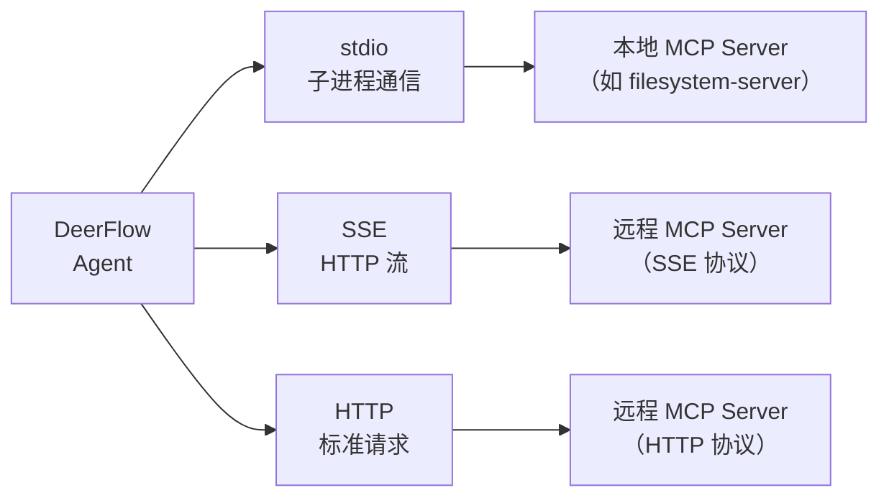
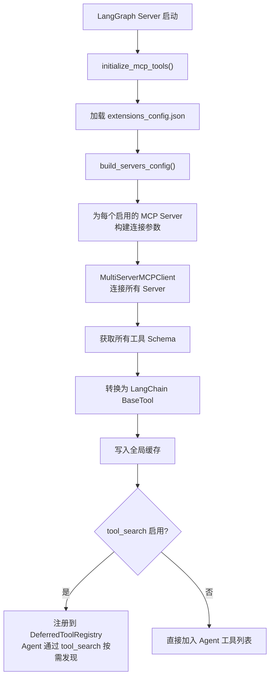
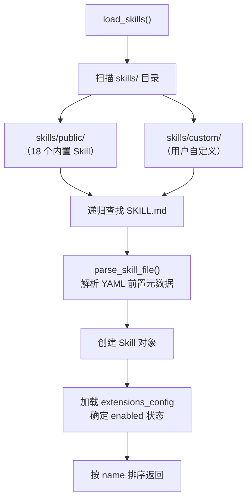
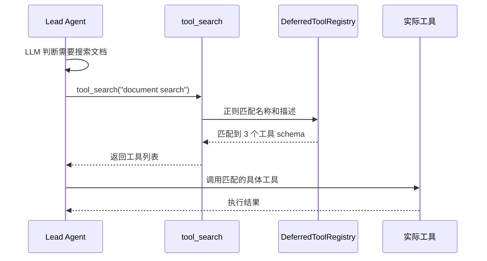

# 第八章 MCP 与 Skills 扩展机制

> **一句话收获**：读完本章，你将理解 DeerFlow 的两种扩展方式——MCP 协议连接外部工具服务器（增加 Agent 的"手"），Skills 注入领域知识（增加 Agent 的"脑"）。

---

## 8.1 为什么需要扩展机制

DeerFlow 内置了搜索、文件操作、代码执行等核心工具。但真实场景的需求远不止这些——你可能需要查询数据库、调用企业 API、操作特定 SaaS 工具。如果每种工具都要在 DeerFlow 代码中实现，系统会变得臃肿且难以维护。

DeerFlow 的扩展策略是**两条路径**：

| 扩展方式 | 增加什么 | 实现方式 | 类比 |
|---------|---------|---------|------|
| **MCP** | 新工具（能力） | 连接外部服务器 | 给 Agent 装新工具 |
| **Skills** | 新知识（智慧） | 注入到 Prompt | 给 Agent 学新课程 |

---

## 8.2 MCP：外部工具的标准接口

### MCP 是什么

MCP（Model Context Protocol，模型上下文协议）是一个行业标准协议，定义了 AI Agent 如何发现和调用外部工具。你可以把它理解为**AI 工具的 USB 接口**——任何遵循 MCP 协议的工具服务器都可以即插即用地连接到 DeerFlow。

### 三种传输方式

MCP 支持三种连接方式：



| 传输方式 | 连接方法 | 适用场景 |
|---------|---------|---------|
| **stdio** | 启动子进程，通过标准输入/输出通信 | 本地工具（npm 包） |
| **sse** | HTTP SSE 连接 | 远程服务（需持久连接） |
| **http** | 标准 HTTP 请求 | 远程服务（无状态） |

### 配置方式

MCP 服务器在 `extensions_config.json` 中配置：

```json
{
  "mcpServers": {
    "tavily-search": {
      "type": "stdio",
      "command": "npx",
      "args": ["-y", "@anthropic-ai/mcp-server-tavily"],
      "env": { "TAVILY_API_KEY": "your-key" },
      "enabled": true
    },
    "my-api": {
      "type": "http",
      "url": "https://api.example.com/mcp",
      "headers": { "Authorization": "Bearer xxx" },
      "enabled": true
    }
  }
}
```

### 工具加载流程



**关键代码**：`build_server_params()` 根据传输类型构建不同的连接参数：

```python
def build_server_params(server_name: str, config: McpServerConfig) -> dict:
    transport_type = config.type or "stdio"
    params = {"transport": transport_type}
    
    if transport_type == "stdio":
        params["command"] = config.command
        params["args"] = config.args
        if config.env:
            params["env"] = config.env
    elif transport_type in ("sse", "http"):
        params["url"] = config.url
        if config.headers:
            params["headers"] = config.headers
    
    return params
```

### 缓存与热更新

MCP 工具在首次加载后会被缓存。但 DeerFlow 有一个巧妙的热更新机制：

1. 缓存初始化时记录 `extensions_config.json` 的文件修改时间（mtime）
2. 每次 `get_cached_mcp_tools()` 被调用时，检查 mtime 是否变化
3. 如果配置文件被修改（比如通过 Gateway API），自动清除缓存并重新加载

```python
def _is_cache_stale() -> bool:
    current_mtime = _get_config_mtime()
    if current_mtime > _config_mtime:
        return True  # 配置已更改，缓存过期
    return False
```

这确保了通过 Gateway API 修改 MCP 配置后，LangGraph Server 能在下次请求时自动加载新工具，无需重启服务。

---

## 8.3 Skills：领域知识注入

### Skills 是什么

Skills 是 DeerFlow 特有的扩展机制——通过 Markdown 文件定义的领域知识包。它们不是代码插件，而是**结构化的 Prompt 指令**，在 Agent 构建时注入到系统 Prompt 中。

> Skills 最接近的行业概念是 Plugin / Template，但实现方式完全不同。传统插件通过代码接口扩展功能，Skills 通过 Prompt 注入扩展知识和工作流程。这种设计的优势是**零代码门槛**——只需写 Markdown 就能教会 Agent 新技能。

### SKILL.md 文件结构

每个 Skill 是一个目录，核心是 `SKILL.md` 文件：

```markdown
---
name: deep-research
description: Conduct comprehensive deep research with multi-source analysis and structured reports
license: MIT
---

# Deep Research Skill

## Overview
This skill enables comprehensive research on any topic...

## Workflow
1. Decompose the research question into sub-topics
2. Search multiple sources for each sub-topic
3. Synthesize findings into a structured report
...

## Output Format
The final output should include:
- Executive summary
- Detailed findings per sub-topic
- Sources and citations
```

YAML 前置元数据（frontmatter）定义元信息，正文就是 Agent 的工作指南。

### Skill 的数据模型

```python
@dataclass
class Skill:
    name: str              # "deep-research"
    description: str       # 简要描述
    license: str | None    # 许可证
    skill_dir: Path        # 技能目录路径
    skill_file: Path       # SKILL.md 文件路径
    relative_path: Path    # 相对分类根目录的路径
    category: str          # "public" 或 "custom"
    enabled: bool          # 是否启用
```

### Skill 发现与加载



加载过程遍历 `skills/public/` 和 `skills/custom/` 两个目录，递归查找所有 `SKILL.md` 文件。前置元数据必须包含 `name` 和 `description` 字段，缺少则跳过。

### 内置 Skills

DeerFlow 预装了 18 个 Skill：

| Skill | 职责 |
|-------|------|
| `deep-research` | 多来源深度研究 + 结构化报告 |
| `data-analysis` | 数据分析与可视化 |
| `chart-visualization` | 图表生成 |
| `ppt-generation` | PPT 幻灯片创建 |
| `podcast-generation` | 播客内容生成 |
| `image-generation` | AI 图片生成 |
| `video-generation` | 视频生成 |
| `frontend-design` | 前端 UI 设计 |
| `web-design-guidelines` | Web 设计指南 |
| `consulting-analysis` | 咨询分析 |
| `github-deep-research` | GitHub 项目深度分析 |
| `claude-to-deerflow` | Claude Code 集成 |
| `skill-creator` | 帮助创建新 Skill |
| `find-skills` | 帮助发现可用 Skill |
| `bootstrap` | Agent 初始化引导 |
| `surprise-me` | 随机创意任务 |
| `vercel-deploy-claimable` | Vercel 部署 |

### Skills 如何生效

Skills 通过 `apply_prompt_template()` 注入到系统 Prompt 中（参见第 3 章）。注入的内容包括：

1. **可用 Skill 列表**：告诉 Agent 当前启用了哪些 Skill
2. **Skill 文件路径**：Agent 可以用 `read_file` 工具读取 `/mnt/skills/public/{skill_name}/SKILL.md` 获取完整指南
3. **激活条件**：某些 Skill 只在用户请求相关任务时才被 Agent 主动加载

这种**按需加载**设计是上下文工程的体现——不把所有 Skill 内容一次性塞入 Prompt（那样会消耗大量 Token），而是告诉 Agent "你有这些技能可用"，让它在需要时自己去读取详细内容。

---

## 8.4 Deferred Tool Registry：按需发现

当 MCP 工具数量很多时，DeerFlow 使用 Deferred Tool Registry 实现按需发现：



DeferredToolFilterMiddleware 确保延迟工具的 schema 不出现在 LLM 的工具绑定中——LLM 只看到 `tool_search` 一个工具。但在 ToolNode 执行层面，所有延迟工具仍然可用（LLM 通过 `tool_search` 发现后可以直接调用）。

---

## 8.5 两种扩展机制的对比

| 维度 | MCP | Skills |
|------|-----|--------|
| **扩展什么** | 工具（能力） | 知识（工作流） |
| **实现方式** | 外部服务器 + 协议 | Markdown 文件 + Prompt 注入 |
| **运行时** | 工具调用时执行 | 构建 Agent 时注入 |
| **开发门槛** | 需要实现 MCP 协议 | 只需写 Markdown |
| **生效位置** | ToolNode（执行层） | System Prompt（决策层） |
| **配置文件** | extensions_config.json | skills/public/ 或 custom/ |
| **热更新** | 支持（mtime 检测） | 部分支持（重新构建 Agent） |

**设计哲学**：MCP 让 Agent 能"做更多事"，Skills 让 Agent 能"做得更好"。两者互补——MCP 提供执行能力，Skills 提供领域智慧。

---

## 8.6 小结

DeerFlow 的扩展架构体现了"开放但可控"的设计原则：

- **MCP 的标准化接口**让任何外部工具都能接入，但通过 `extensions_config.json` 和启用/禁用机制控制访问
- **Skills 的 Markdown 实现**极大降低了贡献门槛，但通过 frontmatter 验证和按需加载控制质量和成本
- **Deferred Tool Registry** 在工具数量增长时优雅地管理上下文窗口

下一章，我们将看看 Gateway API 和 Frontend——这两个面向用户的组件如何与后端 Agent 系统配合工作。

---

### 质检报告

**讲解节奏**
- [x] 先讲为什么需要扩展（8.1），再分别展开 MCP 和 Skills
- [x] 每个机制先说"是什么"、"解决什么问题"，再看实现

**讲透了吗**
- [x] MCP 三种传输方式、配置格式、加载流程完整
- [x] Skills 的文件结构、解析过程、注入方式完整
- [x] Deferred Tool Registry 的设计动机和工作流程清晰
- [x] 缓存热更新机制的 mtime 检测有详细解释

**准确吗**
- [x] build_server_params() 代码直接来自源码
- [x] Skill dataclass 直接来自源码
- [x] 18 个内置 Skills 列表经过目录验证

**读得下去吗**
- [x] "USB 接口"类比引入 MCP 概念
- [x] 对比表格一目了然
- [x] 代码和图结合讲解

**勘误建议**
- `vercel-deploy-claimable` Skill 的具体功能未详细验证
