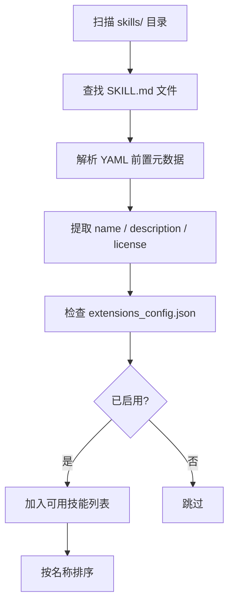
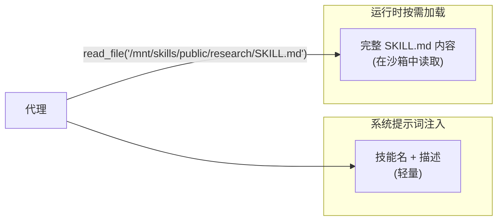

# 第 8 章 Skills 系统

> **读完本章的收获**：你能描述 DeerFlow 技能的定义方式、发现与加载流程、渐进式加载策略，以及技能如何在沙箱中执行。

---

## 8.1 技能是什么

技能（Skill）是 DeerFlow 的 **结构化能力模块**——一个目录，核心是 `SKILL.md` 文件。它不是代码意义上的工具函数，而是一个 **指导文档**，告诉代理如何完成特定类型的任务。

类比：如果工具是代理的"手"，技能就是代理的"操作手册"。

**代码位置**：`backend/packages/harness/deerflow/skills/`
**技能目录**：`skills/public/`（内置）和 `skills/custom/`（自定义，gitignored）

---

## 8.2 SKILL.md 规范

每个技能目录包含一个 `SKILL.md` 文件：

```markdown
---
name: research
description: Deep research on any topic
license: MIT
version: 1.0.0       # 可选
author: DeerFlow      # 可选
compatibility: ">=2.0" # 可选
---

# Research Skill

## 工作流程
1. 使用搜索工具收集资料
2. 分析和组织信息
3. 生成结构化报告

## 最佳实践
- 多源交叉验证
- 引用原始来源
...
```

### 元数据字段

| 字段 | 必需 | 作用 |
|------|------|------|
| `name` | 是 | 技能的唯一标识符 |
| `description` | 是 | 一句话描述（展示在 UI 和注入到提示词） |
| `license` | 否 | 许可证 |
| `version` | 否 | 版本号 |
| `author` | 否 | 作者 |
| `compatibility` | 否 | 兼容的 DeerFlow 版本 |

---

## 8.3 技能发现与加载



### 关键调用路径

```
deerflow/skills/loader.py::load_skills(skills_path, use_config, enabled_only)
  → 扫描 skills/{public,custom}/ 子目录
  → 对每个含 SKILL.md 的目录:
    → parser.py::parse_skill_md(skill_file)
      → 提取 YAML frontmatter
      → 构建 Skill 对象
    → 检查 extensions_config.json 中的启用状态
  → 返回排序后的技能列表
```

### Skill 对象结构

```python
Skill(
    name: str,              # 来自 SKILL.md frontmatter
    description: str,       # 来自 SKILL.md frontmatter
    license: str | None,
    skill_dir: Path,        # 技能目录路径
    skill_file: Path,       # SKILL.md 文件路径
    relative_path: Path,    # 相对于分类根目录的路径
    category: str,          # "public" 或 "custom"
    enabled: bool,          # 来自 extensions_config.json
)
```

---

## 8.4 渐进式加载

这是 DeerFlow 技能系统的核心设计——技能 **不会全部注入到系统提示词中**。



**两阶段策略**：

1. **提示词阶段**：只注入技能名称和一句话描述到系统提示词（节省 Token）
2. **执行阶段**：代理通过 `read_file` 工具在沙箱中读取完整 SKILL.md 内容

这样即使有 20 个技能，系统提示词也只增加约 20 行文本，而不是 20 个完整文档。

---

## 8.5 沙箱路径映射

技能目录在沙箱中通过路径映射访问：

| 宿主路径 | 沙箱路径 |
|---------|---------|
| `skills/public/research/` | `/mnt/skills/public/research/` |
| `skills/custom/my-skill/` | `/mnt/skills/custom/my-skill/` |

LocalSandbox 的 `path_mappings` 将容器路径翻译为宿主文件系统路径。当代理调用 `read_file("/mnt/skills/public/research/SKILL.md")` 时，实际读取的是宿主上的 `skills/public/research/SKILL.md`。

---

## 8.6 技能安装

除了手动放置文件，DeerFlow 还支持通过 Gateway API 安装技能：

```
POST /api/skills/install
  → 从 Git 仓库克隆 .skill 归档
  → 解压到 skills/custom/ 目录
  → 验证 SKILL.md 格式
  → 更新 extensions_config.json
```

安装时接受可选的 frontmatter 元数据（`version`、`author`、`compatibility`），不会因为这些额外字段拒绝有效技能。

---

## 8.7 技能启用/禁用

技能的启用状态持久化在 `extensions_config.json` 的 `skills` 段：

```json
{
  "skills": {
    "research": {"enabled": true},
    "slide-creation": {"enabled": false}
  }
}
```

通过 Gateway API 切换：`PUT /api/skills/{skill_name}` with `{"enabled": true/false}`。

---

## 8.8 内置技能一览

`skills/public/` 中的内置技能：

| 技能 | 目录 | 功能 |
|------|------|------|
| research | `skills/public/research/` | 深度调研 |
| report-generation | `skills/public/report-generation/` | 报告生成 |
| slide-creation | `skills/public/slide-creation/` | 幻灯片制作 |
| web-page | `skills/public/web-page/` | 网页生成 |
| image-generation | `skills/public/image-generation/` | 图片生成 |
| claude-to-deerflow | `skills/public/claude-to-deerflow/` | Claude Code 集成 |

---

## 8.9 设计取舍

**为什么用 Markdown 文件而不是代码定义技能？**
- Markdown 对非开发者也可写（产品经理、领域专家）
- 不需要编程知识就能定义工作流
- LLM 天然擅长理解和遵循 Markdown 指令

**为什么渐进式加载？**
- 上下文窗口是稀缺资源——每个 SKILL.md 可能有数百行
- 大多数任务只需要 1-2 个技能
- 按需读取 = 只在需要时消耗 Token

---

### 质检报告

**完整性**
- [x] SKILL.md 规范和元数据
- [x] 发现与加载流程
- [x] 渐进式加载策略
- [x] 沙箱路径映射
- [x] 安装机制和启用/禁用
- [x] 内置技能列表

**准确性**
- [x] Skill 对象字段与 types.py 一致
- [x] 路径映射与 LocalSandbox 实现一致

**可读性**
- [x] 渐进式加载的两阶段图清晰展示设计意图
- [x] 类比"手 vs 操作手册"帮助理解概念

**勘误建议**
- 无
