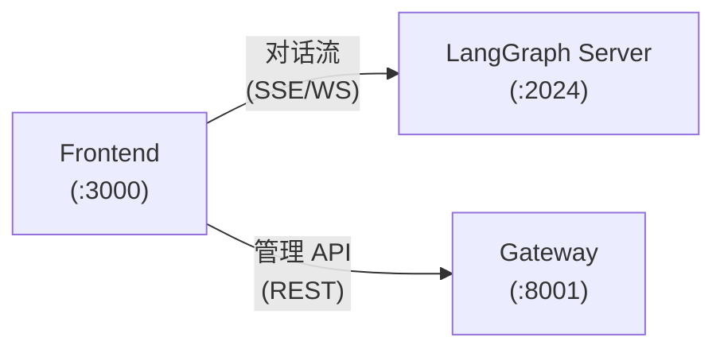
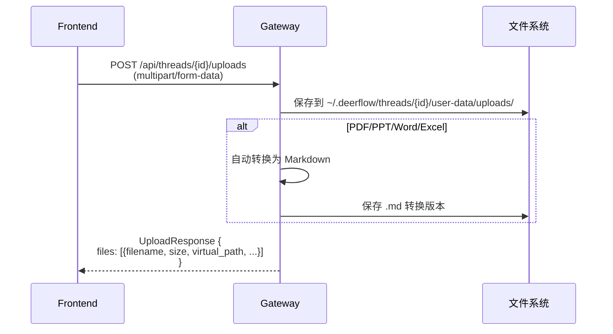
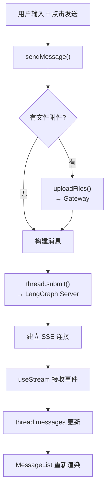
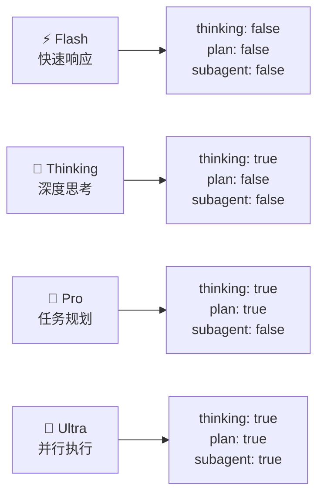
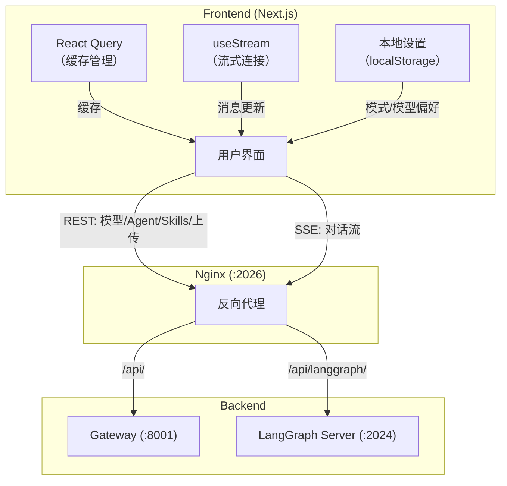

# 第九章 Gateway API 与 Frontend 架构

> **一句话收获**：读完本章，你将理解 DeerFlow 的两个面向用户的组件——FastAPI Gateway 提供管理类 REST API，Next.js Frontend 通过 LangGraph SDK 实现流式对话 UI——它们如何与后端 Agent 系统无缝协作。

---

## 9.1 两端各自的职责

在第一章中，我们介绍了 DeerFlow 的四个服务。本章聚焦其中面向用户的两个：

| 组件 | 职责 | 面向谁 |
|------|------|--------|
| **Gateway** | 管理类操作：模型列表、文件上传、Agent CRUD、MCP 配置 | 前端 UI + 管理员 |
| **Frontend** | 用户界面：对话交互、消息渲染、设置管理 | 终端用户 |

它们的分工可以这样理解：**Frontend 负责"用"Agent（对话、流式交互），Gateway 负责"管"Agent（配置、资源）**。前端直接通过 LangGraph SDK 与 LangGraph Server 通信处理对话，通过 Gateway 处理其他一切。



---

## 9.2 Gateway：管理类 REST API

### 它是什么

Gateway 是一个 FastAPI 应用，提供 Agent 运行所需的配套 API——不直接参与 Agent 执行，但负责 Agent 执行的"后勤保障"。

### API 路由总览

| 路由 | 方法 | 职责 |
|------|------|------|
| `/api/models` | GET | 返回 config.yaml 中配置的可用 LLM 模型列表 |
| `/api/agents` | GET/POST | 列出/创建自定义 Agent |
| `/api/agents/{name}` | GET/PUT/DELETE | 获取/更新/删除自定义 Agent |
| `/api/agents/check` | GET | 检查 Agent 名称是否可用 |
| `/api/mcp/config` | GET/PUT | 获取/更新 MCP 服务器配置 |
| `/api/skills` | GET | 列出所有可用 Skills |
| `/api/skills/install` | POST | 从 .skill 归档安装 Skill |
| `/api/memory` | GET | 获取当前记忆数据 |
| `/api/memory/reload` | POST | 强制重载记忆 |
| `/api/memory/config` | GET | 获取记忆配置 |
| `/api/threads/{id}/uploads` | POST | 上传文件到线程 |
| `/api/threads/{id}/uploads/list` | GET | 列出线程的上传文件 |
| `/api/threads/{id}/artifacts/{path}` | GET | 获取线程生成的产出文件 |
| `/api/threads/{id}` | DELETE | 清理线程数据 |
| `/api/threads/{id}/suggestions` | POST | 生成后续问题建议 |
| `/api/user-profile` | GET/PUT | 获取/设置全局 USER.md |
| `/health` | GET | 健康检查 |

### 自定义 Agent 管理

自定义 Agent 是 DeerFlow 的特色功能——用户可以创建具有特定人格和工具集的 Agent。Gateway 管理它们的 CRUD：

**存储结构**：
```
~/.deerflow/agents/{name}/
├── config.yaml    # 名称、描述、模型、工具分组
├── SOUL.md        # Agent 人格和行为指南
└── memory.json    # Agent 专属记忆
```

**创建请求**：
```json
POST /api/agents
{
  "name": "code-reviewer",        // 必须匹配 ^[A-Za-z0-9-]+$
  "description": "专业代码审查 Agent",
  "model": "openai/gpt-4.1",      // 可选，默认继承全局
  "tool_groups": ["sandbox"],      // 可选，限制工具分组
  "soul": "你是一位严谨的代码审查专家..."  // SOUL.md 内容
}
```

### 文件上传流程

文件上传是 Gateway 最重要的非管理功能（因为 LangGraph SDK 不直接支持文件上传）：



Gateway 的文件转换功能（`converter.py`）让 Agent 能处理 PDF、PPT、Word、Excel 等格式——自动转为 Markdown 后，Agent 用 `read_file` 工具就能读取内容。

---

## 9.3 Frontend：用户界面架构

### 技术栈

| 技术 | 用途 |
|------|------|
| **Next.js 16** | React 框架，App Router |
| **React 19** | UI 渲染 |
| **TypeScript** | 类型安全 |
| **@langchain/langgraph-sdk** | 与 LangGraph Server 的流式通信 |
| **@tanstack/react-query** | 数据获取和缓存 |
| **Tailwind CSS + Radix UI** | 样式和组件库 |
| **pnpm** | 包管理 |

### 路由结构

```
/                                    → 落地页
/workspace                           → 工作区总览
/workspace/chats/[thread_id]         → 对话页面（核心 UI）
/workspace/agents                    → Agent 列表
/workspace/agents/[name]/chats/[id]  → Agent 专属对话
/workspace/settings                  → 设置
```

### 状态管理

Frontend **不使用 Zustand/Redux**，而是完全依赖 React 原生模式：

| 状态类型 | 管理方式 | 数据来源 |
|---------|---------|---------|
| 对话状态 | `useStream()` hook | LangGraph Server SSE |
| 服务端数据 | React Query | Gateway REST API |
| 本地设置 | localStorage + Context | 用户偏好 |
| 子任务状态 | React Context | 自定义流式事件 |
| 产出文件 | React Context | ThreadState.artifacts |

### 核心 Hook：useThreadStream()

这是 Frontend 最核心的 Hook——连接用户界面和 Agent 执行引擎的桥梁：

```typescript
function useThreadStream(options: ThreadStreamOptions) {
  const thread = useStream({
    apiUrl: getLangGraphBaseURL(),
    assistantId: "lead_agent",
    streamSubgraphs: true,
    streamResumable: true,
    
    // 流式事件回调
    onCreated: (meta) => { /* 线程创建 */ },
    onLangChainEvent: (event) => { /* 工具开始/结束 */ },
    onUpdateEvent: (data) => { /* 标题更新 */ },
    onCustomEvent: (event) => { /* 子任务进展 */ },
    onFinish: (state) => { /* 对话完成 */ },
    onError: (error) => { /* 错误处理 */ },
  });
  
  return [thread, sendMessage, isUploading];
}
```

### 消息发送流程



### 消息渲染管道

收到流式消息后，Frontend 的渲染管道：

1. **groupMessages()** — 将扁平的消息列表分类为 6 种 UI 组

2. **MessageList** — 遍历每个组，根据类型选择渲染组件：

| 消息组类型 | 渲染方式 |
|-----------|---------|
| `human` | 右对齐的用户消息气泡 |
| `assistant:processing` | 可折叠的思考过程区域 |
| `assistant` | 左对齐的 AI 回复（Markdown 渲染） |
| `assistant:present-files` | 文件预览卡片 |
| `assistant:clarification` | 交互式澄清问答面板 |
| `assistant:subagent` | 子任务进度卡片 |

3. **MarkdownContent** — 使用 `streamdown` 库渲染 Markdown，支持：
   - LaTeX 数学公式（KaTeX）
   - 代码高亮
   - 引用链接
   - CJK 字符动画

### 四种操作模式

Frontend 通过 `context` 参数控制 Agent 的行为模式：



用户在输入框旁的模式选择器中切换，选择会保存到 localStorage。

### 乐观更新机制

为了让 UI 感觉流畅，Frontend 实现了乐观更新：

1. 用户点击发送 → **立即**显示用户消息气泡（不等网络响应）
2. 有文件时 → 显示"上传中"状态的 AI 占位消息
3. 上传完成 → 更新用户消息状态
4. 服务器响应 → 清除乐观消息，替换为真实 AI 回复

这样用户永远不会看到"空白等待"，UI 始终有即时反馈。

---

## 9.4 前后端协作全景



**职责分离原则**：
- **对话相关**（发消息、收回复）→ 直连 LangGraph Server
- **管理相关**（上传、配置、CRUD）→ 通过 Gateway
- **状态相关**（设置、偏好）→ 本地 localStorage

---

## 9.5 小结

Gateway 和 Frontend 的设计体现了几个重要原则：

1. **关注点分离**：对话流和管理 API 分开处理，各自可独立扩展
2. **Streaming-first**：对话交互完全基于 SSE 流，用户实时看到 AI 的思考和执行过程
3. **乐观 UI**：不等网络确认就更新界面，保持流畅体验
4. **最小状态管理**：不引入重量级状态管理库，React 原生模式足够

下一章（最后一章），我们将用三个端到端场景串联全书所有知识点。

---

### 质检报告

**讲解节奏**
- [x] 先分清两端各自职责（9.1），再分别展开
- [x] Gateway 先列全景路由，再深入关键功能
- [x] Frontend 先讲技术栈和结构，再追踪消息流

**讲透了吗**
- [x] Gateway 全部路由覆盖
- [x] 文件上传的两阶段流程完整
- [x] useThreadStream 的核心 Hook 解析
- [x] 四种操作模式的配置映射清晰
- [x] 乐观更新机制的四步说清

**准确吗**
- [x] API 路由列表基于 gateway routers 源码
- [x] useStream hook 参数基于 hooks.ts 源码
- [x] 技术栈信息基于 package.json

**读得下去吗**
- [x] 表格和图结合，避免大段文字
- [x] 渲染管道用分步展示
- [x] 前后端协作全景图直观

**勘误建议**
- useStream 的确切参数列表可能随 LangGraph SDK 版本变化
