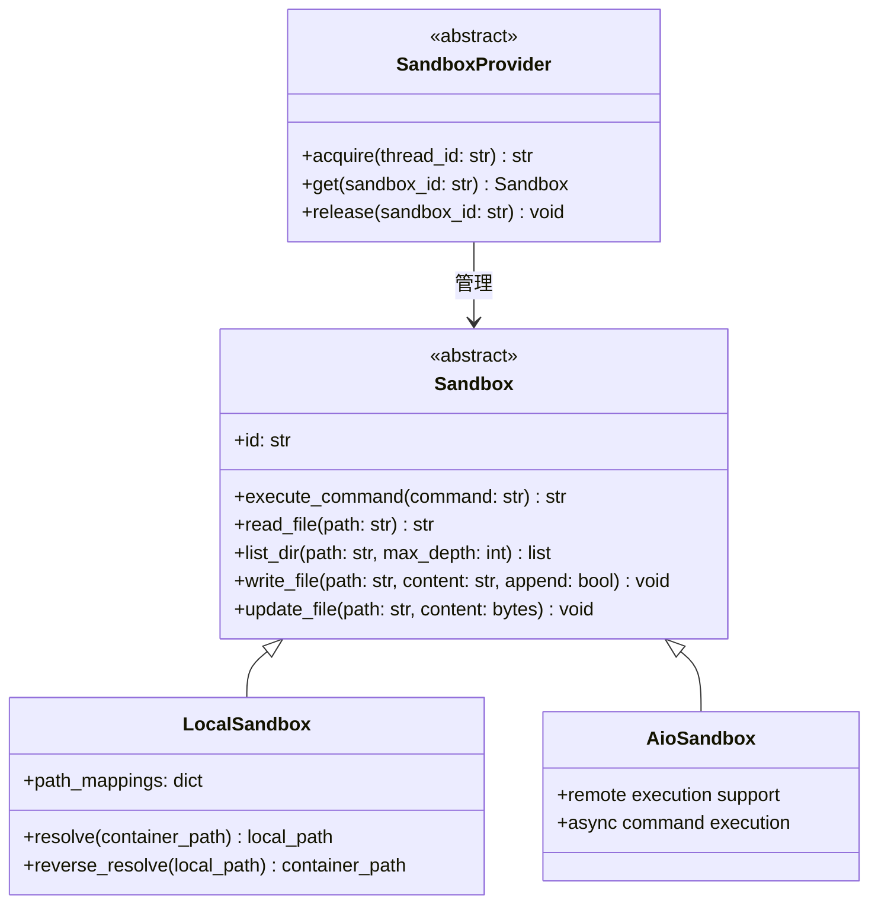
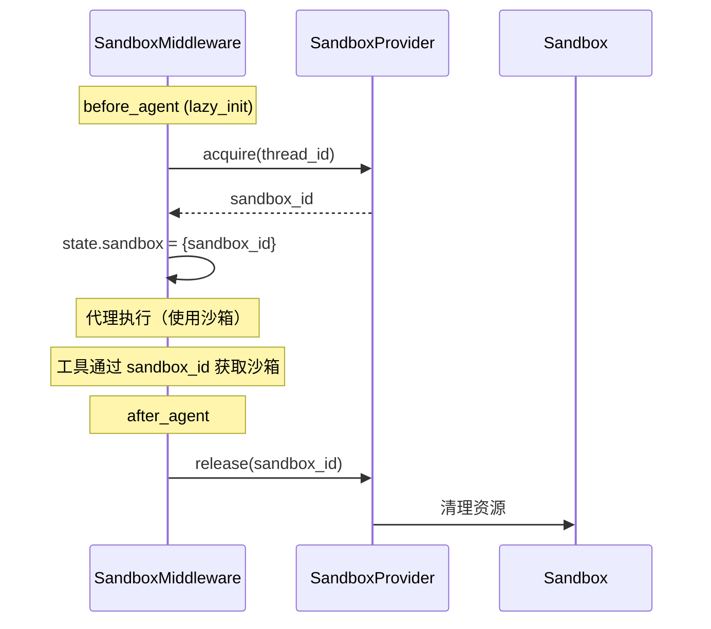

# 第 9 章 沙箱执行引擎

> **读完本章的收获**：你能描述 DeerFlow 沙箱的抽象接口、三种实现模式、Provider 工厂机制、路径映射系统和中间件生命周期管理。

---

## 9.1 沙箱的角色

沙箱是代理的"个人电脑"——一个隔离的执行环境，代理在其中执行代码、读写文件、运行命令。没有沙箱，代理只能"说"；有了沙箱，代理能"做"。

**代码位置**：`backend/packages/harness/deerflow/sandbox/`

---

## 9.2 抽象接口



### Sandbox 接口

| 方法 | 功能 | 在 Local 模式下的实现 |
|------|------|---------------------|
| `execute_command(cmd)` | 执行 Bash 命令 | `subprocess.run()` |
| `read_file(path)` | 读取文本文件 | 路径映射后 `open().read()` |
| `list_dir(path, depth)` | 列出目录 | `os.walk()` |
| `write_file(path, content, append)` | 写入文本 | 路径映射后 `open().write()` |
| `update_file(path, bytes)` | 写入二进制 | 路径映射后写入字节 |

### SandboxProvider 接口

| 方法 | 功能 |
|------|------|
| `acquire(thread_id)` | 获取或创建沙箱，返回 sandbox_id |
| `get(sandbox_id)` | 通过 ID 获取沙箱实例 |
| `release(sandbox_id)` | 释放/清理沙箱资源 |

---

## 9.3 三种沙箱模式

| 模式 | Provider | 隔离级别 | 适用场景 |
|------|---------|---------|---------|
| **Local** | `LocalSandboxProvider` | 无隔离（直接操作宿主文件系统） | 开发/调试 |
| **Docker** | `AioSandboxProvider` | 容器级隔离 | 单机生产 |
| **K8s** | `AioSandboxProvider` + Provisioner | Pod 级隔离 | 多租户生产 |

### Local 模式


路径映射表：

| 容器路径 | 宿主路径 |
|---------|---------|
| `/mnt/user-data/workspace/` | `data/threads/{thread_id}/workspace/` |
| `/mnt/user-data/uploads/` | `data/threads/{thread_id}/uploads/` |
| `/mnt/user-data/outputs/` | `data/threads/{thread_id}/outputs/` |
| `/mnt/skills/public/` | `skills/public/` |
| `/mnt/skills/custom/` | `skills/custom/` |

### Docker / K8s 模式

通过 `AioSandboxProvider`（`deerflow.community.aio_sandbox`）管理。Docker 模式直接启动容器，K8s 模式通过 Provisioner 服务（端口 8002）在 Kubernetes 集群中创建 Pod。

```
config.yaml:
  sandbox:
    use: "deerflow.community.aio_sandbox:AioSandboxProvider"
    provisioner_url: "http://localhost:8002"  # K8s 模式时需要
```

---

## 9.4 Provider 工厂

沙箱 Provider 通过配置系统和反射机制加载：

```
config.yaml → sandbox.use → resolve_class() → SandboxProvider 实例
```

默认为 `LocalSandboxProvider`，不需要额外配置。

---

## 9.5 中间件生命周期

SandboxMiddleware 管理沙箱的获取和释放：



**Lazy Init**：沙箱在首次 `before_agent` 调用时才创建，而不是在中间件构建时。这意味着不使用沙箱工具的简单对话不会产生沙箱开销。

---

## 9.6 沙箱工具的连接

工具通过 `state.sandbox.sandbox_id` 获取沙箱实例：

```
工具调用 (如 write_file)
  → 从 state 读取 sandbox_id
  → SandboxProvider.get(sandbox_id) → Sandbox 实例
  → sandbox.write_file(path, content)
  → LocalSandbox: resolve(path) → 宿主路径 → 写入
```

---

## 9.7 设计取舍

**为什么用 Provider 模式而不是直接实例化？**
- 不同模式需要不同的创建/清理逻辑
- Provider 封装了生命周期管理（acquire/release）
- 通过 config.yaml 切换 Provider 不需要改代码

**为什么 Local 模式要做路径映射？**
- 保持与 Docker/K8s 模式相同的路径接口
- 代理代码不需要知道自己在哪个模式下运行
- 系统提示词中的路径（如 `/mnt/user-data/outputs/`）在所有模式下一致

---

### 质检报告

**完整性**
- [x] 抽象接口（Sandbox + SandboxProvider）
- [x] 三种模式对比
- [x] 路径映射表
- [x] Provider 工厂
- [x] 中间件生命周期

**准确性**
- [x] 接口方法与 sandbox.py 一致
- [x] 路径映射与 LocalSandbox 实现一致

**可读性**
- [x] 类图展示继承关系
- [x] 序列图展示生命周期

**勘误建议**
- 无
