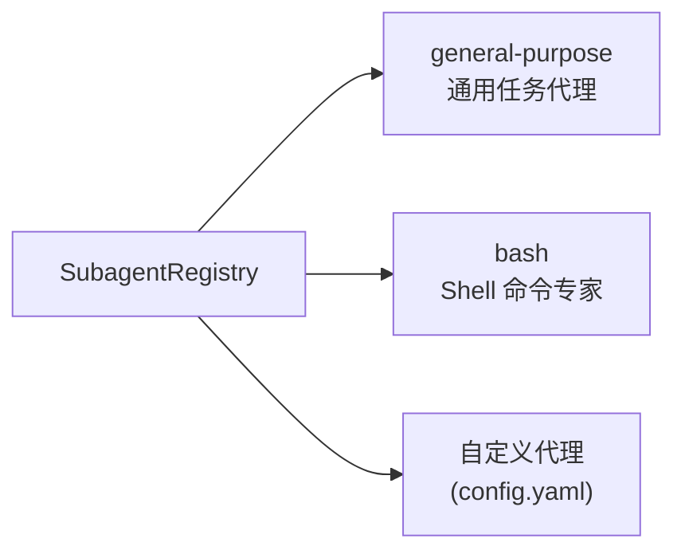
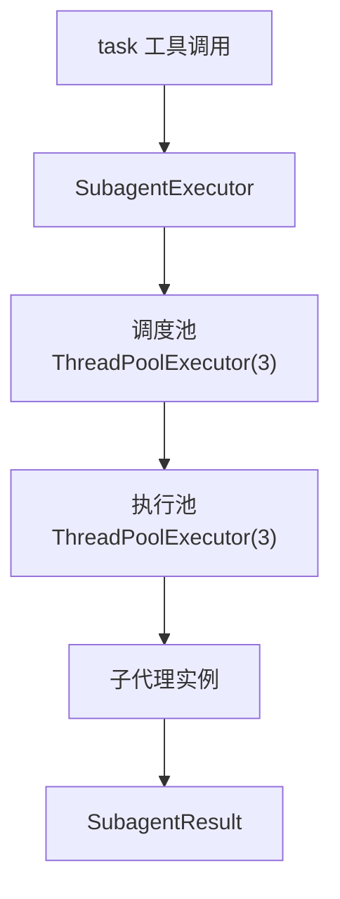
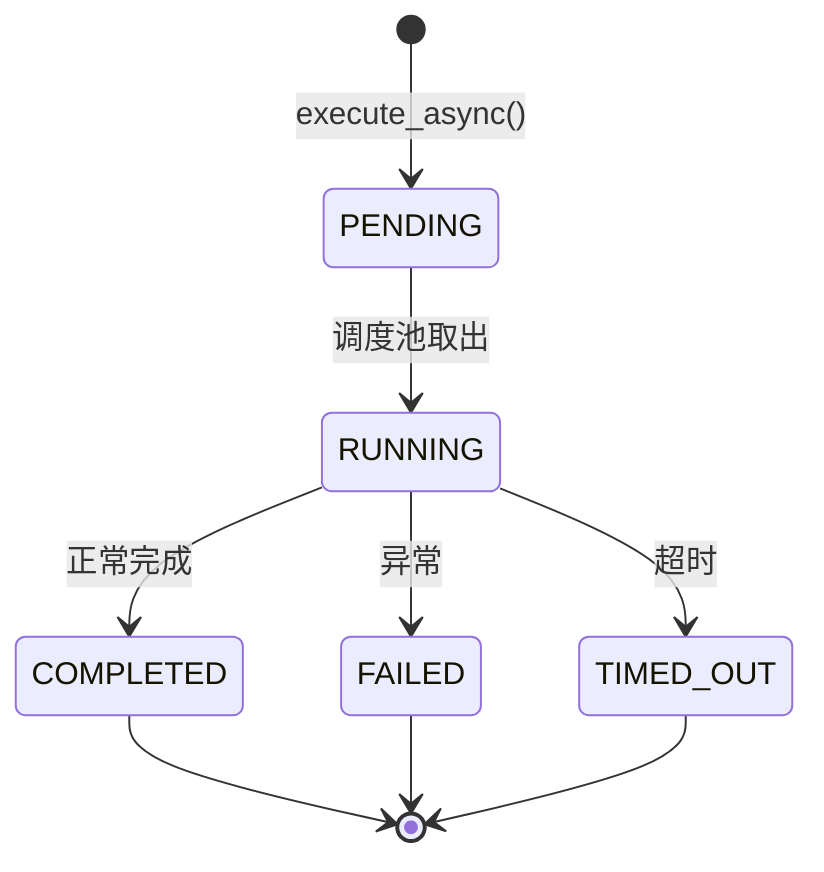
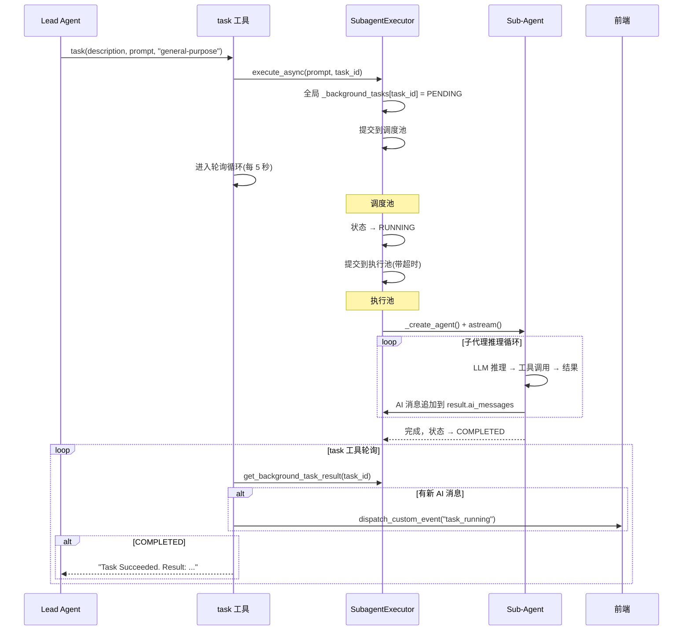
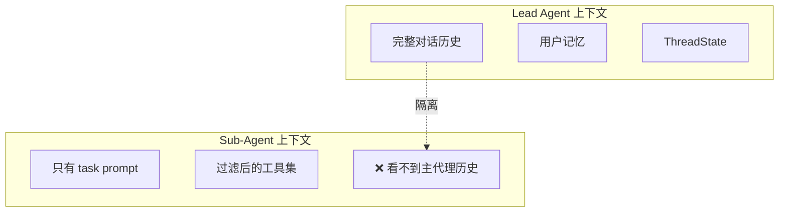

# 第 10 章 子代理系统

> **读完本章的收获**：你能描述子代理的注册、配置、执行和并发控制机制，理解任务如何被拆分、并行执行和结果合并。

---

## 10.1 子代理的角色

当任务足够复杂，Lead Agent 不必亲自完成所有工作——它可以通过 `task` 工具将子任务委派给 **Sub-Agent（子代理）**。每个子代理是一个独立的代理实例，有自己的上下文、工具集和超时限制。

**代码位置**：`backend/packages/harness/deerflow/subagents/`

---

## 10.2 注册表



### 内置子代理

| 名称 | 描述 | 工具限制 | 模型 |
|------|------|---------|------|
| `general-purpose` | 处理任何类型的子任务 | 除 `task` 外全部 | 继承主代理 |
| `bash` | Shell 命令执行专家 | `bash`, `ls`, `read_file`, `write_file` | 继承主代理 |

### SubagentConfig 结构

```python
@dataclass
class SubagentConfig:
    name: str                      # "general-purpose", "bash"
    description: str               # 何时使用（展示给 LLM 决策）
    system_prompt: str             # 行为指南
    tools: list[str] | None        # 工具白名单（None = 全部）
    disallowed_tools: list[str]    # 工具黑名单（默认: ["task"]）
    model: str                     # "inherit" 或具体模型名
    max_turns: int = 50            # 最大推理轮次
    timeout_seconds: int = 900     # 15 分钟超时
```

**关键规则**：`disallowed_tools` 默认包含 `["task"]`——子代理不能再创建子代理。

---

## 10.3 执行引擎

### 线程池架构



### 执行状态机



### SubagentResult 结构

```python
@dataclass
class SubagentResult:
    task_id: str              # 唯一执行 ID（= tool_call_id）
    trace_id: str             # 链接到父级追踪
    status: SubagentStatus    # PENDING / RUNNING / COMPLETED / FAILED / TIMED_OUT
    result: str | None        # 最终输出文本
    error: str | None         # 错误信息
    started_at: datetime | None
    completed_at: datetime | None
    ai_messages: list[dict]   # 子代理的完整对话（用于前端展示进度）
```

---

## 10.4 执行流程详解



### 关键实现细节

**子代理创建**（`_create_agent()`）：
1. 根据 `config.model` 决定模型（`inherit` = 继承主代理的模型）
2. 过滤工具：`_filter_tools(all_tools, config.tools, config.disallowed_tools)`
3. 构建精简的中间件链（ToolErrorHandling, Uploads 等）
4. 调用 `create_agent(model, tools, middlewares)`

**实时进度推送**：task 工具在轮询中发现新的 `ai_messages` 时，通过 `dispatch_custom_event("task_running")` 推送给前端，前端显示子任务进度卡片。

---

## 10.5 并发控制

三层并发控制机制：

| 层 | 机制 | 限制 |
|---|------|------|
| LLM 输出层 | SubagentLimitMiddleware | 截断超出的 task 调用（max 2-4） |
| 调度层 | `_scheduler_pool` | 3 个调度线程 |
| 执行层 | `_execution_pool` | 3 个执行线程 |

**SubagentLimitMiddleware 的工作方式**：

```
LLM 返回: [task_call_1, task_call_2, task_call_3, task_call_4]
max_concurrent_subagents = 2

中间件处理后: [task_call_1, task_call_2]
task_call_3 和 task_call_4 被丢弃
```

---

## 10.6 上下文隔离

每个子代理运行在 **完全隔离的上下文** 中：



**设计目的**：
- 子代理只聚焦于被分配的子任务
- 不被主代理的长历史干扰
- 避免上下文窗口溢出

---

## 10.7 设计取舍

**为什么用后台轮询而不是回调？**
- LangGraph 的工具调用是同步的——task 工具需要返回结果
- 轮询期间可以推送实时进度给前端
- 比回调更简单，更易于超时控制

**为什么默认禁止子代理调用 task？**
- 防止无限递归委派（A 委派给 B，B 又委派给 C…）
- 两层深度（主代理 → 子代理）足以覆盖绝大多数场景
- 简化并发控制和资源管理

---

### 质检报告

**完整性**
- [x] 注册表和内置子代理
- [x] SubagentConfig 完整结构
- [x] 执行引擎（线程池、状态机、Result）
- [x] 详细执行流程
- [x] 三层并发控制
- [x] 上下文隔离

**准确性**
- [x] 与 executor.py 和 registry.py 一致

**可读性**
- [x] 状态机图展示生命周期
- [x] 序列图展示完整执行流程

**勘误建议**
- 无
