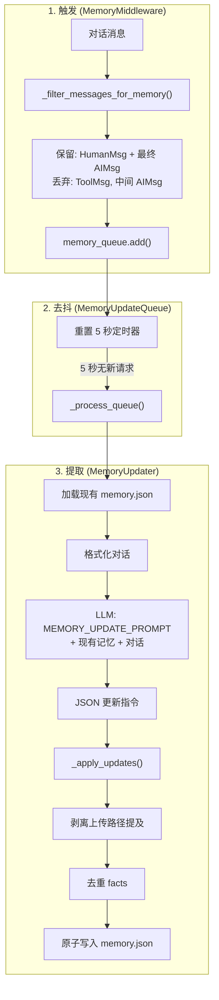
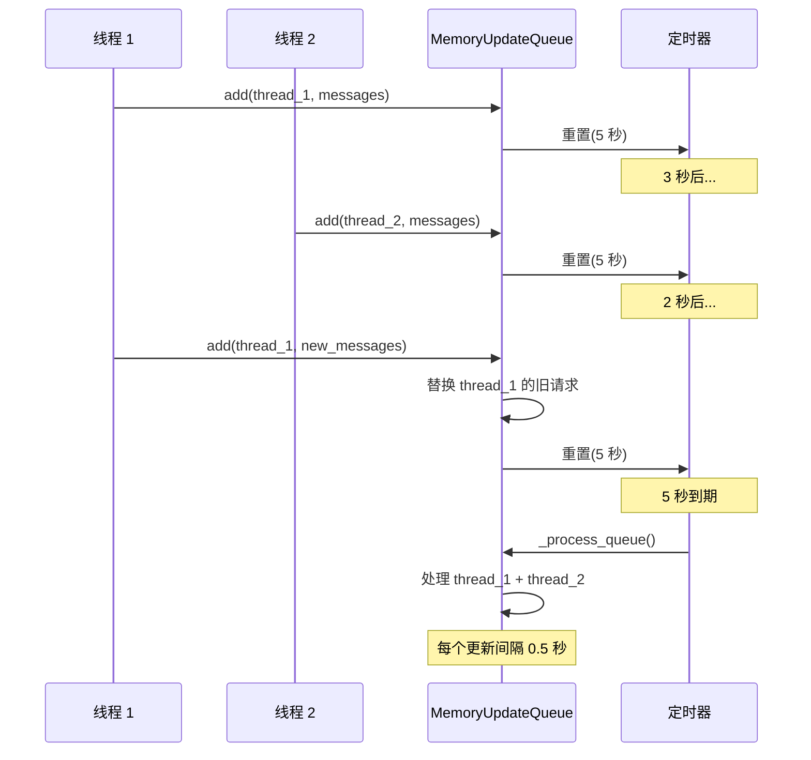

# 第 11 章 长期记忆

> **读完本章的收获**：你能描述 DeerFlow 记忆系统的数据结构、LLM 驱动的提取流程、去抖队列机制、文件存储方案，以及 Per-Agent 隔离。

---

## 11.1 记忆系统的目标

大多数 AI 代理是"金鱼记忆"——会话结束即遗忘。DeerFlow 的长期记忆让代理跨会话积累知识：用户偏好、工作上下文、技术栈、反复出现的需求模式。

**代码位置**：`backend/packages/harness/deerflow/agents/memory/`

---

## 11.2 记忆数据结构

```mermaid
classDiagram
    class Memory {
        +version: "1.0"
        +lastUpdated: datetime
        +user: UserContext
        +history: HistoryContext
        +facts: list~Fact~
    }
    class UserContext {
        +workContext: {summary, updatedAt}
        +personalContext: {summary, updatedAt}
        +topOfMind: {summary, updatedAt}
    }
    class HistoryContext {
        +recentMonths: {summary, updatedAt}
        +earlierContext: {summary, updatedAt}
        +longTermBackground: {summary, updatedAt}
    }
    class Fact {
        +id: str
        +content: str
        +category: str
        +confidence: float
        +createdAt: datetime
        +source: str
    }
    
    Memory *-- UserContext
    Memory *-- HistoryContext
    Memory *-- Fact
```

### 三个维度

| 维度 | 字段 | 存储什么 |
|------|------|---------|
| **用户上下文** | workContext | 当前工作项目和技术栈 |
| | personalContext | 个人偏好和习惯 |
| | topOfMind | 最近关注的焦点 |
| **历史上下文** | recentMonths | 近几个月的重要交互 |
| | earlierContext | 更早的历史摘要 |
| | longTermBackground | 长期背景信息 |
| **事实库** | facts[] | 离散的知识条目 |

### Fact 字段

| 字段 | 作用 |
|------|------|
| `id` | 唯一标识（`fact_` 前缀 + 随机串） |
| `content` | 事实内容（如"用户使用 Python"） |
| `category` | 分类（context / preference / knowledge） |
| `confidence` | 置信度（0-1），用于排序和淘汰 |
| `source` | 来源线程 ID |

---

## 11.3 完整更新流程



### 消息过滤规则

| 消息类型 | 处理 |
|---------|------|
| HumanMessage | ✅ 保留（剥离 `<uploaded_files>` 块） |
| AIMessage（无 tool_call） | ✅ 保留（最终回复） |
| AIMessage（有 tool_call） | ❌ 丢弃（中间推理步骤） |
| ToolMessage | ❌ 丢弃（工具执行细节） |

**为什么只保留最终回复**：中间的工具调用和结果是执行细节，不包含值得记忆的用户意图或偏好信息。

---

## 11.4 去抖机制



**设计目的**：
- **批处理**：多个快速连续的对话合并为一次 LLM 调用
- **去重**：同一线程的多次更新只保留最新
- **防速率限制**：更新之间间隔 0.5 秒

---

## 11.5 LLM 驱动的提取

记忆不是简单的关键词抽取——DeerFlow 用 LLM 理解对话语义，决定什么值得记忆。

**提取 LLM 的输入**：
```
MEMORY_UPDATE_PROMPT:
  "你是一个记忆管理助手。根据以下对话更新用户的记忆。"
  + 当前记忆 JSON
  + 格式化的对话内容

→ LLM 输出 JSON 更新指令
```

**更新指令示例**：
```json
{
  "user": {
    "workContext": {"summary": "正在开发 Python 爬虫项目，使用 Scrapy 框架"}
  },
  "facts": [
    {"content": "用户偏好 Python", "category": "preference", "confidence": 0.9},
    {"content": "正在使用 Scrapy", "category": "context", "confidence": 0.85}
  ]
}
```

### 更新后的清洗

1. **剥离上传路径**：正则移除包含 `/mnt/user-data/uploads/` 或 `<uploaded_files>` 的句子——上传文件是会话级的，不应持久化
2. **Fact 去重**：跳过与现有 fact 内容相同的条目
3. **数量限制**：fact 总数不超过 `config.memory.max_facts`，按 confidence 排序淘汰

---

## 11.6 存储

### FileMemoryStorage

| 存储位置 | 场景 |
|---------|------|
| `data/memory.json` | 全局记忆（agent_name=None） |
| `data/agent_memory/{agent_name}.json` | Per-Agent 记忆 |

**原子写入**：
```
写入临时文件 memory.json.tmp
  → os.rename(tmp, memory.json)  # 原子操作
```

**缓存失效**：
```
load(agent_name):
  → 检查文件 mtime
  → 如果 mtime 未变 → 返回缓存
  → 如果 mtime 更新 → 重新读取文件
```

---

## 11.7 记忆注入

MemoryMiddleware 在 `before_agent` 阶段将记忆注入到系统提示词：

```
apply_prompt_template()
  → _get_memory_context(agent_name)
    → FileMemoryStorage.load(agent_name)
    → 格式化为提示词段落
    → 插入到 <memory> 标签中
```

LLM 在推理时可以看到用户的历史偏好和背景信息。

---

## 11.8 设计取舍

**为什么用 LLM 提取而不是规则/嵌入？**
- LLM 能理解语义——"我讨厌 Java"表达的是偏好，不是 Java 知识
- 规则很难覆盖所有表达方式
- 记忆更新的频率低（每次对话一次），LLM 成本可接受

**为什么用文件存储而不是数据库？**
- 简单——不需要额外依赖
- 单用户场景下足够
- 原子 rename 保证写入安全
- 未来可以替换为数据库 Provider

---

### 质检报告

**完整性**
- [x] 数据结构（三维度 + facts）
- [x] 完整更新流程（触发 → 去抖 → 提取 → 存储）
- [x] 消息过滤规则
- [x] 去抖机制详解
- [x] LLM 提取过程
- [x] 存储和缓存
- [x] 记忆注入

**准确性**
- [x] 与 updater.py / queue.py / storage.py 一致

**可读性**
- [x] 类图展示数据结构
- [x] 流程图展示完整更新链
- [x] 序列图展示去抖时序

**勘误建议**
- 无
