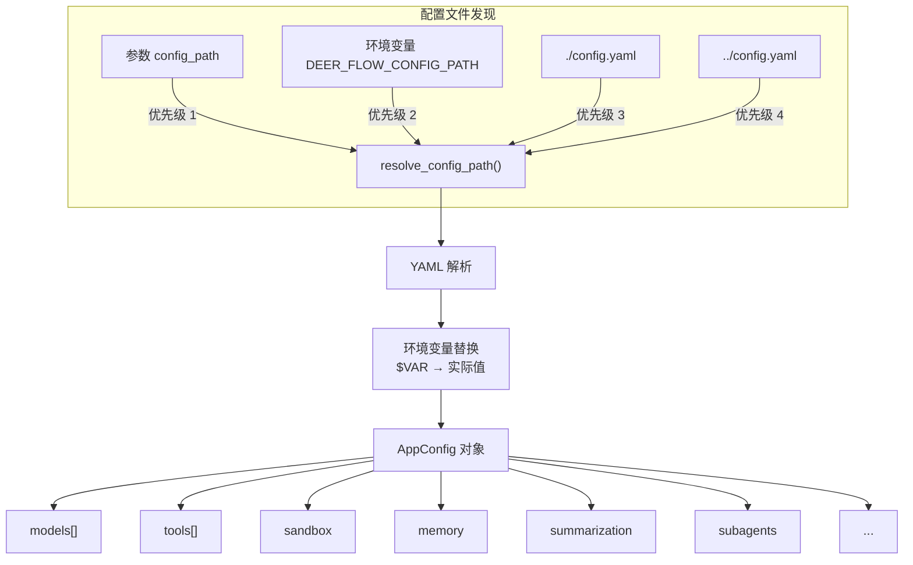

# 第 12 章 配置系统

> **读完本章的收获**：你能描述 DeerFlow 的配置解析链、19 个配置模块的职责划分、环境变量替换机制，以及 ExtensionsConfig 的独立角色。

---

## 12.1 双配置体系

DeerFlow 有两个配置文件，职责不同：

| 文件 | 格式 | 职责 | 修改频率 |
|------|------|------|---------|
| `config.yaml` | YAML | 应用核心配置（模型、工具、沙箱、记忆…） | 部署时 |
| `extensions_config.json` | JSON | 扩展配置（MCP 服务器、技能启用状态） | 运行时 |

**为什么分两个文件**：`config.yaml` 是静态的系统配置，`extensions_config.json` 是用户在运行时通过 UI 动态修改的。

---

## 12.2 配置解析链



### 环境变量替换

`config.yaml` 中以 `$` 开头的值在加载时被替换：

```yaml
# config.yaml
models:
  - name: gpt-4
    api_key: $OPENAI_API_KEY  # ← 加载时替换为 os.environ["OPENAI_API_KEY"]
```

这发生在 AppConfig 的 YAML 解析阶段，支持所有字段。

---

## 12.3 配置模块清单

**代码位置**：`backend/packages/harness/deerflow/config/`

| 模块 | 类 | 管控范围 |
|------|---|---------|
| `app_config.py` | AppConfig | 主配置入口，聚合所有子配置 |
| `model_config.py` | ModelConfig | 模型定义（use, model, api_key, 能力标记…） |
| `tool_config.py` | ToolConfig, ToolGroupConfig | 工具定义和分组 |
| `skills_config.py` | SkillsConfig | 技能目录路径 |
| `extensions_config.py` | ExtensionsConfig | MCP 服务器和技能启用状态 |
| `memory_config.py` | MemoryConfig | 记忆开关、模型、去抖、阈值 |
| `sandbox_config.py` | SandboxConfig | 沙箱 Provider 和参数 |
| `subagents_config.py` | SubagentsConfig | 子代理超时设置 |
| `summarization_config.py` | SummarizationConfig | 摘要触发条件和策略 |
| `token_usage_config.py` | TokenUsageConfig | Token 使用量记录开关 |
| `title_config.py` | TitleConfig | 标题生成提示词和模型 |
| `tool_search_config.py` | ToolSearchConfig | 延迟工具加载配置 |
| `guardrails_config.py` | GuardrailsConfig | 内容安全 Provider |
| `checkpointer_config.py` | CheckpointerConfig | 状态持久化后端 |
| `acp_config.py` | AcpConfig | ACP 代理集成 |
| `tracing_config.py` | TracingConfig | LangSmith 追踪 |
| `paths.py` | PathsConfig | 基础目录、记忆文件、上传/输出路径 |
| `agents_config.py` | AgentConfig | Per-Agent 设置（模型、工具组、超时） |

---

## 12.4 AppConfig 的全局访问

```python
get_app_config() -> AppConfig
```

单例模式，首次调用时解析配置文件，后续调用返回缓存。在开发模式下，后端进程会自动感知 `config.yaml` 变更并在下次访问时重新加载。

---

## 12.5 ExtensionsConfig

独立于 `config.yaml` 的运行时配置，由前端 UI 动态修改。

```json
{
  "mcpServers": {
    "filesystem": {
      "enabled": true,
      "type": "stdio",
      "command": "npx",
      "args": ["-y", "@modelcontextprotocol/server-filesystem", "/path"],
      "env": {},
      "description": "文件系统访问"
    }
  },
  "skills": {
    "research": {"enabled": true},
    "slide-creation": {"enabled": false}
  }
}
```

### API 操作

| 端点 | 功能 |
|------|------|
| `GET /api/mcp` | 读取 MCP 服务器配置 |
| `PUT /api/mcp` | 更新 MCP 服务器配置 |
| `GET /api/skills` | 读取技能列表和状态 |
| `PUT /api/skills/{name}` | 启用/禁用技能 |

修改后文件直接写入磁盘，下次代理运行时生效。

---

## 12.6 配置覆盖模式

DeerFlow 中多处使用 **三级覆盖模式**：

```
请求级参数 > 代理级配置 > 全局默认
```

| 覆盖点 | 请求级 | 代理级 | 全局 |
|--------|--------|--------|------|
| 模型选择 | `config.model_name` | `agents.{name}.model` | `models[0].name` |
| Thinking | `config.thinking_enabled` | — | 默认 True |
| 子代理超时 | — | `subagents.{name}.timeout` | 900 秒 |
| 记忆存储 | — | `agent_memory/{name}.json` | `data/memory.json` |

---

## 12.7 设计取舍

**为什么用 YAML 而不是 JSON / TOML？**
- YAML 支持注释（配置文件需要大量注释说明）
- YAML 的可读性适合复杂嵌套结构
- 社区习惯（LangGraph、LangChain 生态常用 YAML）

**为什么 ExtensionsConfig 独立为 JSON？**
- 运行时动态修改（不像 YAML 需要重启）
- 前端 JavaScript 原生处理 JSON
- 与 config.yaml 的静态配置职责分离

---

### 质检报告

**完整性**
- [x] 双配置体系
- [x] 配置解析链（发现 → 解析 → 环境变量替换）
- [x] 19 个配置模块清单
- [x] ExtensionsConfig 独立角色
- [x] 三级覆盖模式

**准确性**
- [x] 模块清单与 config/ 目录一致
- [x] 解析优先级与 resolve_config_path 一致

**可读性**
- [x] 流程图展示解析链
- [x] 表格清晰列出所有配置模块

**勘误建议**
- 无
