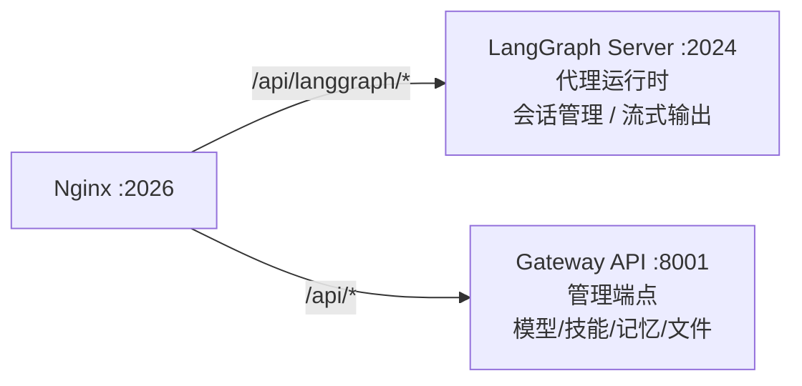

# 第 13 章 Gateway API

> **读完本章的收获**：你能描述 Gateway API 的所有 10 个 Router、端点设计、与 LangGraph Server 的分工，以及 Lifespan 管理。

---

## 13.1 Gateway 与 LangGraph Server 的分工

DeerFlow 的后端有两个 HTTP 服务，各有明确职责：



| 职责 | LangGraph Server | Gateway API |
|------|-----------------|-------------|
| 代理执行 | ✅ | ❌ |
| 会话管理（Thread） | ✅ | 仅清理 |
| 流式输出（SSE） | ✅ | ❌ |
| 模型列表 | ❌ | ✅ |
| 技能管理 | ❌ | ✅ |
| 记忆读写 | ❌ | ✅ |
| 文件上传/下载 | ❌ | ✅ |
| MCP 配置 | ❌ | ✅ |
| IM 通道管理 | ❌ | ✅ |

**代码位置**：`backend/app/gateway/`

---

## 13.2 FastAPI 应用结构

```python
# backend/app/gateway/app.py
def create_app() -> FastAPI:
    app = FastAPI(lifespan=lifespan)
    app.include_router(models_router, prefix="/api")
    app.include_router(skills_router, prefix="/api")
    app.include_router(memory_router, prefix="/api")
    app.include_router(mcp_router, prefix="/api")
    app.include_router(uploads_router, prefix="/api")
    app.include_router(artifacts_router, prefix="/api")
    app.include_router(agents_router, prefix="/api")
    app.include_router(suggestions_router, prefix="/api")
    app.include_router(channels_router, prefix="/api")
    app.include_router(threads_router, prefix="/api")
    return app
```

### Lifespan 管理

Gateway 使用 FastAPI 的 Lifespan 机制管理启动/关闭：

```
启动时:
  → 加载 config.yaml
  → 启动 Channel Service（如果配置了 IM 通道）

关闭时:
  → 停止 Channel Service
  → 清理资源
```

---

## 13.3 十个 Router

### ① Models Router

| 端点 | 功能 |
|------|------|
| `GET /api/models` | 返回所有可用模型的列表 |
| `GET /api/models/{model_name}` | 返回模型详情（supports_thinking, supports_vision 等） |

### ② Skills Router

| 端点 | 功能 |
|------|------|
| `GET /api/skills` | 列出所有技能（名称、描述、启用状态） |
| `GET /api/skills/{skill_name}` | 获取技能详情 |
| `PUT /api/skills/{skill_name}` | 启用/禁用技能 |
| `POST /api/skills/install` | 从 Git 仓库安装技能 |

### ③ Memory Router

| 端点 | 功能 |
|------|------|
| `GET /api/memory` | 获取全局记忆数据 |
| `POST /api/memory/reload` | 强制从磁盘重新加载 |
| `GET /api/memory/config` | 获取记忆配置 |
| `GET /api/memory/status` | 记忆更新队列状态 |

### ④ MCP Router

| 端点 | 功能 |
|------|------|
| `GET /api/mcp` | 获取已启用的 MCP 服务器配置 |
| `PUT /api/mcp` | 更新 MCP 服务器配置 |

### ⑤ Uploads Router

| 端点 | 功能 |
|------|------|
| `POST /api/threads/{thread_id}/uploads` | 上传文件（multipart/form-data） |
| `GET /api/uploads/list?thread_id=...` | 列出已上传文件 |
| `DELETE /api/uploads/{filename}?thread_id=...` | 删除已上传文件 |

### ⑥ Artifacts Router

| 端点 | 功能 |
|------|------|
| `GET /api/artifacts/{thread_id}/{path}` | 获取制品文件 |

**安全措施**：HTML/SVG 等活跃内容类型强制为 `Content-Disposition: attachment`（防 XSS）。

### ⑦ Agents Router

| 端点 | 功能 |
|------|------|
| `GET /api/agents` | 列出所有代理（含配置） |
| `GET /api/agents/{name}/check` | 验证代理名是否可用 |
| `GET /api/agents/{name}` | 获取代理详情 + SOUL.md |
| `POST /api/agents` | 创建自定义代理 |
| `PUT /api/agents/{name}` | 更新代理配置 |
| `DELETE /api/agents/{name}` | 删除代理 |

### ⑧ Suggestions Router

| 端点 | 功能 |
|------|------|
| `POST /api/suggestions` | AI 生成后续建议 |

输入最近的对话，LLM 生成 3-5 条建议性后续消息。响应经过规范化处理，兼容不同模型的输出格式。

### ⑨ Channels Router

| 端点 | 功能 |
|------|------|
| `GET /api/channels` | 获取所有 IM 通道状态 |
| `POST /api/channels/{name}/restart` | 重启指定通道 |

### ⑩ Threads Router

| 端点 | 功能 |
|------|------|
| `DELETE /api/threads/{thread_id}` | 清理本地线程数据（工作目录、上传文件、输出文件） |

**注意**：这只清理 Gateway 管理的本地数据，不清理 LangGraph Server 的线程状态（那由 Checkpointer 管理）。

---

## 13.4 嵌入式 Python 客户端

除了 HTTP 访问，DeerFlow 还提供 `DeerFlowClient` 作为嵌入式 Python 客户端：

```python
from deerflow.client import DeerFlowClient
client = DeerFlowClient()

response = client.chat("分析这篇论文", thread_id="my-thread")
models = client.list_models()  # {"models": [...]}
skills = client.list_skills()  # {"skills": [...]}
```

客户端返回的数据结构与 Gateway API 的响应一致，CI 中有 `TestGatewayConformance` 验证一致性。

---

## 13.5 设计取舍

**为什么不把管理端点放在 LangGraph Server 中？**
- LangGraph Server 是一个标准的 LangGraph 实例，不应被修改
- 管理端点（模型/技能/记忆）是 DeerFlow 特有的，不属于 LangGraph 的职责
- 分离让两个服务可以独立扩展和部署

---

### 质检报告

**完整性**
- [x] 10 个 Router 全覆盖
- [x] 每个端点的方法和功能
- [x] Lifespan 管理
- [x] 嵌入式客户端

**准确性**
- [x] 端点与 routers/ 目录一致

**可读性**
- [x] 分工对比表清晰
- [x] 端点表格一目了然

**勘误建议**
- 无
