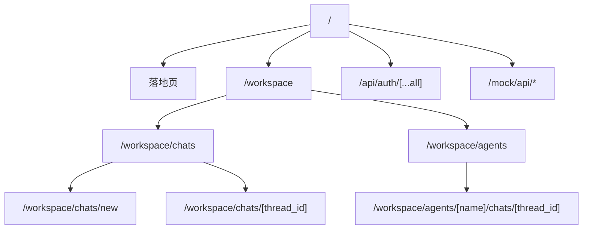
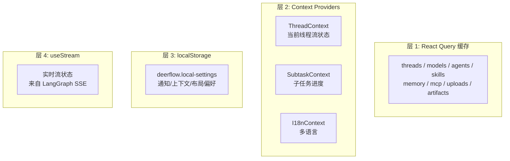
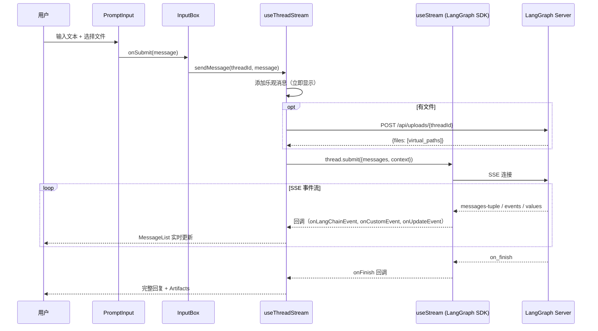

# 第 14 章 前端架构

> **读完本章的收获**：你能描述 DeerFlow 前端的路由结构、状态管理方案、SSE 流式消息处理机制、组件层次和核心数据流。

---

## 14.1 技术栈

| 技术 | 版本 | 用途 |
|------|------|------|
| Next.js | 16 | 框架（App Router） |
| React | 19 | UI 库 |
| TypeScript | 5.8 | 类型安全 |
| pnpm | 10 | 包管理 |
| @tanstack/react-query | 5 | 服务端状态管理 |
| @langchain/langgraph-sdk | 1.5 | LangGraph 客户端 + useStream |
| Radix UI | — | 无障碍基础组件 |
| Tailwind CSS | 4 | 样式 |
| CodeMirror | 6 | 代码编辑器 |

**代码位置**：`frontend/src/`

---

## 14.2 路由结构



| 路由 | 组件 | 功能 |
|------|------|------|
| `/` | LandingPage | 产品落地页 |
| `/workspace` | WorkspaceLayout | 工作空间入口，重定向到聊天 |
| `/workspace/chats/[thread_id]` | ChatPage | **核心页面**：聊天界面 |
| `/workspace/agents` | AgentGallery | 代理画廊 |
| `/workspace/agents/[name]/chats/[thread_id]` | AgentChatPage | 指定代理的聊天 |

---

## 14.3 状态管理四层架构



| 层 | 工具 | 数据类型 | 刷新策略 |
|---|------|---------|---------|
| React Query | `@tanstack/react-query` | 服务端数据（线程、模型、技能…） | 请求级缓存 + Mutation 失效 |
| Context | React Context | 页面级状态（当前线程、子任务） | 组件树传播 |
| localStorage | `useLocalSettings` | 用户偏好 | 持久化 |
| useStream | `@langchain/langgraph-sdk` | 实时流 | SSE 事件驱动 |

---

## 14.4 核心数据流：消息发送到显示



### useThreadStream 核心

```
frontend/src/core/threads/hooks.ts::useThreadStream(threadId, context, isMock)
```

这是前端最核心的 Hook。它：
1. 初始化 `useStream()` 连接到 LangGraph Server
2. 提供 `sendMessage()` 方法
3. 处理所有 SSE 事件类型
4. 管理乐观更新和错误恢复

### SSE 事件处理

| 事件类型 | 处理 |
|---------|------|
| `onCreated` | 线程初始化，保存 thread_id |
| `onLangChainEvent("on_tool_end")` | 更新工具执行状态 |
| `onCustomEvent("task_running")` | 更新子任务进度卡片 |
| `onUpdateEvent` | 更新线程状态（标题变更等） |
| `onError` | 显示错误 Toast |
| `onFinish` | 标记完成，触发建议生成 |

---

## 14.5 组件层次

```
WorkspaceLayout
├── WorkspaceSidebar          # 导航 + 聊天列表
├── CommandPalette            # Cmd+K 快捷导航
└── ChatPage
    ├── MessageList           # 消息渲染
    │   └── MessageListItem
    │       ├── Message       # 文本消息
    │       ├── CodeBlock     # 代码高亮
    │       ├── ChainOfThought # 推理过程
    │       ├── Task          # 子任务卡片
    │       └── Artifact      # 制品展示
    ├── InputBox              # 输入区域
    │   └── PromptInput       # 文本 + 文件附件
    ├── ModelSelector          # 模型选择
    ├── TodoList              # 计划模式待办
    ├── TokenUsageIndicator   # Token 消耗显示
    └── StreamingIndicator    # 加载动画
```

### AI Elements

`frontend/src/components/ai-elements/` 是聊天特有的组件集：

| 组件 | 功能 |
|------|------|
| `prompt-input.tsx` | 文本输入 + 文件拖拽 + 快捷键 |
| `message.tsx` | 消息气泡渲染 |
| `conversation.tsx` | 对话容器 |
| `artifact.tsx` | 制品预览和下载 |
| `code-block.tsx` | 语法高亮代码块 |
| `task.tsx` | 子任务执行卡片 |
| `chain-of-thought.tsx` | 推理过程折叠展示 |
| `reasoning.tsx` | Thinking 模式思考过程 |
| `canvas.tsx` | React Flow 图形可视化 |
| `model-selector.tsx` | 模型切换下拉框 |
| `suggestion.tsx` | 后续建议芯片 |

---

## 14.6 消息分组与渲染

```
messages[] → groupMessages(messages) → MessageGroup[]
```

消息按类型和连续性分组：连续的 AI 消息合并为一组，工具调用和结果归入同一组。每个 `MessageGroup` 渲染为一个视觉单元。

---

## 14.7 关键前端模块

| 模块 | 路径 | 职责 |
|------|------|------|
| `core/threads/` | 线程 CRUD + useThreadStream | 会话管理的核心 |
| `core/api/` | LangGraph 客户端创建 | API 接入层 |
| `core/models/` | 模型列表和详情 | 模型管理 |
| `core/agents/` | 代理 CRUD | 代理管理 |
| `core/skills/` | 技能列表和启用/禁用 | 技能管理 |
| `core/mcp/` | MCP 配置读写 | MCP 管理 |
| `core/memory/` | 记忆读取 | 记忆展示 |
| `core/uploads/` | 文件上传 API | 文件管理 |
| `core/artifacts/` | 制品内容获取 | 制品展示 |
| `core/tasks/` | 子任务状态追踪 | SubtaskContext |
| `core/settings/` | localStorage 偏好 | 用户设置 |
| `core/i18n/` | 多语言（en-US, zh-CN） | 国际化 |

---

## 14.8 设计取舍

**为什么用 React Query 而不是 Redux/Zustand？**
- DeerFlow 的状态主要是 **服务端状态**（线程、模型、技能来自 API）
- React Query 天然适合：请求缓存、自动刷新、Mutation 失效
- 不需要客户端全局状态管理的复杂度

**为什么用 useStream 而不是自己实现 SSE？**
- `@langchain/langgraph-sdk` 的 `useStream` 是为 LangGraph 定制的
- 处理了重连、事件解析、状态合并等细节
- 保持与 LangGraph Server 的协议兼容

---

### 质检报告

**完整性**
- [x] 路由结构
- [x] 状态管理四层
- [x] 核心数据流（发送到显示）
- [x] 组件层次
- [x] SSE 事件处理
- [x] 关键模块清单

**准确性**
- [x] 路由与 app/ 目录一致
- [x] 组件与 components/ 目录一致
- [x] 依赖版本与 package.json 一致

**可读性**
- [x] 序列图展示核心数据流
- [x] 组件树展示层次关系

**勘误建议**
- 无
