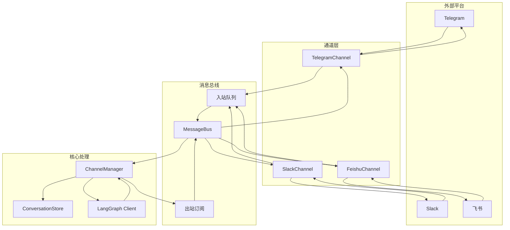
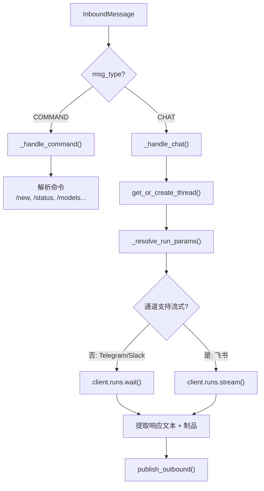

# 第 15 章 IM 通道集成

> **读完本章的收获**：你能描述 DeerFlow 的 Channel 抽象、MessageBus 解耦机制、ChannelManager 的消息路由，以及 Telegram/Slack/飞书三种适配器的实现差异。

---

## 15.1 通道系统的架构

IM 通道让 DeerFlow 直接接收来自 Telegram、Slack、飞书的消息，并将代理响应发送回平台。



**代码位置**：`backend/app/channels/`

---

## 15.2 Channel 抽象

```python
class Channel(ABC):
    async def start() -> None       # 连接平台，开始监听
    async def stop() -> None        # 断开连接
    async def send(msg) -> None     # 发送消息
    async def send_file(msg, attachment) -> bool  # 发送文件（可选）
```

每个通道实现负责：
- 与平台 API 通信（协议适配）
- 将平台消息转换为 `InboundMessage`
- 将 `OutboundMessage` 转换为平台格式

---

## 15.3 消息模型

### InboundMessage（入站）

| 字段 | 类型 | 作用 |
|------|------|------|
| `chat_id` | str | 聊天/群组 ID |
| `user_id` | str | 发送者 ID |
| `text` | str | 消息文本 |
| `msg_type` | enum | CHAT / COMMAND |
| `thread_ts` | str \| None | 线程标识（Slack 有，Telegram 无） |
| `files` | list | 附件列表 |
| `metadata` | dict | 平台特定元数据 |

### OutboundMessage（出站）

| 字段 | 类型 | 作用 |
|------|------|------|
| `channel_name` | str | 目标通道（telegram/slack/feishu） |
| `chat_id` | str | 目标聊天 ID |
| `thread_id` | str | DeerFlow 线程 ID |
| `text` | str | 回复文本 |
| `artifacts` | list | 文件附件 |
| `is_final` | bool | 是否为最终消息（流式时使用） |

---

## 15.4 MessageBus

异步发布/订阅总线，解耦通道和处理逻辑：

```python
class MessageBus:
    publish_inbound(msg)          # 通道发布入站消息
    get_inbound() -> InboundMessage  # Manager 消费入站消息
    publish_outbound(msg)         # Manager 发布出站消息
    subscribe_outbound(callback)  # 通道订阅出站消息
```

**设计目的**：通道不需要知道 ChannelManager 的存在，Manager 也不需要知道具体是哪个通道。通过总线实现完全解耦。

---

## 15.5 ChannelManager

核心的消息路由和处理引擎。

### 分派循环

```python
async def _dispatch_loop():
    while True:
        msg = await bus.get_inbound(timeout=1)
        if msg:
            create_task(_handle_message(msg))
```

### 消息处理



### 线程复用

ConversationStore 维护 `(channel, chat_id, topic_id) → thread_id` 的映射。同一聊天窗口的后续消息复用同一个 DeerFlow 线程。

用户发送 `/new` 命令可以强制创建新线程。

---

## 15.6 三种通道的差异

| 特性 | Telegram | Slack | 飞书 |
|------|---------|-------|------|
| **传输协议** | Bot API 长轮询 | Socket Mode (WebSocket) | WebSocket |
| **代理调用方式** | `runs.wait()` 同步 | `runs.wait()` 同步 | `runs.stream()` 流式 |
| **线程概念** | 无原生线程 | `thread_ts` | 话题/群组 |
| **文件上传** | `send_document()` | `files_upload_v2()` | 富文本附件 |
| **用户过滤** | `allowed_users` 列表 | `allowed_users` 列表 | 应用权限范围 |
| **富文本支持** | Markdown | Slack Blocks | 飞书消息卡片 |

### 流式 vs 同步

飞书通道支持流式响应——在代理执行过程中就开始推送部分结果，每 0.35 秒更新一次消息。这对长时间任务提供更好的用户体验。

Telegram 和 Slack 使用同步模式——等待代理完全执行完毕后一次性发送结果。

---

## 15.7 配置层级

通道的运行参数支持三层覆盖（参见 Ch2 和 Ch12）：

```yaml
channels:
  session:                    # 全局默认
    assistant_id: lead_agent
    context:
      thinking_enabled: true
  
  telegram:
    session:                  # 通道级覆盖
      context:
        thinking_enabled: false
      users:
        "123456789":          # 用户级覆盖
          assistant_id: vip_agent
          context:
            thinking_enabled: true
```

---

## 15.8 支持的命令

| 命令 | 功能 |
|------|------|
| `/new` | 创建新对话 |
| `/status` | 显示当前线程信息 |
| `/models` | 列出可用模型 |
| `/memory` | 查看记忆 |
| `/help` | 显示帮助 |

无命令前缀的消息作为普通聊天处理。

---

## 15.9 服务生命周期

```
Gateway 启动
  → ChannelService.start()
    → 读取 config.yaml 中的 channels 配置
    → 为每个 enabled 通道创建 Channel 实例
    → 启动 ChannelManager 分派循环
    → 各通道连接各自平台

Gateway 关闭
  → ChannelService.stop()
    → 各通道断开连接
    → ChannelManager 停止分派循环
```

---

### 质检报告

**完整性**
- [x] Channel 抽象
- [x] MessageBus 解耦
- [x] ChannelManager 路由逻辑
- [x] 三种通道差异对比
- [x] 配置层级
- [x] 命令列表
- [x] 服务生命周期

**准确性**
- [x] 与 channels/ 目录一致

**可读性**
- [x] 架构图展示完整消息流
- [x] 差异对比表直观

**勘误建议**
- 无
